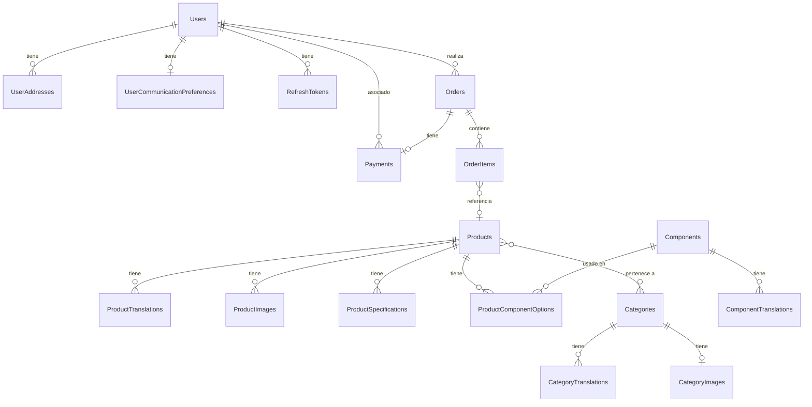
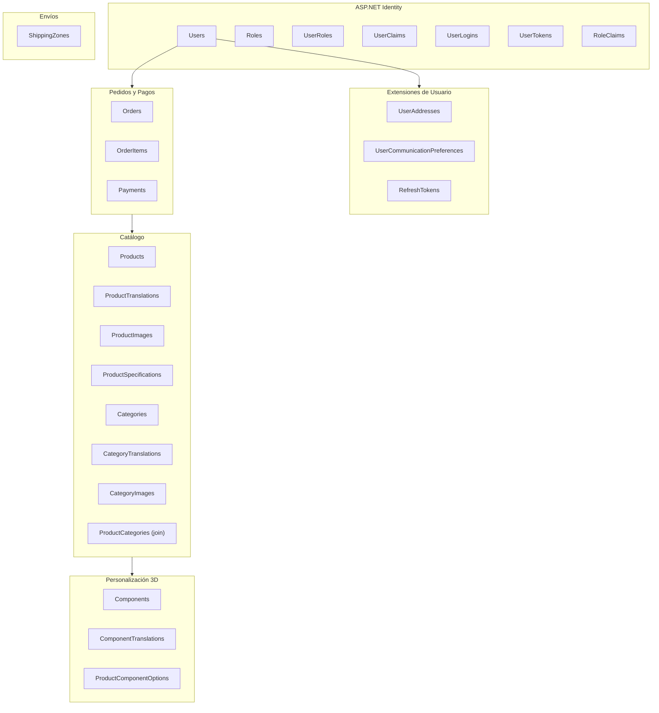
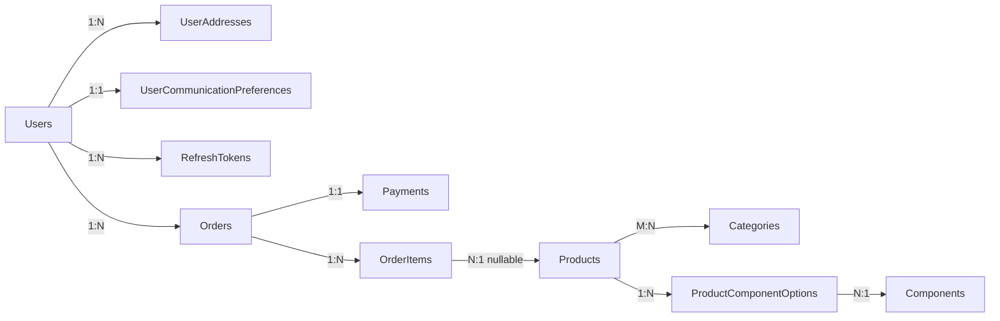

# Diseño de Base de Datos

## Visión General

Base de datos relacional PostgreSQL 16 gestionada con **Entity Framework Core (Code First)**. El schema se genera y evoluciona mediante migraciones de EF Core — no se escribe SQL directamente para crear tablas.

### Características del Modelo

- **20 tablas** (17 entidades de dominio + 7 tablas de ASP.NET Identity + 1 tabla join M:M)
- **ASP.NET Identity** para autenticación y gestión de roles
- **Soporte multiidioma** via tablas de traducciones separadas
- **Sistema de componentes** para personalización de productos con visor 3D
- **Auditoría automática** de `CreatedAt`/`UpdatedAt` en `SaveChangesAsync`
- **Patrón Code First**: las migraciones son la fuente de verdad del schema

---

## Diagrama Entidad-Relación



---

## Diagrama de Agrupación por Módulos



---

## Entidades Detalladas

### 1. Usuarios y Autenticación

#### `Users` — extiende `IdentityUser<Guid>`

ASP.NET Identity gestiona email, password hash, 2FA, email confirmation, etc. Esta entidad añade campos de negocio.

| Propiedad | Tipo | Descripción |
|-----------|------|-------------|
| `Id` | `Guid` | PK (heredado de Identity) |
| `Email` | `string` | Email único (Identity) |
| `PasswordHash` | `string` | Hash bcrypt (Identity) |
| `EmailConfirmed` | `bool` | Verificación de email (Identity) |
| `TwoFactorEnabled` | `bool` | 2FA (Identity) |
| `FirstName` | `string?` | Nombre |
| `LastName` | `string?` | Apellido |
| `Phone` | `string?` | Teléfono |
| `Language` | `string` | Idioma preferido (`"es"` por defecto) |
| `CreatedAt` | `DateTime` | Auto-set en INSERT |
| `UpdatedAt` | `DateTime` | Auto-set en INSERT/UPDATE |

**Tablas de Identity generadas automáticamente:** `Roles`, `UserRoles`, `UserClaims`, `UserLogins`, `UserTokens`, `RoleClaims`

---

#### `UserAddresses`

Direcciones de facturación o envío del usuario.

| Propiedad | Tipo | Descripción |
|-----------|------|-------------|
| `Id` | `Guid` | PK |
| `UserId` | `Guid` | FK → `Users` (CASCADE) |
| `Name` | `string?` | Etiqueta de la dirección |
| `AddressType` | `AddressType` | Enum: `Billing`, `Delivery` |
| `Street` | `string` | Calle |
| `City` | `string` | Ciudad |
| `State` | `string?` | Provincia/estado |
| `PostalCode` | `string` | Código postal |
| `Country` | `string` | ISO 3166-1 alpha-2 (default: `"ES"`) |
| `IsDefault` | `bool` | Dirección predeterminada |
| `CreatedAt` | `DateTime` | Auto-set en INSERT |

---

#### `UserCommunicationPreferences`

Preferencias de comunicación (relación 1:1 con usuario).

| Propiedad | Tipo | Descripción |
|-----------|------|-------------|
| `Id` | `Guid` | PK |
| `UserId` | `Guid` | FK → `Users` (1:1) |
| `Newsletter` | `bool` | Acepta emails de newsletter |
| `OrderNotifications` | `bool` | Acepta notificaciones de pedidos |
| `SmsPromotions` | `bool` | Acepta SMS promocionales |
| `CreatedAt` | `DateTime` | Auto-set en INSERT |
| `UpdatedAt` | `DateTime` | Auto-set en INSERT/UPDATE |

---

#### `RefreshTokens`

Tokens de refresco para renovar JWTs sin re-autenticación.

| Propiedad | Tipo | Descripción |
|-----------|------|-------------|
| `Id` | `Guid` | PK |
| `Token` | `string` | Token opaco único |
| `UserId` | `Guid` | FK → `Users` (CASCADE) |
| `ExpiresAt` | `DateTime` | Fecha de expiración |
| `CreatedAt` | `DateTime` | Auto-set en INSERT |
| `RevokedAt` | `DateTime?` | Fecha de revocación (null = activo) |
| `ReplacedByToken` | `string?` | Token que lo reemplazó (rotación) |

**Propiedades calculadas (no persistidas):** `IsExpired`, `IsRevoked`, `IsActive`

---

### 2. Catálogo de Productos

#### `Products`

Producto base sin traducciones ni personalización.

| Propiedad | Tipo | Descripción |
|-----------|------|-------------|
| `Id` | `Guid` | PK |
| `Sku` | `string` | Código único (UNIQUE, max 50) |
| `BasePrice` | `decimal(10,2)` | Precio base sin IVA |
| `VatRate` | `decimal(5,2)` | Tipo IVA (default: 21.00) |
| `Model3dUrl` | `string?` | Ruta al archivo `.glb` (max 500) |
| `Model3dSizeKb` | `int?` | Tamaño del modelo 3D |
| `IsActive` | `bool` | Visible en tienda (default: true) |
| `IsCustomizable` | `bool` | Permite personalización 3D (default: true) |
| `BaseProductionDays` | `int` | Días base de producción (default: 7) |
| `WeightGrams` | `int?` | Peso en gramos |
| `CreatedAt` | `DateTime` | Auto-set en INSERT |
| `UpdatedAt` | `DateTime` | Auto-set en INSERT/UPDATE |

---

#### `ProductTranslations`

Contenido multiidioma de productos (nombre, descripciones, SEO, slug).

| Propiedad | Tipo | Descripción |
|-----------|------|-------------|
| `Id` | `Guid` | PK |
| `ProductId` | `Guid` | FK → `Products` (CASCADE) |
| `Locale` | `string` | Idioma (`"es"`, `"en"`) |
| `Name` | `string` | Nombre del producto |
| `ShortDescription` | `string?` | Descripción corta |
| `LongDescription` | `string?` | Descripción larga |
| `MetaTitle` | `string?` | SEO title |
| `MetaDescription` | `string?` | SEO description |
| `Slug` | `string` | URL amigable única por idioma |

**Restricción única:** `(ProductId, Locale)`

---

#### `ProductImages`

Galería de imágenes de un producto.

| Propiedad | Tipo | Descripción |
|-----------|------|-------------|
| `Id` | `Guid` | PK |
| `ProductId` | `Guid` | FK → `Products` (CASCADE) |
| `ImageUrl` | `string` | URL de la imagen |
| `AltText` | `string?` | Texto alternativo |
| `DisplayOrder` | `int` | Orden de visualización |
| `CreatedAt` | `DateTime` | Auto-set en INSERT |

---

#### `ProductSpecifications`

Especificaciones técnicas como tabla clave-valor localizada.

| Propiedad | Tipo | Descripción |
|-----------|------|-------------|
| `Id` | `Guid` | PK |
| `ProductId` | `Guid` | FK → `Products` (CASCADE) |
| `Locale` | `string` | Idioma de la especificación |
| `SpecKey` | `string` | Clave (ej: `"dimensions"`, `"weight"`) |
| `SpecValue` | `string` | Valor (ej: `"30cm × 28cm × 12cm"`) |
| `DisplayOrder` | `int` | Orden de visualización |

---

### 3. Categorías

#### `Categories`

Categorías de productos con soporte jerárquico.

| Propiedad | Tipo | Descripción |
|-----------|------|-------------|
| `Id` | `Guid` | PK |
| `ParentCategory` | `Guid?` | FK → `Categories` (auto-referencia, nullable) |
| `IsActive` | `bool` | Visible en tienda (default: true) |
| `CreatedAt` | `DateTime` | Auto-set en INSERT |
| `UpdatedAt` | `DateTime` | Auto-set en INSERT/UPDATE |

---

#### `CategoryTranslations`

| Propiedad | Tipo | Descripción |
|-----------|------|-------------|
| `Id` | `Guid` | PK |
| `CategoryId` | `Guid` | FK → `Categories` (CASCADE) |
| `Locale` | `string` | Idioma |
| `Name` | `string` | Nombre de la categoría |
| `ShortDescription` | `string?` | Descripción corta |
| `Slug` | `string` | URL amigable |

---

#### `CategoryImages`

| Propiedad | Tipo | Descripción |
|-----------|------|-------------|
| `Id` | `Guid` | PK |
| `CategoryId` | `Guid` | FK → `Categories` (CASCADE, 1:1) |
| `ImageUrl` | `string` | URL de la imagen |
| `AltText` | `string?` | Texto alternativo |
| `CreatedAt` | `DateTime` | Auto-set en INSERT |

---

#### `ProductCategories` (tabla join M:M)

Generada automáticamente por EF Core para la relación muchos-a-muchos entre `Products` y `Categories`.

| Columna | Tipo | Descripción |
|---------|------|-------------|
| `ProductId` | `Guid` | FK → `Products` (CASCADE) |
| `CategoryId` | `Guid` | FK → `Categories` (CASCADE) |

---

### 4. Componentes (Personalización 3D)

#### `Components`

Piezas físicas que forman los productos configurables.

| Propiedad | Tipo | Descripción |
|-----------|------|-------------|
| `Id` | `Guid` | PK |
| `Sku` | `string` | Código único (UNIQUE, max 50) |
| `ComponentType` | `string` | Tipo (ej: `grip`, `button_plate`, `base`) |
| `StockQuantity` | `int` | Stock disponible (≥ 0) |
| `MinStockThreshold` | `int` | Umbral de alerta de stock bajo (default: 5) |
| `LeadTimeDays` | `int` | Días extra si hay bajo stock |
| `WeightGrams` | `int?` | Peso del componente |
| `CostPrice` | `decimal?` | Precio de coste |
| `CreatedAt` | `DateTime` | Auto-set en INSERT |
| `UpdatedAt` | `DateTime` | Auto-set en INSERT/UPDATE |

**Lógica de stock:** si `StockQuantity <= MinStockThreshold` → mostrar "bajo stock" y añadir `LeadTimeDays` al tiempo de fabricación.

---

#### `ComponentTranslations`

| Propiedad | Tipo | Descripción |
|-----------|------|-------------|
| `Id` | `Guid` | PK |
| `ComponentId` | `Guid` | FK → `Components` (CASCADE) |
| `Locale` | `string` | Idioma |
| `Name` | `string` | Nombre del componente |
| `Description` | `string?` | Descripción |

**Restricción única:** `(ComponentId, Locale)`

---

#### `ProductComponentOptions`

Qué componentes puede usar cada producto y cómo se muestran en el configurador 3D.

| Propiedad | Tipo | Descripción |
|-----------|------|-------------|
| `Id` | `Guid` | PK |
| `ProductId` | `Guid` | FK → `Products` (CASCADE) |
| `ComponentId` | `Guid` | FK → `Components` |
| `OptionGroup` | `string` | Grupo de opción (ej: `grip_color`, `button_layout`) |
| `IsGroupRequired` | `bool` | Si el grupo es obligatorio (default: false) |
| `GlbObjectName` | `string?` | Nombre del objeto en el archivo `.glb` para swap 3D |
| `ThumbnailUrl` | `string?` | Miniatura para el selector |
| `PriceModifier` | `decimal` | Incremento de precio por esta opción |
| `IsDefault` | `bool` | Opción seleccionada por defecto |
| `DisplayOrder` | `int` | Orden en el configurador |

---

### 5. Pedidos

#### `Orders`

| Propiedad | Tipo | Descripción |
|-----------|------|-------------|
| `Id` | `Guid` | PK |
| `OrderNumber` | `string` | Número único (UNIQUE, ej: `ORD-2026-0001`) |
| `UserId` | `Guid?` | FK → `Users` (SET NULL) — nullable para pedidos de invitados |
| `ShippingStreet` | `string` | Calle de envío |
| `ShippingCity` | `string` | Ciudad de envío |
| `ShippingState` | `string?` | Provincia de envío |
| `ShippingPostalCode` | `string` | CP de envío |
| `ShippingCountry` | `string` | País (default: `"ES"`) |
| `PaymentId` | `Guid?` | FK → `Payments` (1:1) |
| `Subtotal` | `decimal(18,2)` | Subtotal sin IVA ni envío |
| `VatAmount` | `decimal(18,2)` | Importe del IVA |
| `ShippingCost` | `decimal(18,2)` | Coste de envío |
| `TotalAmount` | `decimal(18,2)` | Total final |
| `OrderStatus` | `string` | Estado (default: `"pending"`) |
| `EstimatedProductionDays` | `int?` | Días estimados de producción |
| `ProductionNotes` | `string?` | Notas internas de producción |
| `TrackingNumber` | `string?` | Número de seguimiento |
| `ShippedAt` | `DateTime?` | Fecha de envío |
| `Notes` | `string?` | Notas del pedido |
| `CreatedAt` | `DateTime` | Auto-set en INSERT |
| `UpdatedAt` | `DateTime` | Auto-set en INSERT/UPDATE |

**Estados del pedido:** `pending` → `paid` → `in_production` → `shipped` → `completed` / `cancelled`

---

#### `OrderItems`

Líneas de un pedido. Guarda un snapshot del producto para preservar el estado en el momento de la compra.

| Propiedad | Tipo | Descripción |
|-----------|------|-------------|
| `Id` | `Guid` | PK |
| `OrderId` | `Guid` | FK → `Orders` (CASCADE) |
| `ProductId` | `Guid?` | FK → `Products` (SET NULL) — snapshot por si se borra el producto |
| `ProductName` | `string` | Snapshot: nombre del producto |
| `ProductSku` | `string` | Snapshot: SKU del producto |
| `ConfigurationJson` | `string?` | Snapshot: configuración de componentes (tipo `jsonb`) |
| `Quantity` | `int` | Cantidad |
| `UnitPrice` | `decimal(10,2)` | Precio unitario en el momento de compra |
| `LineTotal` | `decimal(10,2)` | Total de la línea |
| `CreatedAt` | `DateTime` | Auto-set en INSERT |

---

#### `Payments`

Registro del pago asociado a un pedido (relación 1:1).

| Propiedad | Tipo | Descripción |
|-----------|------|-------------|
| `Id` | `Guid` | PK |
| `OrderId` | `Guid` | FK → `Orders` (CASCADE, UNIQUE) |
| `UserId` | `Guid?` | FK → `Users` (SET NULL) |
| `PaymentMethod` | `string?` | Método (ej: `stripe`, `paypal`) |
| `PaymentStatus` | `string` | Estado (default: `"pending"`) |
| `PaymentTransactionId` | `string?` | ID de transacción del proveedor |
| `Amount` | `decimal(18,2)` | Importe cobrado |
| `PaidAt` | `DateTime?` | Fecha de pago efectivo |
| `CreatedAt` | `DateTime` | Auto-set en INSERT |
| `UpdatedAt` | `DateTime` | Auto-set en INSERT/UPDATE |

**Estados del pago:** `pending` → `paid` / `failed` / `refunded`

---

### 6. Envíos

#### `ShippingZones`

Zonas de envío con tarifas configurables.

| Propiedad | Tipo | Descripción |
|-----------|------|-------------|
| `Id` | `Guid` | PK |
| `Name` | `string` | Nombre (ej: `"Península"`, `"Baleares"`) |
| `PostalCodePrefixes` | `string` | Prefijos CP separados por coma (ej: `"35,38"`) |
| `BaseCost` | `decimal` | Coste base de envío en euros |
| `CostPerKg` | `decimal` | Coste por kilogramo en euros |
| `FreeShippingThreshold` | `decimal` | Pedido mínimo para envío gratuito |
| `IsActive` | `bool` | Zona activa (default: true) |
| `CreatedAt` | `DateTime` | Auto-set en INSERT |
| `UpdatedAt` | `DateTime` | Auto-set en INSERT/UPDATE |

**Cálculo:** `coste = BaseCost + (peso_kg × CostPerKg)` — gratuito si `total_pedido >= FreeShippingThreshold`

---

## Gestión de Migraciones (Code First)

El schema de base de datos se genera y actualiza exclusivamente mediante migraciones de EF Core. **No se escribe SQL manualmente para crear o modificar tablas.**

```bash
# Crear nueva migración
dotnet ef migrations add <NombreMigración> \
  --project src/SimRacingShop.Infrastructure \
  --startup-project src/SimRacingShop.API

# Aplicar migraciones pendientes
dotnet ef database update \
  --project src/SimRacingShop.Infrastructure \
  --startup-project src/SimRacingShop.API

# Revertir última migración
dotnet ef database update <MigraciónAnterior> \
  --project src/SimRacingShop.Infrastructure \
  --startup-project src/SimRacingShop.API
```

### Migraciones existentes

| Migración | Descripción |
|-----------|-------------|
| `20260130201519_InitialMigration` | Schema inicial: Users, Products, Orders, OrderItems, ShippingZones |
| `20260204182930_AddRefreshTokens` | Tabla `RefreshTokens` |
| `20260210175659_AddComponents` | Tablas `Components`, `ComponentTranslations`, `ProductComponentOptions` |
| `20260210180358_AddCategories` | Tablas `Categories`, `CategoryTranslations`, `CategoryImages`, `ProductCategories` |

---

## Auditoría Automática de Timestamps

`ApplicationDbContext.SaveChangesAsync` intercepta todos los cambios y actualiza automáticamente `CreatedAt` y `UpdatedAt` sin necesidad de triggers SQL:

```csharp
// En SaveChangesAsync:
// Estado Added  → establece CreatedAt = DateTime.UtcNow
// Estado Added/Modified → establece UpdatedAt = DateTime.UtcNow
```

---

## Índices Configurados

| Tabla | Índice | Tipo |
|-------|--------|------|
| `Users` | `Email` | UNIQUE (Identity) |
| `Products` | `Sku` | UNIQUE |
| `Products` | `IsActive` | |
| `Orders` | `OrderNumber` | UNIQUE |
| `Orders` | `UserId` | |
| `Orders` | `OrderStatus` | |
| `Orders` | `CreatedAt` | |
| `Payments` | `OrderId` | UNIQUE |
| `Payments` | `UserId` | |
| `Payments` | `PaymentStatus` | |
| `Payments` | `PaymentTransactionId` | |
| `Payments` | `(PaymentStatus, CreatedAt)` | Compuesto |
| `OrderItems` | `OrderId` | |
| `OrderItems` | `ProductId` | |
| `Components` | `Sku` | UNIQUE |
| `RefreshTokens` | `Token` | UNIQUE |

---

## Relaciones Clave



---

## Configuración de la Conexión

```json
// appsettings.Development.json
{
  "ConnectionStrings": {
    "DefaultConnection": "Host=localhost;Port=5432;Database=simracing;Username=postgres;Password=postgres"
  }
}
```

- **PostgreSQL 16**: `localhost:5432`
- **Base de datos**: `simracing`
- **Tipo de columna especial**: `jsonb` para `OrderItems.ConfigurationJson` (búsquedas indexadas en PostgreSQL)

---

**Última actualización:** Marzo 2026
**Versión schema:** ver migraciones en `SimRacingShop.Infrastructure/Data/Migrations/`
**ORM:** Entity Framework Core 10 (Code First)
**PostgreSQL:** 16+
