# API Architecture Documentation

## Descripción General

SimRacing Shop API es el backend de una plataforma e-commerce para hardware de sim racing personalizable. Está construida con **.NET 10** siguiendo los principios de **Clean Architecture** y proporciona servicios RESTful para autenticación, gestión de usuarios, productos y pedidos.

### Stack Tecnológico

| Tecnología | Uso |
|------------|-----|
| ASP.NET Core 10 | Framework web |
| PostgreSQL 16 | Base de datos relacional |
| Redis 7 | Cache distribuido |
| Entity Framework Core | ORM |
| ASP.NET Identity | Gestión de usuarios y roles |
| JWT + Refresh Tokens | Autenticación stateless |
| FluentValidation | Validación de DTOs (capa dominio) |
| Serilog | Logging estructurado |
| Resend | Servicio de emails |

### Arquitectura de Capas

```
┌─────────────────────────────────────────────────────────────┐
│                    SimRacingShop.API                        │
│              (Controllers, Middleware, Config)              │
├─────────────────────────────────────────────────────────────┤
│                   SimRacingShop.Core                        │
│        (Entities, DTOs, Validators, Settings, Interfaces)   │
├─────────────────────────────────────────────────────────────┤
│                SimRacingShop.Infrastructure                 │
│         (DbContext, Repositories, Services, EF Config)      │
├─────────────────────────────────────────────────────────────┤
│               PostgreSQL 16        Redis 7                  │
│              (Persistencia)    (Cache distribuido)           │
└─────────────────────────────────────────────────────────────┘
```

### Estructura de Proyectos

```
backend/src/
├── SimRacingShop.API/
│   ├── Controllers/          # Endpoints REST
│   ├── Program.cs            # Configuración DI y middleware
│   └── appsettings.json      # Configuración
├── SimRacingShop.Core/
│   ├── DTOs/                 # Objetos de transferencia
│   ├── Entities/             # Entidades de dominio
│   ├── Repositories/         # Interfaces de repositorios
│   ├── Services/             # Interfaces de servicios
│   ├── Settings/             # Clases de configuración
│   └── Validators/           # FluentValidation (reglas de dominio)
└── SimRacingShop.Infrastructure/
    ├── Data/                 # DbContext y configuraciones EF
    ├── Repositories/         # Implementaciones de repositorios
    └── Services/             # Implementaciones de servicios
```

### Características de Seguridad

- **Validación de contraseñas**: Mínimo 8 caracteres, mayúscula, minúscula y dígito
- **Bloqueo de cuenta**: 15 minutos después de 5 intentos fallidos
- **Security Stamp**: Invalidación de tokens tras logout o cambio de contraseña
- **Rotación de Refresh Tokens**: Token anterior revocado al emitir uno nuevo
- **HTTPS**: Redirección automática en producción

---

## Controladores

### 1. AuthController

**Ruta Base**: `/api/auth`

**Descripción**: Controlador de autenticación y autorización. Gestiona el registro de usuarios, inicio de sesión, renovación de tokens JWT, recuperación de contraseña y cierre de sesión. Implementa un flujo completo de autenticación basado en JWT con soporte para refresh tokens persistidos en base de datos.

**Dependencias**:
- `IAuthService`: Servicio de autenticación
- `ILogger<AuthController>`: Logging

---

#### POST `/api/auth/register`

**Descripción**: Registra un nuevo usuario en el sistema. Crea la cuenta, asigna el rol "Customer" por defecto y retorna tokens de autenticación.

**Autenticación requerida**: No

**Parámetros de entrada**:

| Campo | Tipo | Requerido | Descripción |
|-------|------|-----------|-------------|
| `email` | string | Sí | Email del usuario (formato válido) |
| `password` | string | Sí | Contraseña (min 8 chars, mayúscula, minúscula, dígito) |
| `confirmPassword` | string | Sí | Confirmación de contraseña (debe coincidir) |
| `firstName` | string | No | Nombre del usuario |
| `lastName` | string | No | Apellido del usuario |
| `language` | string | No | Idioma preferido (default: "es") |

**Respuesta exitosa** (201 Created):

```json
{
  "token": "eyJhbGciOiJIUzI1NiIs...",
  "refreshToken": "base64-encoded-string",
  "expiresAt": "2026-02-05T15:00:00Z",
  "user": {
    "id": "550e8400-e29b-41d4-a716-446655440000",
    "email": "user@example.com",
    "firstName": "John",
    "lastName": "Doe",
    "language": "es",
    "emailVerified": false,
    "roles": ["Customer"]
  }
}
```

**Errores posibles**:
- `400 Bad Request`: Datos inválidos o email ya registrado

**Diagrama de secuencia**:

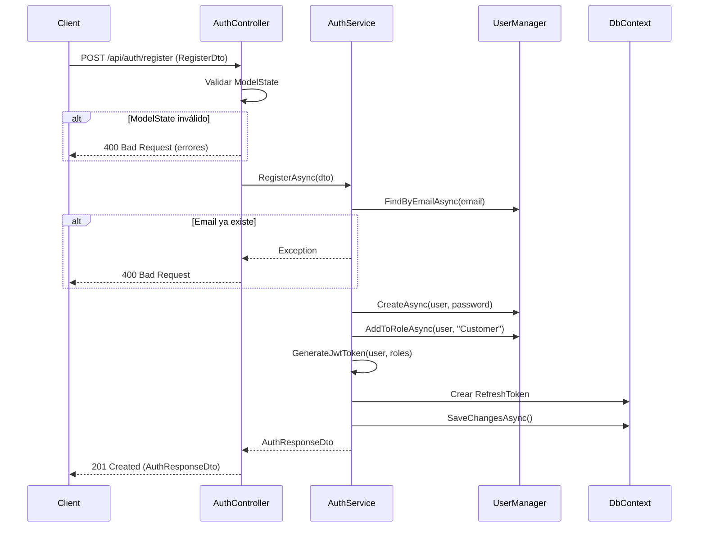
```mermaid
sequenceDiagram
    participant Client
    participant AuthController
    participant AuthService
    participant UserManager
    participant DbContext

    Client->>AuthController: POST /api/auth/register (RegisterDto)
    AuthController->>AuthController: Validar ModelState

    alt ModelState inválido
        AuthController-->>Client: 400 Bad Request (errores)
    end

    AuthController->>AuthService: RegisterAsync(dto)
    AuthService->>UserManager: FindByEmailAsync(email)

    alt Email ya existe
        AuthService-->>AuthController: Exception
        AuthController-->>Client: 400 Bad Request
    end

    AuthService->>UserManager: CreateAsync(user, password)
    AuthService->>UserManager: AddToRoleAsync(user, "Customer")
    AuthService->>AuthService: GenerateJwtToken(user, roles)
    AuthService->>DbContext: Crear RefreshToken
    AuthService->>DbContext: SaveChangesAsync()
    AuthService-->>AuthController: AuthResponseDto
    AuthController-->>Client: 201 Created (AuthResponseDto)
```

---

#### POST `/api/auth/login`

**Descripción**: Autentica un usuario existente con email y contraseña. Soporta la opción "recordarme" que extiende la duración del refresh token.

**Autenticación requerida**: No

**Parámetros de entrada**:

| Campo | Tipo | Requerido | Descripción |
|-------|------|-----------|-------------|
| `email` | string | Sí | Email del usuario |
| `password` | string | Sí | Contraseña del usuario |
| `rememberMe` | boolean | No | Extender duración del refresh token (default: false) |

**Respuesta exitosa** (200 OK):

```json
{
  "token": "eyJhbGciOiJIUzI1NiIs...",
  "refreshToken": "base64-encoded-string",
  "expiresAt": "2026-02-05T15:00:00Z",
  "user": {
    "id": "550e8400-e29b-41d4-a716-446655440000",
    "email": "user@example.com",
    "firstName": "John",
    "lastName": "Doe",
    "language": "es",
    "emailVerified": false,
    "roles": ["Customer", "Admin"]
  }
}
```

**Errores posibles**:
- `400 Bad Request`: Datos inválidos
- `401 Unauthorized`: Credenciales incorrectas o cuenta bloqueada

**Diagrama de secuencia**:

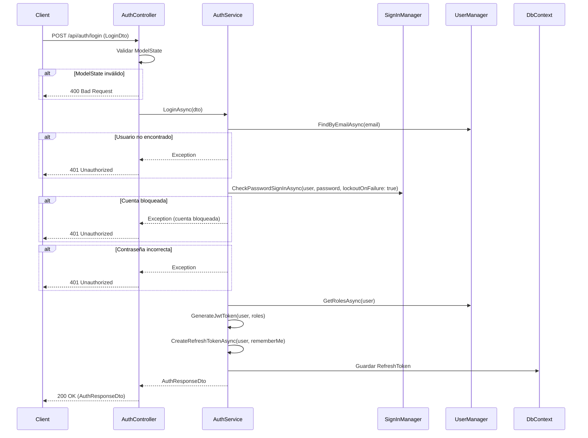
```mermaid
sequenceDiagram
    participant Client
    participant AuthController
    participant AuthService
    participant SignInManager
    participant UserManager
    participant DbContext

    Client->>AuthController: POST /api/auth/login (LoginDto)
    AuthController->>AuthController: Validar ModelState

    alt ModelState inválido
        AuthController-->>Client: 400 Bad Request
    end

    AuthController->>AuthService: LoginAsync(dto)
    AuthService->>UserManager: FindByEmailAsync(email)

    alt Usuario no encontrado
        AuthService-->>AuthController: Exception
        AuthController-->>Client: 401 Unauthorized
    end

    AuthService->>SignInManager: CheckPasswordSignInAsync(user, password, lockoutOnFailure: true)

    alt Cuenta bloqueada
        AuthService-->>AuthController: Exception (cuenta bloqueada)
        AuthController-->>Client: 401 Unauthorized
    end

    alt Contraseña incorrecta
        AuthService-->>AuthController: Exception
        AuthController-->>Client: 401 Unauthorized
    end

    AuthService->>UserManager: GetRolesAsync(user)
    AuthService->>AuthService: GenerateJwtToken(user, roles)
    AuthService->>AuthService: CreateRefreshTokenAsync(user, rememberMe)
    AuthService->>DbContext: Guardar RefreshToken
    AuthService-->>AuthController: AuthResponseDto
    AuthController-->>Client: 200 OK (AuthResponseDto)
```

---

#### POST `/api/auth/refresh-token`

**Descripción**: Renueva un JWT expirado usando un refresh token válido. El refresh token anterior es revocado (rotación de tokens).

**Autenticación requerida**: No

**Parámetros de entrada**:

| Campo | Tipo | Requerido | Descripción |
|-------|------|-----------|-------------|
| `refreshToken` | string | Sí | Refresh token válido |

**Respuesta exitosa** (200 OK):

```json
{
  "token": "eyJhbGciOiJIUzI1NiIs...",
  "refreshToken": "nuevo-base64-encoded-string",
  "expiresAt": "2026-02-05T16:00:00Z",
  "user": {
    "id": "550e8400-e29b-41d4-a716-446655440000",
    "email": "user@example.com",
    "firstName": "John",
    "lastName": "Doe",
    "language": "es",
    "emailVerified": false,
    "roles": ["Customer"]
  }
}
```

**Errores posibles**:
- `400 Bad Request`: Datos inválidos
- `401 Unauthorized`: Token inválido, expirado o revocado

**Diagrama de secuencia**:

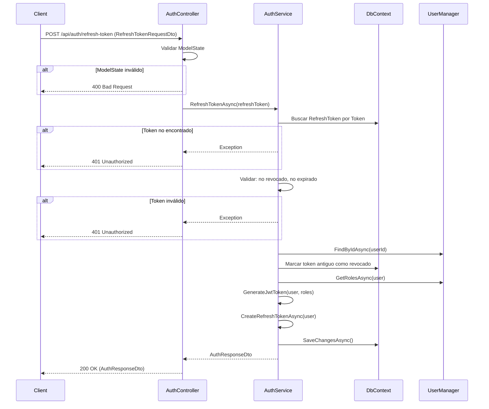
```mermaid
sequenceDiagram
    participant Client
    participant AuthController
    participant AuthService
    participant DbContext
    participant UserManager

    Client->>AuthController: POST /api/auth/refresh-token (RefreshTokenRequestDto)
    AuthController->>AuthController: Validar ModelState

    alt ModelState inválido
        AuthController-->>Client: 400 Bad Request
    end

    AuthController->>AuthService: RefreshTokenAsync(refreshToken)
    AuthService->>DbContext: Buscar RefreshToken por Token

    alt Token no encontrado
        AuthService-->>AuthController: Exception
        AuthController-->>Client: 401 Unauthorized
    end

    AuthService->>AuthService: Validar: no revocado, no expirado

    alt Token inválido
        AuthService-->>AuthController: Exception
        AuthController-->>Client: 401 Unauthorized
    end

    AuthService->>UserManager: FindByIdAsync(userId)
    AuthService->>DbContext: Marcar token antiguo como revocado
    AuthService->>UserManager: GetRolesAsync(user)
    AuthService->>AuthService: GenerateJwtToken(user, roles)
    AuthService->>AuthService: CreateRefreshTokenAsync(user)
    AuthService->>DbContext: SaveChangesAsync()
    AuthService-->>AuthController: AuthResponseDto
    AuthController-->>Client: 200 OK (AuthResponseDto)
```

---

#### POST `/api/auth/forgot-password`

**Descripción**: Inicia el proceso de recuperación de contraseña. Envía un email con un enlace de reset si el usuario existe. Por seguridad, siempre retorna éxito independientemente de si el email existe.

**Autenticación requerida**: No

**Parámetros de entrada**:

| Campo | Tipo | Requerido | Descripción |
|-------|------|-----------|-------------|
| `email` | string | Sí | Email del usuario (formato válido) |

**Respuesta exitosa** (200 OK):

```json
{
  "message": "Si el email existe, recibirás instrucciones para restablecer tu contraseña."
}
```

**Errores posibles**:
- `400 Bad Request`: Formato de email inválido

**Diagrama de secuencia**:

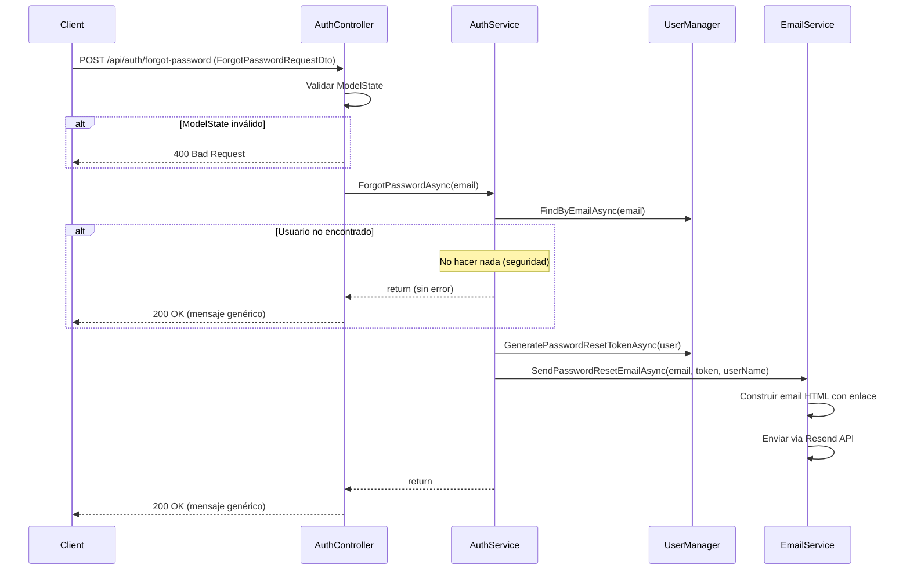
```mermaid
sequenceDiagram
    participant Client
    participant AuthController
    participant AuthService
    participant UserManager
    participant EmailService

    Client->>AuthController: POST /api/auth/forgot-password (ForgotPasswordRequestDto)
    AuthController->>AuthController: Validar ModelState

    alt ModelState inválido
        AuthController-->>Client: 400 Bad Request
    end

    AuthController->>AuthService: ForgotPasswordAsync(email)
    AuthService->>UserManager: FindByEmailAsync(email)

    alt Usuario no encontrado
        Note over AuthService: No hacer nada (seguridad)
        AuthService-->>AuthController: return (sin error)
        AuthController-->>Client: 200 OK (mensaje genérico)
    end

    AuthService->>UserManager: GeneratePasswordResetTokenAsync(user)
    AuthService->>EmailService: SendPasswordResetEmailAsync(email, token, userName)
    EmailService->>EmailService: Construir email HTML con enlace
    EmailService->>EmailService: Enviar via Resend API
    AuthService-->>AuthController: return
    AuthController-->>Client: 200 OK (mensaje genérico)
```

---

#### POST `/api/auth/reset-password`

**Descripción**: Completa el proceso de recuperación de contraseña. Valida el token recibido por email y establece la nueva contraseña. Revoca todos los refresh tokens activos del usuario.

**Autenticación requerida**: No

**Parámetros de entrada**:

| Campo | Tipo | Requerido | Descripción |
|-------|------|-----------|-------------|
| `email` | string | Sí | Email del usuario |
| `token` | string | Sí | Token de reset (recibido por email) |
| `newPassword` | string | Sí | Nueva contraseña (min 8 chars) |
| `confirmPassword` | string | Sí | Confirmación de contraseña |

**Respuesta exitosa** (200 OK):

```json
{
  "message": "Contraseña restablecida exitosamente."
}
```

**Errores posibles**:
- `400 Bad Request`: Token inválido, expirado o contraseñas no coinciden

**Diagrama de secuencia**:

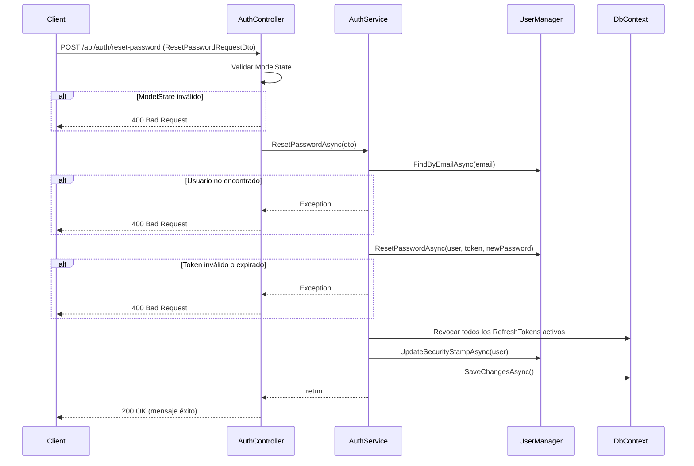
```mermaid
sequenceDiagram
    participant Client
    participant AuthController
    participant AuthService
    participant UserManager
    participant DbContext

    Client->>AuthController: POST /api/auth/reset-password (ResetPasswordRequestDto)
    AuthController->>AuthController: Validar ModelState

    alt ModelState inválido
        AuthController-->>Client: 400 Bad Request
    end

    AuthController->>AuthService: ResetPasswordAsync(dto)
    AuthService->>UserManager: FindByEmailAsync(email)

    alt Usuario no encontrado
        AuthService-->>AuthController: Exception
        AuthController-->>Client: 400 Bad Request
    end

    AuthService->>UserManager: ResetPasswordAsync(user, token, newPassword)

    alt Token inválido o expirado
        AuthService-->>AuthController: Exception
        AuthController-->>Client: 400 Bad Request
    end

    AuthService->>DbContext: Revocar todos los RefreshTokens activos
    AuthService->>UserManager: UpdateSecurityStampAsync(user)
    AuthService->>DbContext: SaveChangesAsync()
    AuthService-->>AuthController: return
    AuthController-->>Client: 200 OK (mensaje éxito)
```

---

#### GET `/api/auth/me`

**Descripción**: Obtiene la información del usuario autenticado actual basándose en el JWT proporcionado.

**Autenticación requerida**: Sí (Bearer Token)

**Parámetros de entrada**: Ninguno (usuario extraído del JWT)

**Respuesta exitosa** (200 OK):

```json
{
  "id": "550e8400-e29b-41d4-a716-446655440000",
  "email": "user@example.com",
  "firstName": "John",
  "lastName": "Doe",
  "language": "es",
  "emailVerified": false,
  "roles": ["Customer"]
}
```

**Errores posibles**:
- `401 Unauthorized`: Token no proporcionado o inválido
- `404 Not Found`: Usuario no encontrado

**Diagrama de secuencia**:

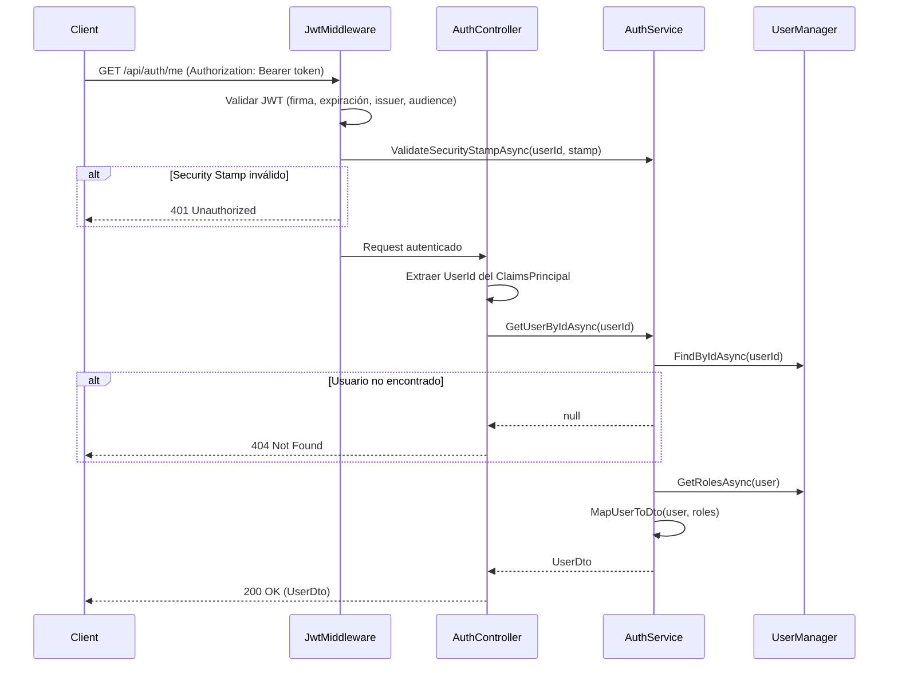
```mermaid
sequenceDiagram
    participant Client
    participant JwtMiddleware
    participant AuthController
    participant AuthService
    participant UserManager

    Client->>JwtMiddleware: GET /api/auth/me (Authorization: Bearer token)
    JwtMiddleware->>JwtMiddleware: Validar JWT (firma, expiración, issuer, audience)
    JwtMiddleware->>AuthService: ValidateSecurityStampAsync(userId, stamp)

    alt Security Stamp inválido
        JwtMiddleware-->>Client: 401 Unauthorized
    end

    JwtMiddleware->>AuthController: Request autenticado
    AuthController->>AuthController: Extraer UserId del ClaimsPrincipal
    AuthController->>AuthService: GetUserByIdAsync(userId)
    AuthService->>UserManager: FindByIdAsync(userId)

    alt Usuario no encontrado
        AuthService-->>AuthController: null
        AuthController-->>Client: 404 Not Found
    end

    AuthService->>UserManager: GetRolesAsync(user)
    AuthService->>AuthService: MapUserToDto(user, roles)
    AuthService-->>AuthController: UserDto
    AuthController-->>Client: 200 OK (UserDto)
```

---

#### GET `/api/auth/test-auth`

**Descripción**: Endpoint de prueba para verificar que la autenticación JWT funciona correctamente. Útil durante desarrollo.

**Autenticación requerida**: Sí (Bearer Token)

**Parámetros de entrada**: Ninguno

**Respuesta exitosa** (200 OK):

```json
{
  "message": "Authenticated!",
  "userId": "550e8400-e29b-41d4-a716-446655440000",
  "email": "user@example.com",
  "roles": ["Customer"]
}
```

**Errores posibles**:
- `401 Unauthorized`: Token no proporcionado o inválido

**Diagrama de secuencia**:

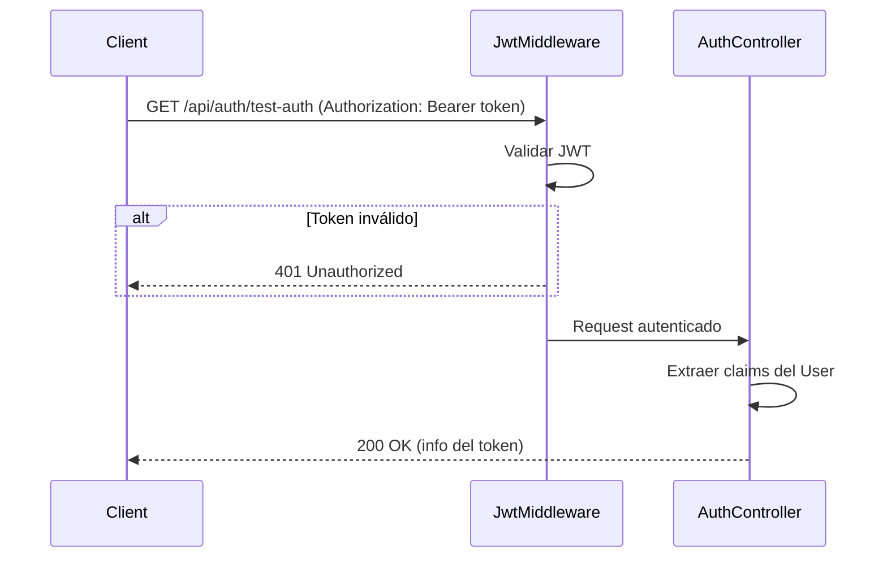
```mermaid
sequenceDiagram
    participant Client
    participant JwtMiddleware
    participant AuthController

    Client->>JwtMiddleware: GET /api/auth/test-auth (Authorization: Bearer token)
    JwtMiddleware->>JwtMiddleware: Validar JWT

    alt Token inválido
        JwtMiddleware-->>Client: 401 Unauthorized
    end

    JwtMiddleware->>AuthController: Request autenticado
    AuthController->>AuthController: Extraer claims del User
    AuthController-->>Client: 200 OK (info del token)
```

---

#### GET `/api/auth/admin-only`

**Descripción**: Endpoint de prueba que solo permite acceso a usuarios con el rol "Admin". Útil para verificar autorización basada en roles.

**Autenticación requerida**: Sí (Bearer Token con rol Admin)

**Parámetros de entrada**: Ninguno

**Respuesta exitosa** (200 OK):

```json
{
  "message": "Welcome, Admin!"
}
```

**Errores posibles**:
- `401 Unauthorized`: Token no proporcionado o inválido
- `403 Forbidden`: Usuario autenticado pero sin rol Admin

**Diagrama de secuencia**:

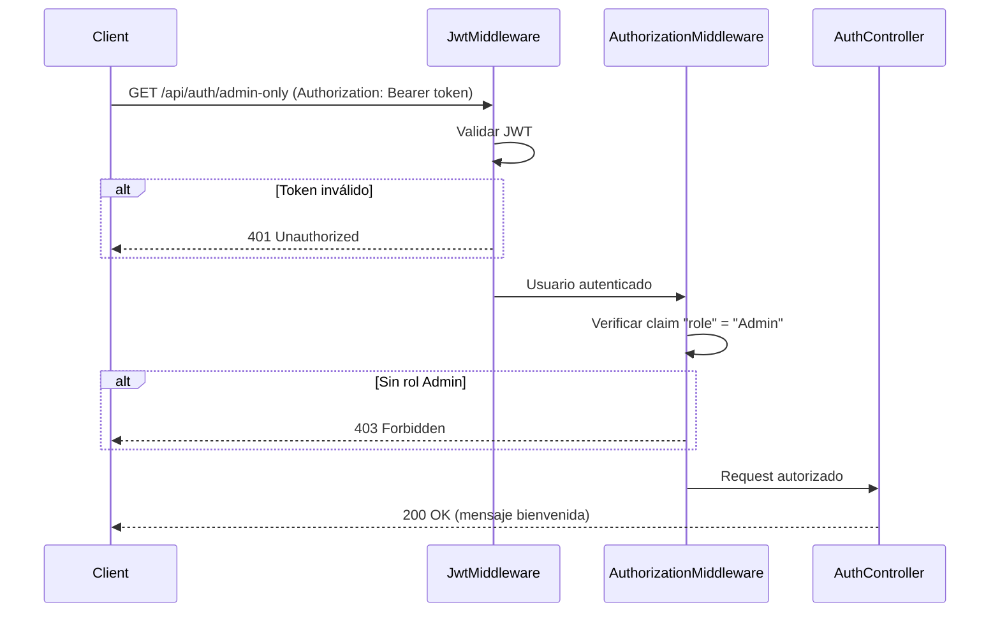
```mermaid
sequenceDiagram
    participant Client
    participant JwtMiddleware
    participant AuthorizationMiddleware
    participant AuthController

    Client->>JwtMiddleware: GET /api/auth/admin-only (Authorization: Bearer token)
    JwtMiddleware->>JwtMiddleware: Validar JWT

    alt Token inválido
        JwtMiddleware-->>Client: 401 Unauthorized
    end

    JwtMiddleware->>AuthorizationMiddleware: Usuario autenticado
    AuthorizationMiddleware->>AuthorizationMiddleware: Verificar claim "role" = "Admin"

    alt Sin rol Admin
        AuthorizationMiddleware-->>Client: 403 Forbidden
    end

    AuthorizationMiddleware->>AuthController: Request autorizado
    AuthController-->>Client: 200 OK (mensaje bienvenida)
```

---

#### POST `/api/auth/logout`

**Descripción**: Cierra la sesión del usuario actual. Revoca todos los refresh tokens activos y actualiza el security stamp para invalidar todos los JWT emitidos.

**Autenticación requerida**: Sí (Bearer Token)

**Parámetros de entrada**: Ninguno

**Respuesta exitosa** (200 OK):

```json
{
  "message": "Sesión cerrada exitosamente."
}
```

**Errores posibles**:
- `401 Unauthorized`: Token no proporcionado o inválido

**Diagrama de secuencia**:

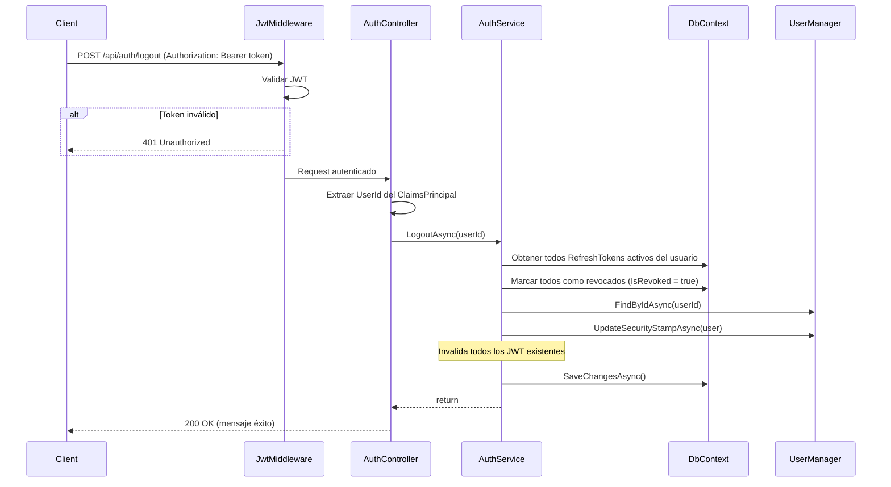
```mermaid
sequenceDiagram
    participant Client
    participant JwtMiddleware
    participant AuthController
    participant AuthService
    participant DbContext
    participant UserManager

    Client->>JwtMiddleware: POST /api/auth/logout (Authorization: Bearer token)
    JwtMiddleware->>JwtMiddleware: Validar JWT

    alt Token inválido
        JwtMiddleware-->>Client: 401 Unauthorized
    end

    JwtMiddleware->>AuthController: Request autenticado
    AuthController->>AuthController: Extraer UserId del ClaimsPrincipal
    AuthController->>AuthService: LogoutAsync(userId)
    AuthService->>DbContext: Obtener todos RefreshTokens activos del usuario
    AuthService->>DbContext: Marcar todos como revocados (IsRevoked = true)
    AuthService->>UserManager: FindByIdAsync(userId)
    AuthService->>UserManager: UpdateSecurityStampAsync(user)
    Note over AuthService: Invalida todos los JWT existentes
    AuthService->>DbContext: SaveChangesAsync()
    AuthService-->>AuthController: return
    AuthController-->>Client: 200 OK (mensaje éxito)
```

---

### 2. ProductsController

**Ruta Base**: `/api/products`

**Descripción**: Controlador público de productos del catálogo. Proporciona listado paginado con filtros avanzados y detalle de producto por ID o slug. Soporta internacionalización (i18n) mediante el parámetro `locale`. Los resultados se cachean en Redis mediante el patrón Decorator (`CachedProductRepository`) para optimizar el rendimiento.

**Dependencias**:
- `IProductRepository`: Repositorio de productos (decorado con cache Redis)
- `ILogger<ProductsController>`: Logging

**Estrategia de Cache (Redis)**:

| Endpoint | Cache Key | TTL |
|----------|-----------|-----|
| `GET /api/products` | `products:list:{locale}:{page}:{pageSize}:{search}:{minPrice}:{maxPrice}:{isActive}:{isCustomizable}:{sortBy}:{sortDescending}` | 1 hora |
| `GET /api/products/{id}` | `products:detail:id:{id}:{locale}` | 24 horas |
| `GET /api/products/slug/{slug}` | `products:detail:slug:{slug}:{locale}` | 24 horas |

> Los resultados `null` (producto no encontrado) no se cachean.

---

#### GET `/api/products`

**Descripción**: Obtiene un listado paginado de productos con soporte para búsqueda full-text, filtros por precio, estado y personalización, y ordenamiento configurable.

**Autenticación requerida**: No

**Parámetros de entrada** (query string):

| Campo | Tipo | Requerido | Default | Descripción |
|-------|------|-----------|---------|-------------|
| `search` | string | No | — | Búsqueda por nombre o descripción corta (ILIKE) |
| `minPrice` | decimal | No | — | Precio mínimo |
| `maxPrice` | decimal | No | — | Precio máximo |
| `isActive` | bool | No | `true` | Filtrar por estado activo |
| `isCustomizable` | bool | No | — | Filtrar por productos personalizables |
| `locale` | string | No | `"es"` | Idioma de las traducciones |
| `page` | int | No | `1` | Número de página |
| `pageSize` | int | No | `12` | Tamaño de página (1-50) |
| `sortBy` | string | No | — | Ordenar por: `"price"`, `"name"`, `"newest"` |
| `sortDescending` | bool | No | `false` | Orden descendente |

**Respuesta exitosa** (200 OK):

```json
{
  "items": [
    {
      "id": "550e8400-e29b-41d4-a716-446655440000",
      "sku": "SKU-001",
      "name": "Volante F1 Pro",
      "slug": "volante-f1-pro",
      "shortDescription": "Volante de competición con display integrado",
      "basePrice": 299.99,
      "vatRate": 0.21,
      "imageUrl": "https://cdn.example.com/products/volante-f1.jpg",
      "isActive": true,
      "isCustomizable": true
    }
  ],
  "totalCount": 15,
  "page": 1,
  "pageSize": 12,
  "totalPages": 2
}
```

**Diagrama de secuencia**:

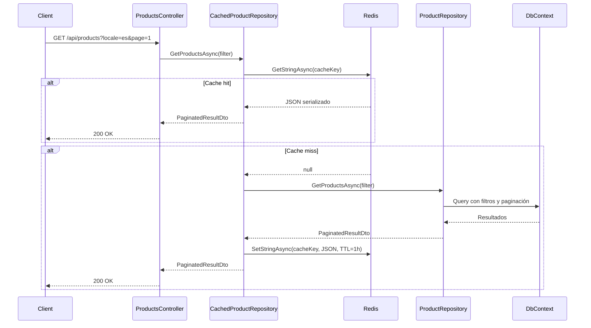
```mermaid
sequenceDiagram
    participant Client
    participant ProductsController
    participant CachedProductRepository
    participant Redis
    participant ProductRepository
    participant DbContext

    Client->>ProductsController: GET /api/products?locale=es&page=1
    ProductsController->>CachedProductRepository: GetProductsAsync(filter)
    CachedProductRepository->>Redis: GetStringAsync(cacheKey)

    alt Cache hit
        Redis-->>CachedProductRepository: JSON serializado
        CachedProductRepository-->>ProductsController: PaginatedResultDto
        ProductsController-->>Client: 200 OK
    end

    alt Cache miss
        Redis-->>CachedProductRepository: null
        CachedProductRepository->>ProductRepository: GetProductsAsync(filter)
        ProductRepository->>DbContext: Query con filtros y paginación
        DbContext-->>ProductRepository: Resultados
        ProductRepository-->>CachedProductRepository: PaginatedResultDto
        CachedProductRepository->>Redis: SetStringAsync(cacheKey, JSON, TTL=1h)
        CachedProductRepository-->>ProductsController: PaginatedResultDto
        ProductsController-->>Client: 200 OK
    end
```

---

#### GET `/api/products/{id}`

**Descripción**: Obtiene el detalle completo de un producto por su ID, incluyendo imágenes, especificaciones y metadatos SEO.

**Autenticación requerida**: No

**Parámetros de entrada**:

| Campo | Tipo | Requerido | Default | Descripción |
|-------|------|-----------|---------|-------------|
| `id` | Guid | Sí | — | ID del producto (path) |
| `locale` | string | No | `"es"` | Idioma de las traducciones (query) |

**Respuesta exitosa** (200 OK):

```json
{
  "id": "550e8400-e29b-41d4-a716-446655440000",
  "sku": "SKU-001",
  "name": "Volante F1 Pro",
  "slug": "volante-f1-pro",
  "shortDescription": "Volante de competición con display integrado",
  "longDescription": "Descripción detallada del producto...",
  "basePrice": 299.99,
  "vatRate": 0.21,
  "metaTitle": "Volante F1 Pro | SimRacing Shop",
  "metaDescription": "Compra el volante F1 Pro...",
  "model3dUrl": "https://cdn.example.com/models/volante-f1.glb",
  "model3dSizeKb": 2048,
  "isActive": true,
  "isCustomizable": true,
  "baseProductionDays": 5,
  "weightGrams": 1200,
  "createdAt": "2026-01-15T10:00:00Z",
  "images": [
    {
      "id": "660e8400-e29b-41d4-a716-446655440001",
      "imageUrl": "https://cdn.example.com/products/volante-f1-front.jpg",
      "altText": "Volante F1 Pro - Vista frontal",
      "displayOrder": 0
    }
  ],
  "specifications": [
    {
      "specKey": "Diámetro",
      "specValue": "300mm",
      "displayOrder": 0
    }
  ]
}
```

**Errores posibles**:
- `404 Not Found`: Producto no encontrado

**Diagrama de secuencia**:

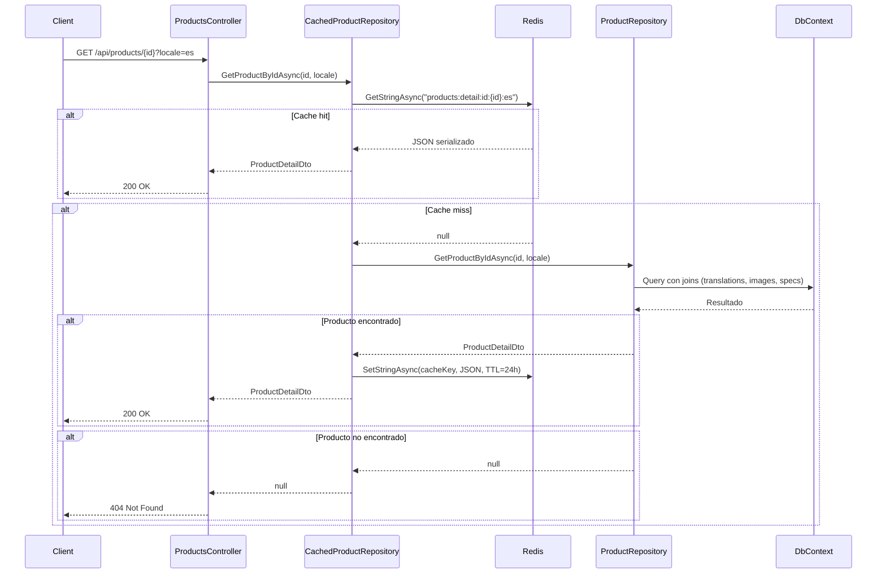
```mermaid
sequenceDiagram
    participant Client
    participant ProductsController
    participant CachedProductRepository
    participant Redis
    participant ProductRepository
    participant DbContext

    Client->>ProductsController: GET /api/products/{id}?locale=es
    ProductsController->>CachedProductRepository: GetProductByIdAsync(id, locale)
    CachedProductRepository->>Redis: GetStringAsync("products:detail:id:{id}:es")

    alt Cache hit
        Redis-->>CachedProductRepository: JSON serializado
        CachedProductRepository-->>ProductsController: ProductDetailDto
        ProductsController-->>Client: 200 OK
    end

    alt Cache miss
        Redis-->>CachedProductRepository: null
        CachedProductRepository->>ProductRepository: GetProductByIdAsync(id, locale)
        ProductRepository->>DbContext: Query con joins (translations, images, specs)
        DbContext-->>ProductRepository: Resultado

        alt Producto encontrado
            ProductRepository-->>CachedProductRepository: ProductDetailDto
            CachedProductRepository->>Redis: SetStringAsync(cacheKey, JSON, TTL=24h)
            CachedProductRepository-->>ProductsController: ProductDetailDto
            ProductsController-->>Client: 200 OK
        end

        alt Producto no encontrado
            ProductRepository-->>CachedProductRepository: null
            CachedProductRepository-->>ProductsController: null
            ProductsController-->>Client: 404 Not Found
        end
    end
```

---

#### GET `/api/products/slug/{slug}`

**Descripción**: Obtiene el detalle completo de un producto por su slug traducido. Ideal para URLs amigables en el frontend.

**Autenticación requerida**: No

**Parámetros de entrada**:

| Campo | Tipo | Requerido | Default | Descripción |
|-------|------|-----------|---------|-------------|
| `slug` | string | Sí | — | Slug del producto (path) |
| `locale` | string | No | `"es"` | Idioma de las traducciones (query) |

**Respuesta exitosa** (200 OK): Misma estructura que `GET /api/products/{id}`

**Errores posibles**:
- `404 Not Found`: Producto no encontrado

**Diagrama de secuencia**:

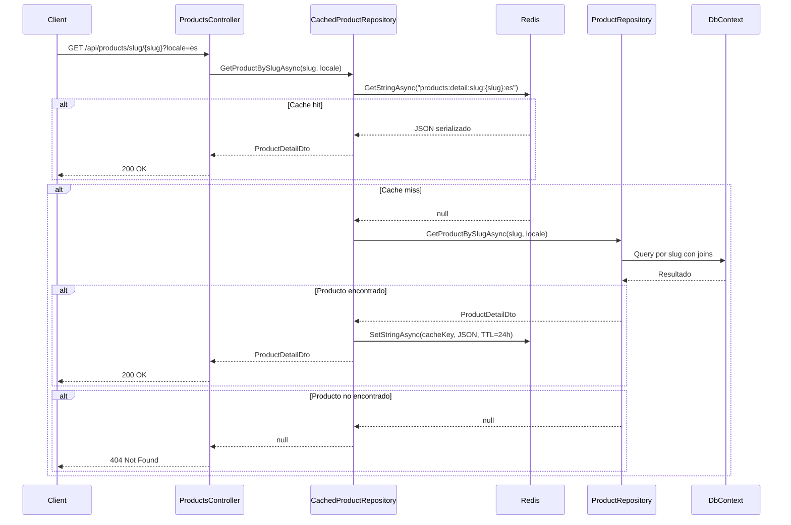
```mermaid
sequenceDiagram
    participant Client
    participant ProductsController
    participant CachedProductRepository
    participant Redis
    participant ProductRepository
    participant DbContext

    Client->>ProductsController: GET /api/products/slug/{slug}?locale=es
    ProductsController->>CachedProductRepository: GetProductBySlugAsync(slug, locale)
    CachedProductRepository->>Redis: GetStringAsync("products:detail:slug:{slug}:es")

    alt Cache hit
        Redis-->>CachedProductRepository: JSON serializado
        CachedProductRepository-->>ProductsController: ProductDetailDto
        ProductsController-->>Client: 200 OK
    end

    alt Cache miss
        Redis-->>CachedProductRepository: null
        CachedProductRepository->>ProductRepository: GetProductBySlugAsync(slug, locale)
        ProductRepository->>DbContext: Query por slug con joins
        DbContext-->>ProductRepository: Resultado

        alt Producto encontrado
            ProductRepository-->>CachedProductRepository: ProductDetailDto
            CachedProductRepository->>Redis: SetStringAsync(cacheKey, JSON, TTL=24h)
            CachedProductRepository-->>ProductsController: ProductDetailDto
            ProductsController-->>Client: 200 OK
        end

        alt Producto no encontrado
            ProductRepository-->>CachedProductRepository: null
            CachedProductRepository-->>ProductsController: null
            ProductsController-->>Client: 404 Not Found
        end
    end
```

---

### 3. ComponentsController

**Ruta Base**: `/api/components`

**Descripción**: Controlador público de componentes del catálogo. Proporciona listado paginado de componentes con filtros y consulta de componentes disponibles para un producto específico (opciones de personalización).

**Dependencias**:
- `IComponentRepository`: Repositorio de componentes
- `ILogger<ComponentsController>`: Logging

---

#### GET `/api/components`

**Descripción**: Obtiene un listado paginado de componentes con filtros por tipo y disponibilidad de stock.

**Autenticación requerida**: No

**Parámetros de entrada** (query string):

| Campo | Tipo | Requerido | Default | Descripción |
|-------|------|-----------|---------|-------------|
| `search` | string | No | — | Búsqueda por nombre |
| `componentType` | string | No | — | Filtrar por tipo de componente |
| `inStock` | bool | No | — | Filtrar por disponibilidad |
| `locale` | string | No | `"es"` | Idioma de las traducciones |
| `page` | int | No | `1` | Número de página |
| `pageSize` | int | No | `12` | Tamaño de página |

**Respuesta exitosa** (200 OK):

```json
{
  "items": [
    {
      "id": "770e8400-e29b-41d4-a716-446655440000",
      "sku": "COMP-001",
      "componentType": "wheel_rim",
      "name": "Aro de aluminio 300mm",
      "description": "Aro fresado en aluminio aeronáutico",
      "stockQuantity": 25,
      "inStock": true,
      "weightGrams": 450
    }
  ],
  "totalCount": 8,
  "page": 1,
  "pageSize": 12,
  "totalPages": 1
}
```

**Diagrama de secuencia**:

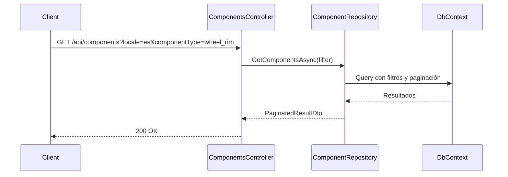
```mermaid
sequenceDiagram
    participant Client
    participant ComponentsController
    participant ComponentRepository
    participant DbContext

    Client->>ComponentsController: GET /api/components?locale=es&componentType=wheel_rim
    ComponentsController->>ComponentRepository: GetComponentsAsync(filter)
    ComponentRepository->>DbContext: Query con filtros y paginación
    DbContext-->>ComponentRepository: Resultados
    ComponentRepository-->>ComponentsController: PaginatedResultDto
    ComponentsController-->>Client: 200 OK
```

---

#### GET `/api/components/product/{productId}`

**Descripción**: Obtiene las opciones de componentes disponibles para personalizar un producto específico, agrupadas por tipo de opción.

**Autenticación requerida**: No

**Parámetros de entrada**:

| Campo | Tipo | Requerido | Default | Descripción |
|-------|------|-----------|---------|-------------|
| `productId` | Guid | Sí | — | ID del producto (path) |
| `locale` | string | No | `"es"` | Idioma de las traducciones (query) |

**Respuesta exitosa** (200 OK):

```json
[
  {
    "componentId": "770e8400-e29b-41d4-a716-446655440000",
    "sku": "COMP-001",
    "componentType": "wheel_rim",
    "name": "Aro de aluminio 300mm",
    "description": "Aro fresado en aluminio aeronáutico",
    "optionGroup": "Aro",
    "priceModifier": 49.99,
    "isDefault": true,
    "displayOrder": 0,
    "stockQuantity": 25,
    "inStock": true
  },
  {
    "componentId": "880e8400-e29b-41d4-a716-446655440001",
    "sku": "COMP-002",
    "componentType": "wheel_rim",
    "name": "Aro de fibra de carbono 300mm",
    "description": "Aro ultraligero de fibra de carbono",
    "optionGroup": "Aro",
    "priceModifier": 149.99,
    "isDefault": false,
    "displayOrder": 1,
    "stockQuantity": 10,
    "inStock": true
  }
]
```

**Diagrama de secuencia**:

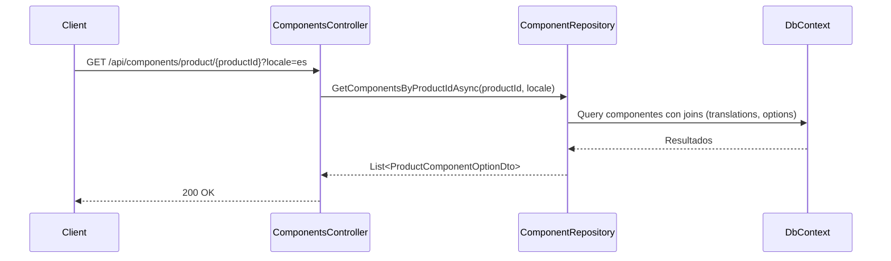
```mermaid
sequenceDiagram
    participant Client
    participant ComponentsController
    participant ComponentRepository
    participant DbContext

    Client->>ComponentsController: GET /api/components/product/{productId}?locale=es
    ComponentsController->>ComponentRepository: GetComponentsByProductIdAsync(productId, locale)
    ComponentRepository->>DbContext: Query componentes con joins (translations, options)
    DbContext-->>ComponentRepository: Resultados
    ComponentRepository-->>ComponentsController: List<ProductComponentOptionDto>
    ComponentsController-->>Client: 200 OK
```

---

### 4. AdminProductsController

**Ruta Base**: `/api/admin/products`

**Descripción**: Controlador de administración de productos. Proporciona CRUD completo, subida de imágenes al sistema de archivos local, gestión de traducciones y asignación de categorías. Invalida la cache Redis tras cada operación de escritura.

**Autenticación requerida**: Sí (Bearer Token con rol **Admin**)

**Dependencias**:
- `IProductAdminRepository`: Repositorio admin de productos
- `IFileStorageService`: Almacenamiento de archivos (local filesystem)
- `IDistributedCache`: Cache Redis para invalidación
- `ILogger<AdminProductsController>`: Logging

**Validación (FluentValidation)**:

| DTO | Reglas |
|-----|--------|
| `CreateProductDto` | SKU requerido/max 50, SKU único (async), BasePrice > 0, VatRate 0-100, BaseProductionDays 1-365, Translations no vacías |
| `UpdateProductDto` | BasePrice > 0, VatRate 0-100, BaseProductionDays 1-365 |
| `UpdateTranslationsDto` | Translations no vacías, cada traducción con Locale/Name/Slug requeridos |

**Invalidación de Cache**:

Tras cada operación de escritura se invalidan las cache keys de detalle por ID y slug para cada locale del producto. Los listados expiran naturalmente por TTL (1 hora).

---

#### POST `/api/admin/products`

**Descripción**: Crea un nuevo producto con sus traducciones iniciales.

**Autenticación requerida**: Sí (Admin)

**Parámetros de entrada** (body JSON):

| Campo | Tipo | Requerido | Default | Descripción |
|-------|------|-----------|---------|-------------|
| `sku` | string | Sí | — | SKU único del producto (max 50) |
| `basePrice` | decimal | Sí | — | Precio base (> 0) |
| `vatRate` | decimal | No | `21.00` | Porcentaje de IVA (0-100) |
| `model3dUrl` | string | No | — | URL del modelo 3D |
| `model3dSizeKb` | int | No | — | Tamaño del modelo 3D en KB |
| `isActive` | bool | No | `true` | Estado activo |
| `isCustomizable` | bool | No | `true` | Es personalizable |
| `baseProductionDays` | int | No | `7` | Días de producción (1-365) |
| `weightGrams` | int | No | — | Peso en gramos |
| `translations` | array | Sí | — | Al menos una traducción |

**Respuesta exitosa** (201 Created): `ProductDetailDto`

**Errores posibles**:
- `400 Bad Request`: Validación fallida (SKU duplicado, precio negativo, traducciones vacías)

**Diagrama de secuencia**:

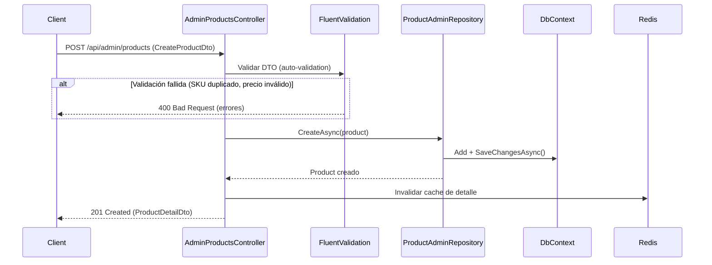
```mermaid
sequenceDiagram
    participant Client
    participant AdminProductsController
    participant FluentValidation
    participant ProductAdminRepository
    participant DbContext
    participant Redis

    Client->>AdminProductsController: POST /api/admin/products (CreateProductDto)
    AdminProductsController->>FluentValidation: Validar DTO (auto-validation)

    alt Validación fallida (SKU duplicado, precio inválido)
        FluentValidation-->>Client: 400 Bad Request (errores)
    end

    AdminProductsController->>ProductAdminRepository: CreateAsync(product)
    ProductAdminRepository->>DbContext: Add + SaveChangesAsync()
    ProductAdminRepository-->>AdminProductsController: Product creado
    AdminProductsController->>Redis: Invalidar cache de detalle
    AdminProductsController-->>Client: 201 Created (ProductDetailDto)
```

---

#### PUT `/api/admin/products/{id}`

**Descripción**: Edita los campos base de un producto existente (no modifica traducciones ni imágenes).

**Autenticación requerida**: Sí (Admin)

**Parámetros de entrada**:

| Campo | Tipo | Requerido | Descripción |
|-------|------|-----------|-------------|
| `id` | Guid | Sí | ID del producto (path) |
| `basePrice` | decimal | Sí | Precio base (> 0) |
| `vatRate` | decimal | No | Porcentaje de IVA (0-100) |
| `model3dUrl` | string | No | URL del modelo 3D |
| `model3dSizeKb` | int | No | Tamaño del modelo 3D en KB |
| `isActive` | bool | No | Estado activo |
| `isCustomizable` | bool | No | Es personalizable |
| `baseProductionDays` | int | No | Días de producción (1-365) |
| `weightGrams` | int | No | Peso en gramos |

**Respuesta exitosa** (200 OK): `ProductDetailDto`

**Errores posibles**:
- `400 Bad Request`: Validación fallida
- `404 Not Found`: Producto no encontrado

---

#### DELETE `/api/admin/products/{id}`

**Descripción**: Elimina un producto, sus traducciones, especificaciones y archivos de imagen del filesystem.

**Autenticación requerida**: Sí (Admin)

**Parámetros de entrada**:

| Campo | Tipo | Requerido | Descripción |
|-------|------|-----------|-------------|
| `id` | Guid | Sí | ID del producto (path) |

**Respuesta exitosa** (204 No Content)

**Errores posibles**:
- `404 Not Found`: Producto no encontrado

**Diagrama de secuencia**:

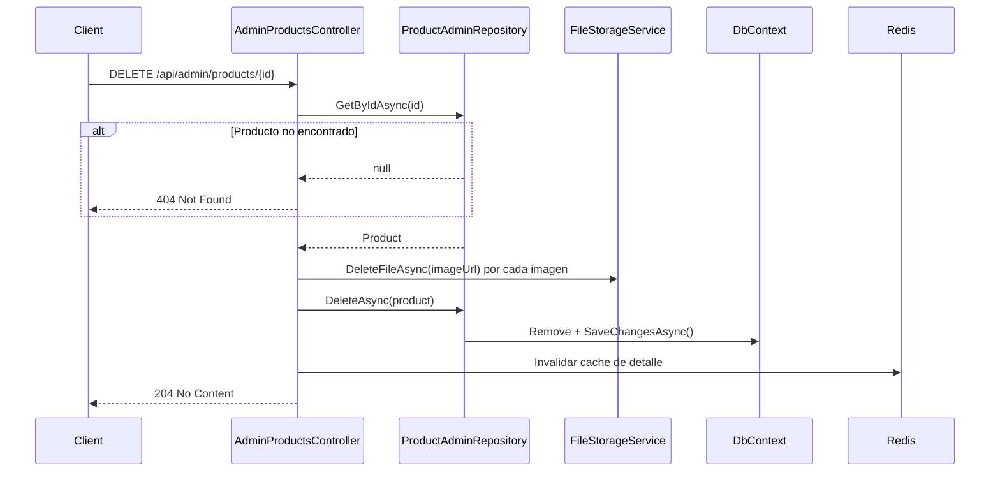
```mermaid
sequenceDiagram
    participant Client
    participant AdminProductsController
    participant ProductAdminRepository
    participant FileStorageService
    participant DbContext
    participant Redis

    Client->>AdminProductsController: DELETE /api/admin/products/{id}
    AdminProductsController->>ProductAdminRepository: GetByIdAsync(id)

    alt Producto no encontrado
        ProductAdminRepository-->>AdminProductsController: null
        AdminProductsController-->>Client: 404 Not Found
    end

    ProductAdminRepository-->>AdminProductsController: Product
    AdminProductsController->>FileStorageService: DeleteFileAsync(imageUrl) por cada imagen
    AdminProductsController->>ProductAdminRepository: DeleteAsync(product)
    ProductAdminRepository->>DbContext: Remove + SaveChangesAsync()
    AdminProductsController->>Redis: Invalidar cache de detalle
    AdminProductsController-->>Client: 204 No Content
```

---

#### POST `/api/admin/products/{id}/images`

**Descripción**: Sube imágenes para un producto. Los archivos se almacenan en `wwwroot/uploads/products/` con nombre GUID. Se auto-asigna el `displayOrder` incremental.

**Autenticación requerida**: Sí (Admin)

**Parámetros de entrada** (multipart/form-data):

| Campo | Tipo | Requerido | Descripción |
|-------|------|-----------|-------------|
| `id` | Guid | Sí | ID del producto (path) |
| `files` | IFormFile[] | Sí | Archivos de imagen (jpg, jpeg, png, webp; max 5MB) |

**Respuesta exitosa** (201 Created):

```json
[
  {
    "id": "550e8400-e29b-41d4-a716-446655440000",
    "imageUrl": "/uploads/products/a1b2c3d4.jpg",
    "altText": "nombre-archivo",
    "displayOrder": 1
  }
]
```

**Errores posibles**:
- `400 Bad Request`: Sin archivos, tipo de archivo no permitido o tamaño excedido
- `404 Not Found`: Producto no encontrado

---

#### GET `/api/admin/products/{id}/images`

**Descripción**: Devuelve la lista de imágenes asociadas a un producto, ordenadas por `displayOrder`.

**Autenticación requerida**: Sí (Admin)

**Parámetros de entrada**:

| Campo | Tipo | Requerido | Descripción |
|-------|------|-----------|-------------|
| `id` | Guid | Sí | ID del producto (path) |

**Respuesta exitosa** (200 OK):

```json
[
  {
    "id": "550e8400-e29b-41d4-a716-446655440000",
    "imageUrl": "https://cdn.example.com/products/volante-f1.jpg",
    "altText": "Vista frontal",
    "displayOrder": 0
  }
]
```

**Errores posibles**:
- `404 Not Found`: Producto no encontrado

---

#### POST `/api/admin/products/{id}/images/url`

**Descripción**: Añade una imagen a un producto mediante URL externa. No sube ningún archivo; almacena directamente la URL en base de datos. El `displayOrder` se asigna automáticamente como el número actual de imágenes del producto (se añade al final).

**Autenticación requerida**: Sí (Admin)

**Parámetros de entrada** (body JSON):

| Campo | Tipo | Requerido | Descripción |
|-------|------|-----------|-------------|
| `id` | Guid | Sí | ID del producto (path) |
| `imageUrl` | string | Sí | URL de la imagen |
| `altText` | string | No | Texto alternativo |
| `displayOrder` | int | Sí | Orden de visualización |

**Respuesta exitosa** (201 Created):

```json
{
  "id": "550e8400-e29b-41d4-a716-446655440000",
  "imageUrl": "https://cdn.example.com/products/volante-f1.jpg",
  "altText": "Vista frontal",
  "displayOrder": 1
}
```

**Errores posibles**:
- `404 Not Found`: Producto no encontrado

---

#### DELETE `/api/admin/products/{id}/images/{imageId}`

**Descripción**: Elimina una imagen de un producto por su ID. Solo elimina el registro de base de datos; no borra ningún archivo del filesystem.

**Autenticación requerida**: Sí (Admin)

**Parámetros de entrada**:

| Campo | Tipo | Requerido | Descripción |
|-------|------|-----------|-------------|
| `id` | Guid | Sí | ID del producto (path) |
| `imageId` | Guid | Sí | ID de la imagen (path) |

**Respuesta exitosa**: `204 No Content`

**Errores posibles**:
- `404 Not Found`: Producto no encontrado, imagen no encontrada, o la imagen no pertenece al producto

---

#### PUT `/api/admin/products/{id}/translations`

**Descripción**: Reemplaza todas las traducciones de un producto. Elimina las existentes y añade las nuevas.

**Autenticación requerida**: Sí (Admin)

**Parámetros de entrada** (body JSON):

| Campo | Tipo | Requerido | Descripción |
|-------|------|-----------|-------------|
| `id` | Guid | Sí | ID del producto (path) |
| `translations` | array | Sí | Al menos una traducción |
| `translations[].locale` | string | Sí | Código de idioma (max 5) |
| `translations[].name` | string | Sí | Nombre del producto (max 200) |
| `translations[].slug` | string | Sí | Slug URL-friendly (max 200) |
| `translations[].shortDescription` | string | No | Descripción corta |
| `translations[].longDescription` | string | No | Descripción larga |
| `translations[].metaTitle` | string | No | Título SEO |
| `translations[].metaDescription` | string | No | Descripción SEO |

**Respuesta exitosa** (200 OK): `ProductDetailDto`

**Errores posibles**:
- `400 Bad Request`: Validación fallida (traducciones vacías)
- `404 Not Found`: Producto no encontrado

---

#### GET `/api/admin/products/{id}/categories`

**Descripción**: Devuelve la lista de categorías actualmente asignadas a un producto.

**Autenticación requerida**: Sí (Admin)

**Parámetros de entrada**:

| Campo | Tipo | Requerido | Descripción |
|-------|------|-----------|-------------|
| `id` | Guid | Sí | ID del producto (path) |

**Respuesta exitosa** (200 OK):

```json
[
  {
    "id": "550e8400-e29b-41d4-a716-446655440000",
    "name": "Volantes",
    "slug": "volantes"
  }
]
```

> El campo `name` y `slug` se obtienen de la traducción en español (`locale = "es"`). Si no existe traducción en español, se usa la primera disponible.

**Errores posibles**:
- `404 Not Found`: Producto no encontrado

---

#### PUT `/api/admin/products/{id}/categories`

**Descripción**: Reemplaza el conjunto completo de categorías asignadas a un producto. Enviar una lista vacía desvincula todas las categorías. La operación es idempotente: se borran todas las asociaciones actuales y se crean las nuevas en una sola transacción.

**Autenticación requerida**: Sí (Admin)

**Parámetros de entrada** (body JSON):

| Campo | Tipo | Requerido | Descripción |
|-------|------|-----------|-------------|
| `id` | Guid | Sí | ID del producto (path) |
| `categoryIds` | Guid[] | Sí | Lista de IDs de categorías a asignar (puede ser vacía) |

**Ejemplo de body**:

```json
{
  "categoryIds": [
    "550e8400-e29b-41d4-a716-446655440000",
    "661f9511-f3ac-52e5-b827-557766551111"
  ]
}
```

**Respuesta exitosa** (200 OK): lista actualizada de `ProductCategoryDto`

```json
[
  {
    "id": "550e8400-e29b-41d4-a716-446655440000",
    "name": "Volantes",
    "slug": "volantes"
  },
  {
    "id": "661f9511-f3ac-52e5-b827-557766551111",
    "name": "Accesorios",
    "slug": "accesorios"
  }
]
```

**Errores posibles**:
- `404 Not Found`: Producto no encontrado

> Los IDs de categoría inexistentes se ignoran silenciosamente; solo se asignan las categorías que existan en la base de datos.

**Diagrama de secuencia**:

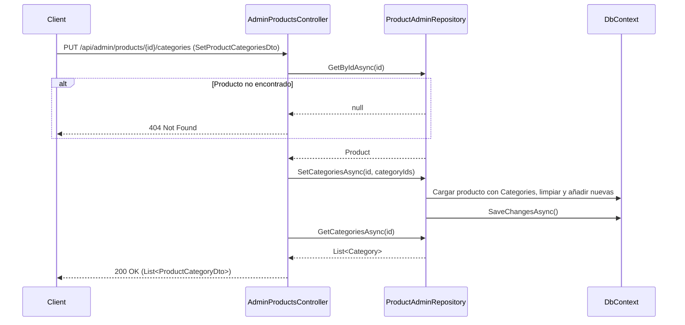
```mermaid
sequenceDiagram
    participant Client
    participant AdminProductsController
    participant ProductAdminRepository
    participant DbContext

    Client->>AdminProductsController: PUT /api/admin/products/{id}/categories (SetProductCategoriesDto)
    AdminProductsController->>ProductAdminRepository: GetByIdAsync(id)

    alt Producto no encontrado
        ProductAdminRepository-->>AdminProductsController: null
        AdminProductsController-->>Client: 404 Not Found
    end

    ProductAdminRepository-->>AdminProductsController: Product
    AdminProductsController->>ProductAdminRepository: SetCategoriesAsync(id, categoryIds)
    ProductAdminRepository->>DbContext: Cargar producto con Categories, limpiar y añadir nuevas
    ProductAdminRepository->>DbContext: SaveChangesAsync()
    AdminProductsController->>ProductAdminRepository: GetCategoriesAsync(id)
    ProductAdminRepository-->>AdminProductsController: List<Category>
    AdminProductsController-->>Client: 200 OK (List<ProductCategoryDto>)
```

---

### 5. CategoriesController

**Ruta Base**: `/api/categories`

**Descripción**: Controlador público de categorías de productos del catálogo. Proporciona listado paginado con filtros y detalle de categoría por ID. Soporta internacionalización (i18n) mediante el parámetro `locale`. Los resultados se cachean en Redis mediante el patrón Decorator (`CachedCategoryRepository`) para optimizar el rendimiento.

**Dependencias**:
- `ICategoryRepository`: Repositorio de categorías (decorado con cache Redis)
- `ILogger<CategoriesController>`: Logging

**Estrategia de Cache (Redis)**:

| Endpoint | Cache Key | TTL |
|----------|-----------|-----|
| `GET /api/categories` | `categories:list:{locale}:{page}:{pageSize}:{isActive}:{sortBy}:{sortDescending}` | 1 hora |
| `GET /api/categories/{id}` | `categories:detail:id:{id}:{locale}` | 24 horas |

> Los resultados `null` (categoría no encontrada) no se cachean.

---

#### GET `/api/categories`

**Descripción**: Obtiene un listado paginado de categorías con soporte para filtros por estado activo y ordenamiento configurable.

**Autenticación requerida**: No

**Parámetros de entrada** (query string):

| Campo | Tipo | Requerido | Default | Descripción |
|-------|------|-----------|---------|-------------|
| `isActive` | bool | No | `true` | Filtrar por estado activo |
| `locale` | string | No | `"es"` | Idioma de las traducciones |
| `page` | int | No | `1` | Número de página |
| `pageSize` | int | No | `12` | Tamaño de página (1-50) |
| `sortBy` | string | No | — | Ordenar por: `"name"`, `"newest"` |
| `sortDescending` | bool | No | `false` | Orden descendente |

**Respuesta exitosa** (200 OK):

```json
{
  "items": [
    {
      "id": "550e8400-e29b-41d4-a716-446655440000",
      "name": "Volantes",
      "slug": "volantes",
      "shortDescription": "Categoría de volantes de competición",
      "imageUrl": "https://cdn.example.com/categories/volantes.jpg",
      "isActive": true
    }
  ],
  "totalCount": 5,
  "page": 1,
  "pageSize": 12,
  "totalPages": 1
}
```

**Diagrama de secuencia**:

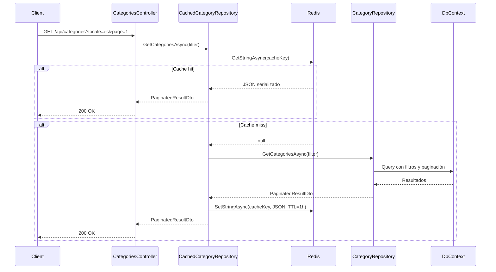
```mermaid
sequenceDiagram
    participant Client
    participant CategoriesController
    participant CachedCategoryRepository
    participant Redis
    participant CategoryRepository
    participant DbContext

    Client->>CategoriesController: GET /api/categories?locale=es&page=1
    CategoriesController->>CachedCategoryRepository: GetCategoriesAsync(filter)
    CachedCategoryRepository->>Redis: GetStringAsync(cacheKey)

    alt Cache hit
        Redis-->>CachedCategoryRepository: JSON serializado
        CachedCategoryRepository-->>CategoriesController: PaginatedResultDto
        CategoriesController-->>Client: 200 OK
    end

    alt Cache miss
        Redis-->>CachedCategoryRepository: null
        CachedCategoryRepository->>CategoryRepository: GetCategoriesAsync(filter)
        CategoryRepository->>DbContext: Query con filtros y paginación
        DbContext-->>CategoryRepository: Resultados
        CategoryRepository-->>CachedCategoryRepository: PaginatedResultDto
        CachedCategoryRepository->>Redis: SetStringAsync(cacheKey, JSON, TTL=1h)
        CachedCategoryRepository-->>CategoriesController: PaginatedResultDto
        CategoriesController-->>Client: 200 OK
    end
```

---

#### GET `/api/categories/{id}`

**Descripción**: Obtiene el detalle completo de una categoría por su ID, incluyendo imagen y metadatos.

**Autenticación requerida**: No

**Parámetros de entrada**:

| Campo | Tipo | Requerido | Default | Descripción |
|-------|------|-----------|---------|-------------|
| `id` | Guid | Sí | — | ID de la categoría (path) |
| `locale` | string | No | `"es"` | Idioma de las traducciones (query) |

**Respuesta exitosa** (200 OK):

```json
{
  "id": "550e8400-e29b-41d4-a716-446655440000",
  "parentCategory": null,
  "name": "Volantes",
  "slug": "volantes",
  "shortDescription": "Categoría de volantes de competición",
  "isActive": true,
  "createdAt": "2026-01-15T10:00:00Z",
  "image": {
    "id": "660e8400-e29b-41d4-a716-446655440001",
    "imageUrl": "https://cdn.example.com/categories/volantes.jpg",
    "altText": "Categoría Volantes"
  }
}
```

**Errores posibles**:
- `404 Not Found`: Categoría no encontrada

**Diagrama de secuencia**:

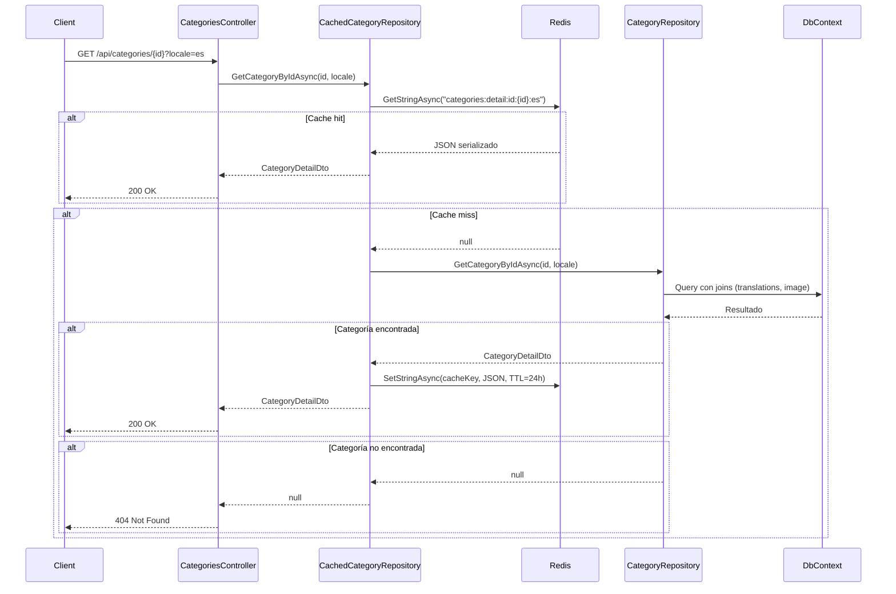
```mermaid
sequenceDiagram
    participant Client
    participant CategoriesController
    participant CachedCategoryRepository
    participant Redis
    participant CategoryRepository
    participant DbContext

    Client->>CategoriesController: GET /api/categories/{id}?locale=es
    CategoriesController->>CachedCategoryRepository: GetCategoryByIdAsync(id, locale)
    CachedCategoryRepository->>Redis: GetStringAsync("categories:detail:id:{id}:es")

    alt Cache hit
        Redis-->>CachedCategoryRepository: JSON serializado
        CachedCategoryRepository-->>CategoriesController: CategoryDetailDto
        CategoriesController-->>Client: 200 OK
    end

    alt Cache miss
        Redis-->>CachedCategoryRepository: null
        CachedCategoryRepository->>CategoryRepository: GetCategoryByIdAsync(id, locale)
        CategoryRepository->>DbContext: Query con joins (translations, image)
        DbContext-->>CategoryRepository: Resultado

        alt Categoría encontrada
            CategoryRepository-->>CachedCategoryRepository: CategoryDetailDto
            CachedCategoryRepository->>Redis: SetStringAsync(cacheKey, JSON, TTL=24h)
            CachedCategoryRepository-->>CategoriesController: CategoryDetailDto
            CategoriesController-->>Client: 200 OK
        end

        alt Categoría no encontrada
            CategoryRepository-->>CachedCategoryRepository: null
            CachedCategoryRepository-->>CategoriesController: null
            CategoriesController-->>Client: 404 Not Found
        end
    end
```

---

### 6. AdminCategoriesController

**Ruta Base**: `/api/admin/categories`

**Descripción**: Controlador de administración de categorías. Proporciona CRUD completo, subida de imagen al sistema de archivos local y gestión de traducciones. Soporta jerarquía de categorías mediante `parentCategory`. Invalida la cache Redis tras cada operación de escritura.

**Autenticación requerida**: Sí (Bearer Token con rol **Admin**)

**Dependencias**:
- `ICategoryAdminRepository`: Repositorio admin de categorías
- `IFileStorageService`: Almacenamiento de archivos (local filesystem)
- `IDistributedCache`: Cache Redis para invalidación
- `ILogger<AdminCategoriesController>`: Logging

**Validación (FluentValidation)**:

| DTO | Reglas |
|-----|--------|
| `CreateCategoryDto` | ParentCategory debe existir (si se proporciona), Translations no vacías |
| `UpdateCategoryDto` | ParentCategory debe existir (si se proporciona) |
| `UpdateCategoryTranslationsDto` | Translations no vacías, cada traducción con Locale/Name/Slug requeridos |

**Invalidación de Cache**:

Tras cada operación de escritura se invalidan las cache keys de detalle por ID y slug para cada locale de la categoría. Los listados expiran naturalmente por TTL (1 hora).

---

#### POST `/api/admin/categories`

**Descripción**: Crea una nueva categoría con sus traducciones iniciales. Opcionalmente puede tener una categoría padre.

**Autenticación requerida**: Sí (Admin)

**Parámetros de entrada** (body JSON):

| Campo | Tipo | Requerido | Default | Descripción |
|-------|------|-----------|---------|-------------|
| `parentCategory` | Guid | No | `null` | ID de la categoría padre (debe existir) |
| `isActive` | bool | No | `true` | Estado activo |
| `translations` | array | Sí | — | Al menos una traducción |

**Respuesta exitosa** (201 Created): `CategoryDetailDto`

**Errores posibles**:
- `400 Bad Request`: Validación fallida (categoría padre no existe, traducciones vacías)

**Diagrama de secuencia**:

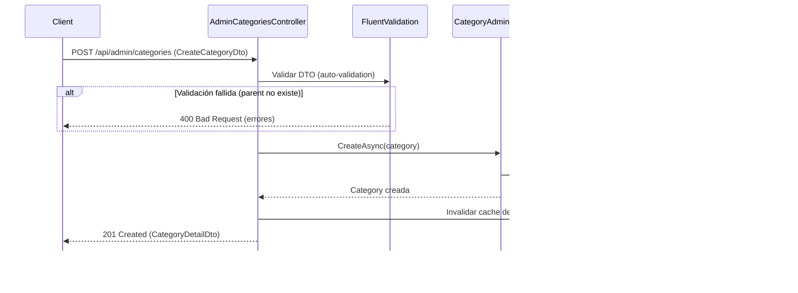
```mermaid
sequenceDiagram
    participant Client
    participant AdminCategoriesController
    participant FluentValidation
    participant CategoryAdminRepository
    participant DbContext
    participant Redis

    Client->>AdminCategoriesController: POST /api/admin/categories (CreateCategoryDto)
    AdminCategoriesController->>FluentValidation: Validar DTO (auto-validation)

    alt Validación fallida (parent no existe)
        FluentValidation-->>Client: 400 Bad Request (errores)
    end

    AdminCategoriesController->>CategoryAdminRepository: CreateAsync(category)
    CategoryAdminRepository->>DbContext: Add + SaveChangesAsync()
    CategoryAdminRepository-->>AdminCategoriesController: Category creada
    AdminCategoriesController->>Redis: Invalidar cache de detalle
    AdminCategoriesController-->>Client: 201 Created (CategoryDetailDto)
```

---

#### PUT `/api/admin/categories/{id}`

**Descripción**: Edita los campos base de una categoría existente (no modifica traducciones ni imagen).

**Autenticación requerida**: Sí (Admin)

**Parámetros de entrada**:

| Campo | Tipo | Requerido | Descripción |
|-------|------|-----------|-------------|
| `id` | Guid | Sí | ID de la categoría (path) |
| `parentCategory` | Guid | No | ID de la categoría padre (debe existir) |
| `isActive` | bool | No | Estado activo |

**Respuesta exitosa** (200 OK): `CategoryDetailDto`

**Errores posibles**:
- `400 Bad Request`: Validación fallida
- `404 Not Found`: Categoría no encontrada

---

#### DELETE `/api/admin/categories/{id}`

**Descripción**: Elimina una categoría, sus traducciones y el archivo de imagen del filesystem.

**Autenticación requerida**: Sí (Admin)

**Parámetros de entrada**:

| Campo | Tipo | Requerido | Descripción |
|-------|------|-----------|-------------|
| `id` | Guid | Sí | ID de la categoría (path) |

**Respuesta exitosa** (204 No Content)

**Errores posibles**:
- `404 Not Found`: Categoría no encontrada

**Diagrama de secuencia**:

```mermaid
sequenceDiagram
    participant Client
    participant AdminCategoriesController
    participant CategoryAdminRepository
    participant FileStorageService
    participant DbContext
    participant Redis

    Client->>AdminCategoriesController: DELETE /api/admin/categories/{id}
    AdminCategoriesController->>CategoryAdminRepository: GetByIdAsync(id)

    alt Categoría no encontrada
        CategoryAdminRepository-->>AdminCategoriesController: null
        AdminCategoriesController-->>Client: 404 Not Found
    end

    CategoryAdminRepository-->>AdminCategoriesController: Category
    AdminCategoriesController->>FileStorageService: DeleteFileAsync(imageUrl) si existe imagen
    AdminCategoriesController->>CategoryAdminRepository: DeleteAsync(category)
    CategoryAdminRepository->>DbContext: Remove + SaveChangesAsync()
    AdminCategoriesController->>Redis: Invalidar cache de detalle
    AdminCategoriesController-->>Client: 204 No Content
```

---

#### POST `/api/admin/categories/{id}/images`

**Descripción**: Sube una imagen para una categoría. El archivo se almacena en `wwwroot/uploads/categories/` con nombre GUID. Reemplaza la imagen existente si la hay.

**Autenticación requerida**: Sí (Admin)

**Parámetros de entrada** (multipart/form-data):

| Campo | Tipo | Requerido | Descripción |
|-------|------|-----------|-------------|
| `id` | Guid | Sí | ID de la categoría (path) |
| `file` | IFormFile | Sí | Archivo de imagen (jpg, jpeg, png, webp; max 5MB) |

**Respuesta exitosa** (201 Created):

```json
{
  "id": "550e8400-e29b-41d4-a716-446655440000",
  "imageUrl": "/uploads/categories/a1b2c3d4.jpg",
  "altText": "nombre-archivo"
}
```

**Errores posibles**:
- `400 Bad Request`: Sin archivo, tipo de archivo no permitido o tamaño excedido
- `404 Not Found`: Categoría no encontrada

---

#### GET `/api/admin/categories/{id}/image`

**Descripción**: Devuelve la imagen actual de una categoría.

**Autenticación requerida**: Sí (Admin)

**Parámetros de entrada**:

| Campo | Tipo | Requerido | Descripción |
|-------|------|-----------|-------------|
| `id` | Guid | Sí | ID de la categoría (path) |

**Respuesta exitosa** (200 OK):

```json
{
  "id": "550e8400-e29b-41d4-a716-446655440000",
  "imageUrl": "https://cdn.example.com/categories/volantes.jpg",
  "altText": "Categoría de volantes"
}
```

**Errores posibles**:
- `404 Not Found`: Categoría no encontrada o sin imagen asignada

---

#### PUT `/api/admin/categories/{id}/image/url`

**Descripción**: Establece la imagen de una categoría mediante URL externa. No sube ningún archivo; almacena directamente la URL en base de datos. Si ya existe una imagen, la reemplaza (elimina la anterior del registro).

**Autenticación requerida**: Sí (Admin)

**Parámetros de entrada** (body JSON):

| Campo | Tipo | Requerido | Descripción |
|-------|------|-----------|-------------|
| `id` | Guid | Sí | ID de la categoría (path) |
| `imageUrl` | string | Sí | URL de la imagen |
| `altText` | string | No | Texto alternativo |

**Respuesta exitosa** (200 OK):

```json
{
  "id": "550e8400-e29b-41d4-a716-446655440000",
  "imageUrl": "https://cdn.example.com/categories/volantes.jpg",
  "altText": "Categoría de volantes"
}
```

**Errores posibles**:
- `404 Not Found`: Categoría no encontrada

---

#### DELETE `/api/admin/categories/{id}/image`

**Descripción**: Elimina la imagen de una categoría. Solo elimina el registro de base de datos; no borra ningún archivo del filesystem.

**Autenticación requerida**: Sí (Admin)

**Parámetros de entrada**:

| Campo | Tipo | Requerido | Descripción |
|-------|------|-----------|-------------|
| `id` | Guid | Sí | ID de la categoría (path) |

**Respuesta exitosa**: `204 No Content`

**Errores posibles**:
- `404 Not Found`: Categoría no encontrada o sin imagen asignada

---

#### PUT `/api/admin/categories/{id}/translations`

**Descripción**: Reemplaza todas las traducciones de una categoría. Elimina las existentes y añade las nuevas.

**Autenticación requerida**: Sí (Admin)

**Parámetros de entrada** (body JSON):

| Campo | Tipo | Requerido | Descripción |
|-------|------|-----------|-------------|
| `id` | Guid | Sí | ID de la categoría (path) |
| `translations` | array | Sí | Al menos una traducción |
| `translations[].locale` | string | Sí | Código de idioma (max 5) |
| `translations[].name` | string | Sí | Nombre de la categoría (max 200) |
| `translations[].slug` | string | Sí | Slug URL-friendly (max 200) |
| `translations[].shortDescription` | string | No | Descripción corta |

**Respuesta exitosa** (200 OK): `CategoryDetailDto`

**Errores posibles**:
- `400 Bad Request`: Validación fallida (traducciones vacías)
- `404 Not Found`: Categoría no encontrada

---

### 7. AdminComponentsController

**Ruta Base**: `/api/admin/components`

**Descripción**: Controlador de administración de componentes. Proporciona CRUD completo, actualización de stock, gestión de traducciones y consulta de componentes con stock bajo. No utiliza cache Redis (los componentes no están cacheados).

**Autenticación requerida**: Sí (Bearer Token con rol **Admin**)

**Dependencias**:
- `IComponentAdminRepository`: Repositorio admin de componentes
- `ILogger<AdminComponentsController>`: Logging

**Validación (FluentValidation)**:

| DTO | Reglas |
|-----|--------|
| `CreateComponentDto` | SKU requerido/max 50, SKU único (async), ComponentType requerido/max 50, StockQuantity >= 0, MinStockThreshold >= 0, CostPrice >= 0 (si presente), Translations no vacías |
| `UpdateComponentDto` | ComponentType requerido/max 50, StockQuantity >= 0, MinStockThreshold >= 0, CostPrice >= 0 (si presente) |
| `UpdateStockDto` | Quantity >= 0 |
| `UpdateComponentTranslationsDto` | Translations no vacías, cada traducción con Locale/Name requeridos |

---

#### POST `/api/admin/components`

**Descripción**: Crea un nuevo componente con sus traducciones iniciales.

**Autenticación requerida**: Sí (Admin)

**Parámetros de entrada** (body JSON):

| Campo | Tipo | Requerido | Default | Descripción |
|-------|------|-----------|---------|-------------|
| `sku` | string | Sí | — | SKU único del componente (max 50) |
| `componentType` | string | Sí | — | Tipo de componente (max 50) |
| `stockQuantity` | int | No | `0` | Cantidad en stock (>= 0) |
| `minStockThreshold` | int | No | `5` | Umbral mínimo de stock (>= 0) |
| `leadTimeDays` | int | No | `0` | Días de entrega |
| `weightGrams` | int | No | — | Peso en gramos |
| `costPrice` | decimal | No | — | Precio de coste (>= 0) |
| `translations` | array | Sí | — | Al menos una traducción |

**Respuesta exitosa** (201 Created): `ComponentDetailDto`

**Errores posibles**:
- `400 Bad Request`: Validación fallida (SKU duplicado, stock negativo, traducciones vacías)

**Diagrama de secuencia**:

```mermaid
sequenceDiagram
    participant Client
    participant AdminComponentsController
    participant FluentValidation
    participant ComponentAdminRepository
    participant DbContext

    Client->>AdminComponentsController: POST /api/admin/components (CreateComponentDto)
    AdminComponentsController->>FluentValidation: Validar DTO (auto-validation)

    alt Validación fallida (SKU duplicado, stock negativo)
        FluentValidation-->>Client: 400 Bad Request (errores)
    end

    AdminComponentsController->>ComponentAdminRepository: CreateAsync(component)
    ComponentAdminRepository->>DbContext: Add + SaveChangesAsync()
    ComponentAdminRepository-->>AdminComponentsController: Component creado
    AdminComponentsController-->>Client: 201 Created (ComponentDetailDto)
```

---

#### PUT `/api/admin/components/{id}`

**Descripción**: Edita los campos base de un componente existente (no modifica traducciones).

**Autenticación requerida**: Sí (Admin)

**Parámetros de entrada**:

| Campo | Tipo | Requerido | Descripción |
|-------|------|-----------|-------------|
| `id` | Guid | Sí | ID del componente (path) |
| `componentType` | string | Sí | Tipo de componente (max 50) |
| `stockQuantity` | int | No | Cantidad en stock (>= 0) |
| `minStockThreshold` | int | No | Umbral mínimo de stock (>= 0) |
| `leadTimeDays` | int | No | Días de entrega |
| `weightGrams` | int | No | Peso en gramos |
| `costPrice` | decimal | No | Precio de coste (>= 0) |

**Respuesta exitosa** (200 OK): `ComponentDetailDto`

**Errores posibles**:
- `400 Bad Request`: Validación fallida
- `404 Not Found`: Componente no encontrado

---

#### DELETE `/api/admin/components/{id}`

**Descripción**: Elimina un componente y todas sus traducciones.

**Autenticación requerida**: Sí (Admin)

**Parámetros de entrada**:

| Campo | Tipo | Requerido | Descripción |
|-------|------|-----------|-------------|
| `id` | Guid | Sí | ID del componente (path) |

**Respuesta exitosa** (204 No Content)

**Errores posibles**:
- `404 Not Found`: Componente no encontrado

---

#### PATCH `/api/admin/components/{id}/stock`

**Descripción**: Actualiza la cantidad de stock de un componente. El campo `lowStock` se calcula automáticamente comparando con `minStockThreshold`.

**Autenticación requerida**: Sí (Admin)

**Parámetros de entrada**:

| Campo | Tipo | Requerido | Descripción |
|-------|------|-----------|-------------|
| `id` | Guid | Sí | ID del componente (path) |
| `quantity` | int | Sí | Nueva cantidad de stock (>= 0) |

**Respuesta exitosa** (200 OK): `ComponentDetailDto`

**Errores posibles**:
- `400 Bad Request`: Cantidad negativa
- `404 Not Found`: Componente no encontrado

**Diagrama de secuencia**:

```mermaid
sequenceDiagram
    participant Client
    participant AdminComponentsController
    participant ComponentAdminRepository
    participant DbContext

    Client->>AdminComponentsController: PATCH /api/admin/components/{id}/stock
    AdminComponentsController->>ComponentAdminRepository: GetByIdAsync(id)

    alt Componente no encontrado
        ComponentAdminRepository-->>AdminComponentsController: null
        AdminComponentsController-->>Client: 404 Not Found
    end

    ComponentAdminRepository-->>AdminComponentsController: Component
    AdminComponentsController->>AdminComponentsController: component.StockQuantity = dto.Quantity
    AdminComponentsController->>ComponentAdminRepository: UpdateAsync(component)
    ComponentAdminRepository->>DbContext: Update + SaveChangesAsync()
    AdminComponentsController-->>Client: 200 OK (ComponentDetailDto con InStock/LowStock calculados)
```

---

#### PUT `/api/admin/components/{id}/translations`

**Descripción**: Reemplaza todas las traducciones de un componente. Elimina las existentes y añade las nuevas.

**Autenticación requerida**: Sí (Admin)

**Parámetros de entrada** (body JSON):

| Campo | Tipo | Requerido | Descripción |
|-------|------|-----------|-------------|
| `id` | Guid | Sí | ID del componente (path) |
| `translations` | array | Sí | Al menos una traducción |
| `translations[].locale` | string | Sí | Código de idioma (max 5) |
| `translations[].name` | string | Sí | Nombre del componente (max 255) |
| `translations[].description` | string | No | Descripción |

**Respuesta exitosa** (200 OK): `ComponentDetailDto`

**Errores posibles**:
- `400 Bad Request`: Validación fallida (traducciones vacías)
- `404 Not Found`: Componente no encontrado

---

#### GET `/api/admin/components/low-stock`

**Descripción**: Lista todos los componentes cuyo stock está por debajo o igual a su umbral mínimo (`stockQuantity <= minStockThreshold`), ordenados por stock ascendente.

**Autenticación requerida**: Sí (Admin)

**Parámetros de entrada**: Ninguno

**Respuesta exitosa** (200 OK):

```json
[
  {
    "id": "770e8400-e29b-41d4-a716-446655440000",
    "sku": "COMP-001",
    "componentType": "grip",
    "stockQuantity": 2,
    "inStock": true,
    "minStockThreshold": 5,
    "lowStock": true,
    "leadTimeDays": 3,
    "weightGrams": 120,
    "costPrice": 15.00,
    "createdAt": "2026-01-15T10:00:00Z",
    "updatedAt": "2026-02-01T14:30:00Z",
    "translations": [
      {
        "id": "880e8400-e29b-41d4-a716-446655440001",
        "locale": "es",
        "name": "Grip Estándar",
        "description": "Grip de cuero sintético"
      }
    ]
  }
]
```

**Diagrama de secuencia**:

```mermaid
sequenceDiagram
    participant Client
    participant AdminComponentsController
    participant ComponentAdminRepository
    participant DbContext

    Client->>AdminComponentsController: GET /api/admin/components/low-stock
    AdminComponentsController->>ComponentAdminRepository: GetLowStockAsync()
    ComponentAdminRepository->>DbContext: WHERE StockQuantity <= MinStockThreshold ORDER BY StockQuantity
    DbContext-->>ComponentAdminRepository: List<Component>
    ComponentAdminRepository-->>AdminComponentsController: Componentes con stock bajo
    AdminComponentsController-->>Client: 200 OK (List<ComponentDetailDto>)
```

---

### 8. UserAddressesController

**Ruta Base**: `/api/addresses`

**Descripción**: Controlador de gestión de direcciones del usuario autenticado. Permite administrar direcciones de facturación (una única por usuario) y direcciones de envío (múltiples). Las direcciones se asocian automáticamente al usuario autenticado mediante el token JWT.

**Autenticación requerida**: Sí (Bearer Token)

**Dependencias**:
- `IUserAddressRepository`: Repositorio de direcciones de usuario
- `ILogger<UserAddressesController>`: Logging

**Validación (FluentValidation)**:

| DTO | Reglas |
|-----|--------|
| `CreateBillingAddressDto` | Street/City/PostalCode/Country requeridos (no vacíos), UserId debe coincidir con usuario autenticado, no debe existir otra dirección de facturación para el usuario |
| `UpdateBillingAddressDto` | Street/City/PostalCode/Country requeridos (no vacíos) |
| `CreateDeliveryAddressDto` | Name/Street/City/PostalCode/Country requeridos (no vacíos), UserId debe coincidir con usuario autenticado |
| `UpdateDeliveryAddressDto` | Name/Street/City/PostalCode/Country requeridos (no vacíos) |

---

#### POST `/api/addresses/billing`

**Descripción**: Crea una nueva dirección de facturación para el usuario autenticado. Solo se permite una dirección de facturación por usuario. La dirección se marca automáticamente como predeterminada.

**Autenticación requerida**: Sí

**Parámetros de entrada** (body JSON):

| Campo | Tipo | Requerido | Default | Descripción |
|-------|------|-----------|---------|-------------|
| `userId` | Guid | Sí | — | ID del usuario (debe coincidir con el usuario autenticado) |
| `street` | string | Sí | — | Calle y número |
| `city` | string | Sí | — | Ciudad |
| `state` | string | No | — | Provincia/Estado |
| `postalCode` | string | Sí | — | Código postal |
| `country` | string | No | `"ES"` | País (código ISO) |

**Respuesta exitosa** (201 Created): `BillingAddressDetailDto`

```json
{
  "id": "550e8400-e29b-41d4-a716-446655440000",
  "street": "Calle Mayor 123",
  "city": "Madrid",
  "state": "Madrid",
  "postalCode": "28001",
  "country": "ES"
}
```

**Errores posibles**:
- `400 Bad Request`: Validación fallida (campos vacíos, ya existe dirección de facturación)
- `401 Unauthorized`: Token inválido o userId no coincide con usuario autenticado

---

#### PUT `/api/addresses/billing`

**Descripción**: Actualiza la dirección de facturación del usuario autenticado.

**Autenticación requerida**: Sí

**Parámetros de entrada** (body JSON):

| Campo | Tipo | Requerido | Descripción |
|-------|------|-----------|-------------|
| `street` | string | Sí | Calle y número |
| `city` | string | Sí | Ciudad |
| `state` | string | No | Provincia/Estado |
| `postalCode` | string | Sí | Código postal |
| `country` | string | Sí | País (código ISO) |

**Respuesta exitosa** (200 OK): `BillingAddressDetailDto`

**Errores posibles**:
- `400 Bad Request`: Validación fallida
- `401 Unauthorized`: Token inválido
- `404 Not Found`: Usuario no tiene dirección de facturación

---

#### GET `/api/addresses/billing`

**Descripción**: Obtiene la dirección de facturación del usuario autenticado.

**Autenticación requerida**: Sí

**Parámetros de entrada**: Ninguno

**Respuesta exitosa** (200 OK): `UserAddress` (entidad completa)

**Errores posibles**:
- `401 Unauthorized`: Token inválido
- `404 Not Found`: Usuario no tiene dirección de facturación

---

#### POST `/api/addresses/delivery`

**Descripción**: Crea una nueva dirección de envío para el usuario autenticado. Un usuario puede tener múltiples direcciones de envío con nombres personalizados (ej: "Casa", "Oficina", "Casa de vacaciones").

**Autenticación requerida**: Sí

**Parámetros de entrada** (body JSON):

| Campo | Tipo | Requerido | Default | Descripción |
|-------|------|-----------|---------|-------------|
| `userId` | Guid | Sí | — | ID del usuario (debe coincidir con el usuario autenticado) |
| `name` | string | Sí | — | Nombre identificativo de la dirección |
| `street` | string | Sí | — | Calle y número |
| `city` | string | Sí | — | Ciudad |
| `state` | string | No | — | Provincia/Estado |
| `postalCode` | string | Sí | — | Código postal |
| `country` | string | No | `"ES"` | País (código ISO) |
| `isDefault` | bool | No | `false` | Marcar como dirección predeterminada |

**Respuesta exitosa** (201 Created): `DeliveryAddressDetailDto`

```json
{
  "id": "660e8400-e29b-41d4-a716-446655440000",
  "name": "Casa",
  "street": "Avenida Principal 456",
  "city": "Barcelona",
  "state": "Barcelona",
  "postalCode": "08001",
  "country": "ES",
  "isDefault": true
}
```

**Errores posibles**:
- `400 Bad Request`: Validación fallida (campos vacíos, nombre vacío)
- `401 Unauthorized`: Token inválido o userId no coincide

---

#### PUT `/api/addresses/delivery/{id}`

**Descripción**: Actualiza una dirección de envío específica del usuario autenticado. Solo el propietario puede modificar sus direcciones.

**Autenticación requerida**: Sí

**Parámetros de entrada**:

| Campo | Tipo | Requerido | Descripción |
|-------|------|-----------|-------------|
| `id` | Guid | Sí | ID de la dirección (path) |
| `name` | string | Sí | Nombre identificativo |
| `street` | string | Sí | Calle y número |
| `city` | string | Sí | Ciudad |
| `state` | string | No | Provincia/Estado |
| `postalCode` | string | Sí | Código postal |
| `country` | string | Sí | País (código ISO) |
| `isDefault` | bool | No | Marcar como predeterminada |

**Respuesta exitosa** (200 OK): `DeliveryAddressDetailDto`

**Errores posibles**:
- `400 Bad Request`: Validación fallida
- `401 Unauthorized`: Token inválido o dirección no pertenece al usuario
- `404 Not Found`: Dirección no encontrada

---

#### DELETE `/api/addresses/delivery/{id}`

**Descripción**: Elimina una dirección de envío específica del usuario autenticado.

**Autenticación requerida**: Sí

**Parámetros de entrada**:

| Campo | Tipo | Requerido | Descripción |
|-------|------|-----------|-------------|
| `id` | Guid | Sí | ID de la dirección (path) |

**Respuesta exitosa** (204 No Content)

**Errores posibles**:
- `401 Unauthorized`: Token inválido o dirección no pertenece al usuario
- `404 Not Found`: Dirección no encontrada

---

#### GET `/api/addresses/delivery`

**Descripción**: Lista todas las direcciones de envío del usuario autenticado.

**Autenticación requerida**: Sí

**Parámetros de entrada**: Ninguno

**Respuesta exitosa** (200 OK):

```json
[
  {
    "id": "660e8400-e29b-41d4-a716-446655440000",
    "name": "Casa",
    "street": "Avenida Principal 456",
    "city": "Barcelona",
    "state": "Barcelona",
    "postalCode": "08001",
    "country": "ES",
    "isDefault": true
  },
  {
    "id": "770e8400-e29b-41d4-a716-446655440001",
    "name": "Oficina",
    "street": "Calle Trabajo 789",
    "city": "Valencia",
    "state": "Valencia",
    "postalCode": "46001",
    "country": "ES",
    "isDefault": false
  }
]
```

**Errores posibles**:
- `401 Unauthorized`: Token inválido
- `404 Not Found`: Usuario no tiene direcciones de envío

**Diagrama de secuencia**:

```mermaid
sequenceDiagram
    participant Client
    participant UserAddressesController
    participant UserAddressRepository
    participant DbContext

    Client->>UserAddressesController: GET /api/addresses/delivery
    UserAddressesController->>UserAddressesController: Extraer userId del token JWT
    UserAddressesController->>UserAddressRepository: GetDeliveryAddressesByUserIdAsync(userId)
    UserAddressRepository->>DbContext: WHERE UserId == userId AND AddressType == Delivery
    DbContext-->>UserAddressRepository: List<UserAddress>
    UserAddressRepository-->>UserAddressesController: Direcciones de envío

    alt Sin direcciones
        UserAddressesController-->>Client: 404 Not Found
    else Con direcciones
        UserAddressesController-->>Client: 200 OK (List<UserAddress>)
    end
```

---

### 9. UserController

**Ruta Base**: `/api/user`

**Descripción**: Controlador de gestión de datos del usuario autenticado. Permite actualizar información personal y eliminar la cuenta. Todas las operaciones se aplican automáticamente al usuario identificado por el token JWT.

**Autenticación requerida**: Sí (Bearer Token)

**Dependencias**:
- `IUserRepository`: Repositorio de usuarios
- `ILogger<UserController>`: Logging

---

#### PUT `/api/user`

**Descripción**: Actualiza los datos personales del usuario autenticado (email, nombre, apellido, idioma). La actualización del email valida que no esté ya registrado por otro usuario.

**Autenticación requerida**: Sí

**Parámetros de entrada** (body JSON):

| Campo | Tipo | Requerido | Descripción |
|-------|------|-----------|-------------|
| `email` | string | Sí | Nuevo email del usuario |
| `firstName` | string | No | Nombre |
| `lastName` | string | No | Apellido |
| `language` | string | Sí | Idioma preferido (ej: "es", "en") |
| `emailVerified` | bool | No | Estado de verificación de email |

**Respuesta exitosa** (200 OK): `UserDetailDto`

```json
{
  "id": "550e8400-e29b-41d4-a716-446655440000",
  "email": "nuevo@example.com",
  "firstName": "Juan",
  "lastName": "Pérez",
  "language": "es",
  "emailVerified": true,
  "roles": ["Customer"]
}
```

**Errores posibles**:
- `400 Bad Request`: Email ya registrado por otro usuario
- `401 Unauthorized`: Token inválido
- `404 Not Found`: Usuario no encontrado

**Diagrama de secuencia**:

```mermaid
sequenceDiagram
    participant Client
    participant UserController
    participant UserRepository
    participant UserManager

    Client->>UserController: PUT /api/user (UpdateUserDto)
    UserController->>UserController: Extraer userId del token JWT
    UserController->>UserRepository: GetUserByIdAsync(userId)

    alt Usuario no encontrado
        UserRepository-->>UserController: null
        UserController-->>Client: 404 Not Found
    end

    UserRepository-->>UserController: User
    UserController->>UserController: Actualizar campos (email, firstName, lastName, language)
    UserController->>UserRepository: UpdateAsync(user)
    UserRepository->>UserManager: FindByEmailAsync(newEmail)

    alt Email duplicado
        UserManager-->>UserRepository: Usuario existente con ese email
        UserRepository-->>UserController: InvalidOperationException
        UserController-->>Client: 400 Bad Request
    end

    UserRepository->>UserManager: UpdateAsync(user)
    UserManager-->>UserRepository: Success
    UserRepository-->>UserController: OK
    UserController-->>Client: 200 OK (UserDetailDto)
```

---

#### DELETE `/api/user`

**Descripción**: Elimina permanentemente la cuenta del usuario autenticado. Esta acción es irreversible y eliminará todos los datos asociados al usuario según las cascadas configuradas en la base de datos.

**Autenticación requerida**: Sí

**Parámetros de entrada**: Ninguno

**Respuesta exitosa** (204 No Content)

**Errores posibles**:
- `401 Unauthorized`: Token inválido
- `404 Not Found`: Usuario no encontrado

**Diagrama de secuencia**:

```mermaid
sequenceDiagram
    participant Client
    participant UserController
    participant UserRepository
    participant UserManager
    participant DbContext

    Client->>UserController: DELETE /api/user
    UserController->>UserController: Extraer userId del token JWT
    UserController->>UserRepository: GetUserByIdAsync(userId)

    alt Usuario no encontrado
        UserRepository-->>UserController: null
        UserController-->>Client: 404 Not Found
    end

    UserRepository-->>UserController: User
    UserController->>UserRepository: DeleteAsync(user)
    UserRepository->>UserManager: DeleteAsync(user)
    UserManager->>DbContext: Remove(user) + SaveChangesAsync()

    alt Error al eliminar
        UserManager-->>UserRepository: IdentityResult.Failed
        UserRepository-->>UserController: InvalidOperationException
        UserController-->>Client: 500 Internal Server Error
    end

    UserManager-->>UserRepository: IdentityResult.Success
    UserRepository-->>UserController: OK
    UserController-->>Client: 204 No Content
```

---

### 10. CommunicationPreferencesController

**Ruta Base**: `/api/communication-preferences`

**Descripción**: Controlador de gestión de preferencias de comunicación del usuario autenticado. Permite consultar y actualizar las preferencias sobre newsletters, notificaciones de pedidos y promociones por SMS. Crea automáticamente preferencias con valores por defecto si no existen.

**Autenticación requerida**: Sí (Bearer Token)

**Dependencias**:
- `IUserCommunicationPreferencesRepository`: Repositorio de preferencias de comunicación
- `ILogger<CommunicationPreferences>`: Logging

---

#### GET `/api/communication-preferences`

**Descripción**: Obtiene las preferencias de comunicación del usuario autenticado. Si el usuario no tiene preferencias configuradas, las crea automáticamente con valores por defecto (Newsletter: false, OrderNotifications: true, SmsPromotions: false).

**Autenticación requerida**: Sí

**Parámetros de entrada**: Ninguno

**Respuesta exitosa** (200 OK): `UserCommunicationPreferencesDto`

```json
{
  "newsletter": false,
  "orderNotifications": true,
  "smsPromotions": false
}
```

**Errores posibles**:
- `401 Unauthorized`: Token inválido o userId inválido

**Diagrama de secuencia**:

```mermaid
sequenceDiagram
    participant Client
    participant CommunicationPreferencesController
    participant Repository
    participant DbContext

    Client->>CommunicationPreferencesController: GET /api/communication-preferences
    CommunicationPreferencesController->>CommunicationPreferencesController: Extraer userId del token JWT
    CommunicationPreferencesController->>Repository: GetByUserIdAsync(userId)

    alt Preferencias no existen
        Repository-->>CommunicationPreferencesController: null
        CommunicationPreferencesController->>CommunicationPreferencesController: Crear preferencias por defecto
        CommunicationPreferencesController->>Repository: CreateAsync(preferences)
        Repository->>DbContext: Add(preferences) + SaveChangesAsync()
        DbContext-->>Repository: Success
        Repository-->>CommunicationPreferencesController: UserCommunicationPreferences
    else Preferencias existen
        Repository-->>CommunicationPreferencesController: UserCommunicationPreferences
    end

    CommunicationPreferencesController->>CommunicationPreferencesController: MapToDto(preferences)
    CommunicationPreferencesController-->>Client: 200 OK (UserCommunicationPreferencesDto)
```

---

#### PUT `/api/communication-preferences`

**Descripción**: Actualiza las preferencias de comunicación del usuario autenticado. Si el usuario no tiene preferencias configuradas, las crea con los valores proporcionados.

**Autenticación requerida**: Sí

**Parámetros de entrada** (body JSON):

| Campo | Tipo | Requerido | Descripción |
|-------|------|-----------|-------------|
| `newsletter` | bool | Sí | Suscripción a newsletter |
| `orderNotifications` | bool | Sí | Notificaciones de estado de pedidos |
| `smsPromotions` | bool | Sí | Promociones y ofertas por SMS |

**Respuesta exitosa** (200 OK): `UserCommunicationPreferencesDto`

```json
{
  "newsletter": true,
  "orderNotifications": true,
  "smsPromotions": false
}
```

**Errores posibles**:
- `401 Unauthorized`: Token inválido o userId inválido

**Diagrama de secuencia**:

```mermaid
sequenceDiagram
    participant Client
    participant CommunicationPreferencesController
    participant Repository
    participant DbContext

    Client->>CommunicationPreferencesController: PUT /api/communication-preferences (UserCommunicationPreferencesDto)
    CommunicationPreferencesController->>CommunicationPreferencesController: Extraer userId del token JWT
    CommunicationPreferencesController->>Repository: GetByUserIdAsync(userId)

    alt Preferencias no existen
        Repository-->>CommunicationPreferencesController: null
        CommunicationPreferencesController->>CommunicationPreferencesController: Crear nuevas preferencias con valores del DTO
        CommunicationPreferencesController->>Repository: CreateAsync(preferences)
        Repository->>DbContext: Add(preferences) + SaveChangesAsync()
        DbContext-->>Repository: Success
    else Preferencias existen
        Repository-->>CommunicationPreferencesController: UserCommunicationPreferences
        CommunicationPreferencesController->>CommunicationPreferencesController: Actualizar campos del DTO
        CommunicationPreferencesController->>Repository: UpdateAsync(preferences)
        Repository->>DbContext: Update(preferences) + SaveChangesAsync()
        DbContext-->>Repository: Success
    end

    Repository-->>CommunicationPreferencesController: UserCommunicationPreferences
    CommunicationPreferencesController->>CommunicationPreferencesController: MapToDto(preferences)
    CommunicationPreferencesController-->>Client: 200 OK (UserCommunicationPreferencesDto)
```

---

### 11. OrdersController

**Ruta Base**: `/api/orders`

**Descripción**: Controlador de gestión de pedidos del usuario autenticado. Permite crear nuevos pedidos, consultar el historial de pedidos y obtener detalles específicos. Los pedidos incluyen validación de productos, cálculo automático de precios en backend (por seguridad), generación de número de pedido único y estimación de días de producción.

**Autenticación requerida**: Sí (Bearer Token)

**Dependencias**:
- `IOrderRepository`: Repositorio de pedidos
- `IOrderService`: Servicio de lógica de negocio de pedidos
- `ILogger<OrdersController>`: Logging

**Validación (FluentValidation)**:

| DTO | Reglas |
|-----|--------|
| `CreateOrderDto` | ShippingStreet/City/PostalCode/Country requeridos, ShippingCountry código ISO 2 chars, Subtotal > 0, VatAmount/ShippingCost >= 0, TotalAmount > 0, TotalAmount = Subtotal + VatAmount + ShippingCost, OrderItems mínimo 1 / máximo 50, Subtotal = suma de LineTotal de items |
| `CreateOrderItemDto` | ProductId requerido, ProductName/ProductSku requeridos, Quantity 1-100, UnitPrice/LineTotal > 0, LineTotal = Quantity × UnitPrice |

**Características de seguridad**:
- **Recálculo de precios en backend**: Los precios de productos y totales son recalculados en el servidor para prevenir manipulación desde el frontend
- **Validación de productos**: Verifica existencia, disponibilidad (IsActive) y precio correcto
- **Generación de número de pedido único**: Formato `ORD-YYYYMMDD-NNNN` con semáforo para concurrencia
- **Cálculo automático de envío**: Integración con `ShippingService` basado en código postal

---

#### POST `/api/orders`

**Descripción**: Crea un nuevo pedido para el usuario autenticado. Valida la disponibilidad de productos, recalcula todos los precios en backend (seguridad contra manipulación), genera número de pedido único, calcula días estimados de producción y gastos de envío según código postal.

**Autenticación requerida**: Sí

**Parámetros de entrada** (body JSON):

| Campo | Tipo | Requerido | Default | Descripción |
|-------|------|-----------|---------|-------------|
| `shippingStreet` | string | Sí | — | Calle y número de envío |
| `shippingCity` | string | Sí | — | Ciudad de envío |
| `shippingState` | string | No | — | Provincia/Estado de envío |
| `shippingPostalCode` | string | Sí | — | Código postal de envío (5 dígitos) |
| `shippingCountry` | string | No | `"ES"` | País de envío (código ISO 2 chars) |
| `subtotal` | decimal | Sí | — | Subtotal (validado vs backend) |
| `vatAmount` | decimal | Sí | — | IVA (validado vs backend) |
| `shippingCost` | decimal | Sí | — | Coste de envío (validado vs backend) |
| `totalAmount` | decimal | Sí | — | Total (validado vs backend) |
| `notes` | string | No | — | Notas adicionales del cliente |
| `orderItems` | array | Sí | — | Items del pedido (1-50 items) |

**orderItems[]**:

| Campo | Tipo | Requerido | Descripción |
|-------|------|-----------|-------------|
| `productId` | Guid | Sí | ID del producto |
| `productName` | string | Sí | Nombre del producto |
| `productSku` | string | Sí | SKU del producto |
| `configurationJson` | string | No | Configuración personalizada (JSON) |
| `quantity` | int | Sí | Cantidad (1-100) |
| `unitPrice` | decimal | Sí | Precio unitario (validado vs backend) |
| `lineTotal` | decimal | Sí | Total línea (validado vs backend) |

**Respuesta exitosa** (201 Created): `OrderDetailDto`

```json
{
  "id": "550e8400-e29b-41d4-a716-446655440000",
  "orderNumber": "ORD-20260216-0001",
  "userId": "660e8400-e29b-41d4-a716-446655440001",
  "shippingStreet": "Calle Mayor 123",
  "shippingCity": "Madrid",
  "shippingState": null,
  "shippingPostalCode": "28001",
  "shippingCountry": "ES",
  "paymentId": null,
  "subtotal": 299.99,
  "vatAmount": 63.00,
  "shippingCost": 6.25,
  "totalAmount": 369.24,
  "orderStatus": "pending",
  "estimatedProductionDays": 14,
  "productionNotes": null,
  "trackingNumber": null,
  "shippedAt": null,
  "notes": "Por favor, llamar antes de entregar",
  "createdAt": "2026-02-16T10:30:00Z",
  "updatedAt": "2026-02-16T10:30:00Z",
  "orderItems": [
    {
      "id": "770e8400-e29b-41d4-a716-446655440002",
      "productId": "880e8400-e29b-41d4-a716-446655440003",
      "productName": "Volante GT Pro",
      "productSku": "VOL-001",
      "configurationJson": "{\"color\":\"red\",\"material\":\"leather\"}",
      "quantity": 1,
      "unitPrice": 299.99,
      "lineTotal": 299.99
    }
  ]
}
```

**Errores posibles**:
- `400 Bad Request`: Validación fallida (campos requeridos, límites excedidos, totales incorrectos)
- `400 Bad Request (InvalidOperationException)`: Producto no encontrado, producto inactivo, precio incorrecto para producto, coste de envío incorrecto
- `401 Unauthorized`: Token inválido o userId inválido

**Diagrama de secuencia**:

```mermaid
sequenceDiagram
    participant Client
    participant OrdersController
    participant OrderService
    participant ProductRepository
    participant ShippingService
    participant OrderRepository
    participant DbContext

    Client->>OrdersController: POST /api/orders (CreateOrderDto)
    OrdersController->>OrdersController: Extraer userId del token JWT
    OrdersController->>OrderService: CreateOrderAsync(dto, userId)

    OrderService->>OrderService: ValidateOrderProductsAsync(dto)
    loop Para cada OrderItem
        OrderService->>ProductRepository: GetByIdAsync(productId)
        ProductRepository->>DbContext: WHERE Id == productId
        DbContext-->>ProductRepository: Product
        ProductRepository-->>OrderService: Product

        alt Producto no existe
            OrderService-->>OrdersController: InvalidOperationException
            OrdersController-->>Client: 400 Bad Request
        else Producto inactivo
            OrderService-->>OrdersController: InvalidOperationException
            OrdersController-->>Client: 400 Bad Request
        else Precio incorrecto
            OrderService-->>OrdersController: InvalidOperationException
            OrdersController-->>Client: 400 Bad Request
        end
    end

    OrderService->>OrderService: GenerateUniqueOrderNumberAsync()
    OrderService->>OrderRepository: CountByOrderNumberPrefixAsync(prefix)
    OrderRepository-->>OrderService: count
    OrderService->>OrderService: Generar "ORD-YYYYMMDD-NNNN"

    OrderService->>OrderService: Recalcular precios (seguridad)
    OrderService->>ShippingService: CalculateShippingCostAsync(postalCode, subtotal, weight)
    ShippingService-->>OrderService: shippingCost
    OrderService->>OrderService: Calcular subtotal, IVA, total
    OrderService->>OrderService: Calcular EstimatedProductionDays (max de items)

    OrderService->>OrderRepository: CreateAsync(order)
    OrderRepository->>DbContext: Add(order) + SaveChangesAsync()
    DbContext-->>OrderRepository: Order
    OrderRepository-->>OrderService: Order
    OrderService-->>OrdersController: Order

    OrdersController->>OrdersController: MapToOrderDetailDto(order)
    OrdersController-->>Client: 201 Created (OrderDetailDto)
```

---

#### GET `/api/orders`

**Descripción**: Obtiene todos los pedidos del usuario autenticado, ordenados por fecha de creación descendente (más recientes primero). Retorna un listado resumido con items incluidos.

**Autenticación requerida**: Sí

**Parámetros de entrada**: Ninguno

**Respuesta exitosa** (200 OK): `OrderSummaryDto[]`

```json
[
  {
    "id": "550e8400-e29b-41d4-a716-446655440000",
    "orderNumber": "ORD-20260216-0001",
    "totalAmount": 369.24,
    "orderStatus": "pending",
    "createdAt": "2026-02-16T10:30:00Z",
    "items": [
      {
        "id": "770e8400-e29b-41d4-a716-446655440002",
        "productName": "Volante GT Pro",
        "productSku": "VOL-001",
        "quantity": 1,
        "lineTotal": 299.99
      }
    ]
  },
  {
    "id": "550e8400-e29b-41d4-a716-446655440001",
    "orderNumber": "ORD-20260215-0003",
    "totalAmount": 189.50,
    "orderStatus": "completed",
    "createdAt": "2026-02-15T15:20:00Z",
    "items": [
      {
        "id": "770e8400-e29b-41d4-a716-446655440003",
        "productName": "Pedales Pro Racing",
        "productSku": "PED-001",
        "quantity": 1,
        "lineTotal": 149.99
      }
    ]
  }
]
```

**Errores posibles**:
- `401 Unauthorized`: Token inválido o userId inválido

---

#### GET `/api/orders/{id}`

**Descripción**: Obtiene los detalles completos de un pedido específico. Solo el propietario del pedido puede acceder a sus detalles.

**Autenticación requerida**: Sí

**Parámetros de entrada**:

| Campo | Tipo | Requerido | Descripción |
|-------|------|-----------|-------------|
| `id` | Guid | Sí | ID del pedido (path) |

**Respuesta exitosa** (200 OK): `OrderDetailDto`

```json
{
  "id": "550e8400-e29b-41d4-a716-446655440000",
  "orderNumber": "ORD-20260216-0001",
  "userId": "660e8400-e29b-41d4-a716-446655440001",
  "shippingStreet": "Calle Mayor 123",
  "shippingCity": "Madrid",
  "shippingState": null,
  "shippingPostalCode": "28001",
  "shippingCountry": "ES",
  "paymentId": null,
  "subtotal": 299.99,
  "vatAmount": 63.00,
  "shippingCost": 6.25,
  "totalAmount": 369.24,
  "orderStatus": "pending",
  "estimatedProductionDays": 14,
  "productionNotes": null,
  "trackingNumber": null,
  "shippedAt": null,
  "notes": "Por favor, llamar antes de entregar",
  "createdAt": "2026-02-16T10:30:00Z",
  "updatedAt": "2026-02-16T10:30:00Z",
  "orderItems": [
    {
      "id": "770e8400-e29b-41d4-a716-446655440002",
      "productId": "880e8400-e29b-41d4-a716-446655440003",
      "productName": "Volante GT Pro",
      "productSku": "VOL-001",
      "configurationJson": "{\"color\":\"red\",\"material\":\"leather\"}",
      "quantity": 1,
      "unitPrice": 299.99,
      "lineTotal": 299.99
    }
  ]
}
```

**Errores posibles**:
- `401 Unauthorized`: Token inválido, userId inválido o pedido no pertenece al usuario
- `404 Not Found`: Pedido no encontrado

---

### 12. ShippingController

**Ruta Base**: `/api/shipping`

**Descripción**: Controlador de cálculo de gastos de envío. Permite obtener información sobre zonas de envío activas y calcular el coste de envío basado en código postal, subtotal y peso. Los endpoints son **públicos** (sin autenticación) para permitir el cálculo en el carrito antes del login.

**Autenticación requerida**: No

**Dependencias**:
- `IShippingService`: Servicio de cálculo de envío
- `ILogger<ShippingController>`: Logging

**Validación (FluentValidation)**:

| DTO | Reglas |
|-----|--------|
| `CalculateShippingRequestDto` | PostalCode requerido formato 5 dígitos, Subtotal >= 0, WeightKg 0-1000 |

**Zonas de envío configuradas**:
- **Península**: Base 5€, 0.50€/kg, envío gratis > 100€
- **Baleares**: Base 10€, 1.00€/kg, envío gratis > 150€
- **Canarias**: Base 15€, 1.50€/kg, envío gratis > 200€

---

#### POST `/api/shipping/calculate`

**Descripción**: Calcula el coste de envío detallado basado en código postal, subtotal del carrito y peso total. Retorna información sobre la zona, costes desglosados, si aplica envío gratis y cuánto falta para alcanzar el umbral de envío gratis.

**Autenticación requerida**: No

**Parámetros de entrada** (body JSON):

| Campo | Tipo | Requerido | Descripción |
|-------|------|-----------|-------------|
| `postalCode` | string | Sí | Código postal de envío (5 dígitos) |
| `subtotal` | decimal | Sí | Subtotal del carrito (>= 0) |
| `weightKg` | decimal | Sí | Peso total en kg (0-1000) |

**Respuesta exitosa** (200 OK): `ShippingCalculationDto`

```json
{
  "zoneName": "Península",
  "baseCost": 5.00,
  "weightCost": 1.25,
  "totalCost": 6.25,
  "weightKg": 2.5,
  "isFreeShipping": false,
  "freeShippingThreshold": 100.00,
  "subtotalNeededForFreeShipping": 15.00
}
```

**Ejemplo con envío gratis**:

```json
{
  "zoneName": "Península",
  "baseCost": 0.00,
  "weightCost": 0.00,
  "totalCost": 0.00,
  "weightKg": 3.0,
  "isFreeShipping": true,
  "freeShippingThreshold": 100.00,
  "subtotalNeededForFreeShipping": 0.00
}
```

**Errores posibles**:
- `400 Bad Request`: Validación fallida (formato código postal, peso excedido)
- `400 Bad Request (InvalidOperationException)`: No se encontró configuración de envío para el código postal

---

#### GET `/api/shipping/zones`

**Descripción**: Lista todas las zonas de envío activas con su configuración de precios. Útil para mostrar información de envío al usuario antes de calcular.

**Autenticación requerida**: No

**Parámetros de entrada**: Ninguno

**Respuesta exitosa** (200 OK): `ShippingZoneDto[]`

```json
[
  {
    "name": "Península",
    "baseCost": 5.00,
    "costPerKg": 0.50,
    "freeShippingThreshold": 100.00
  },
  {
    "name": "Baleares",
    "baseCost": 10.00,
    "costPerKg": 1.00,
    "freeShippingThreshold": 150.00
  },
  {
    "name": "Canarias",
    "baseCost": 15.00,
    "costPerKg": 1.50,
    "freeShippingThreshold": 200.00
  }
]
```

---

#### GET `/api/shipping/zones/{postalCode}`

**Descripción**: Obtiene la zona de envío correspondiente a un código postal específico.

**Autenticación requerida**: No

**Parámetros de entrada**:

| Campo | Tipo | Requerido | Descripción |
|-------|------|-----------|-------------|
| `postalCode` | string | Sí | Código postal (5 dígitos, path) |

**Respuesta exitosa** (200 OK): `ShippingZoneDto`

```json
{
  "name": "Península",
  "baseCost": 5.00,
  "costPerKg": 0.50,
  "freeShippingThreshold": 100.00
}
```

**Errores posibles**:
- `404 Not Found`: No se encontró zona de envío para el código postal

---

### 13. CartController

**Ruta Base**: `/api/cart`

**Descripción**: Controlador de gestión del carrito de compra. Soporta tanto usuarios autenticados como sesiones anónimas. El carrito se almacena en **Redis como un Hash** con TTL automático para gestionar carritos abandonados. Al autenticarse, el cliente puede fusionar su carrito anónimo con el de usuario.

**Autenticación requerida**: Opcional en la mayoría de endpoints (ver cada uno). Solo `POST /api/cart/merge` requiere JWT.

**Identificación del carrito**:
- **Usuario autenticado**: se extrae `userId` del JWT → clave Redis `cart:user:{userId}` (TTL 30 días)
- **Usuario anónimo**: header `X-Cart-Session: {uuid}` generado por el cliente → clave Redis `cart:session:{uuid}` (TTL 7 días)
- Si no hay JWT ni header `X-Cart-Session`, se devuelve `400 Bad Request`

**Dependencias**:
- `ICartService`: Servicio de lógica de negocio del carrito
- `ILogger<CartController>`: Logging

**Almacenamiento Redis**:
```
cart:user:{userId}      → Hash (TTL: 30 días)
cart:session:{uuid}     → Hash (TTL: 7 días)
  {productId-guid}  →  {quantity}
```

**Validación (FluentValidation)**:

| DTO | Reglas |
|-----|--------|
| `AddToCartDto` | ProductId requerido (non-empty Guid), Quantity 1-99 |
| `UpdateCartItemDto` | Quantity 1-99 |
| `MergeCartDto` | SessionId requerido, max 100 caracteres |

---

#### GET `/api/cart`

**Descripción**: Devuelve el carrito actual con detalle completo de productos y subtotales calculados en backend. Los productos inactivos o eliminados son omitidos automáticamente de la respuesta. El IVA se calcula de forma ponderada por producto (cada uno puede tener un tipo distinto).

**Autenticación requerida**: No (pero necesita JWT o header `X-Cart-Session`)

**Parámetros de entrada**:

| Campo | Tipo | Requerido | Default | Descripción |
|-------|------|-----------|---------|-------------|
| `locale` | string | No | `"es"` | Idioma para nombres de producto (query) |

**Respuesta exitosa** (200 OK): `CartDto`

```json
{
  "items": [
    {
      "productId": "550e8400-e29b-41d4-a716-446655440000",
      "sku": "VOL-F1-PRO",
      "name": "Volante F1 Pro",
      "imageUrl": "https://cdn.example.com/products/volante-f1.jpg",
      "quantity": 2,
      "unitPrice": 299.99,
      "vatRate": 21.0,
      "subtotal": 599.98
    }
  ],
  "totalItems": 2,
  "subtotal": 599.98,
  "vatAmount": 125.99,
  "total": 725.97
}
```

**Errores posibles**:
- `400 Bad Request`: No se proporcionó autenticación ni header `X-Cart-Session`

**Diagrama de secuencia**:

```mermaid
sequenceDiagram
    participant Client
    participant CartController
    participant CartService
    participant CartRepository
    participant Redis
    participant ProductRepository

    Client->>CartController: GET /api/cart (JWT o X-Cart-Session)
    CartController->>CartController: ResolveCartKey()

    alt Sin JWT ni header
        CartController-->>Client: 400 Bad Request
    end

    CartController->>CartService: GetCartAsync(cartKey, locale)
    CartService->>CartRepository: GetAllItemsAsync(cartKey)
    CartRepository->>Redis: HGETALL cart:{key}
    Redis-->>CartRepository: HashEntry[] (productId → quantity)
    CartRepository-->>CartService: Dictionary<productId, qty>

    loop Por cada producto
        CartService->>ProductRepository: GetProductByIdAsync(productId, locale)
        ProductRepository-->>CartService: ProductDetailDto
    end

    CartService->>CartService: Calcular subtotales e IVA ponderado
    CartService-->>CartController: CartDto
    CartController-->>Client: 200 OK (CartDto)
```

---

#### POST `/api/cart/items`

**Descripción**: Añade un producto al carrito. Si el producto ya existe, **incrementa la cantidad** (no la reemplaza). Valida que el producto exista en base de datos y esté activo. La cantidad máxima acumulada por producto es 99.

**Autenticación requerida**: No (pero necesita JWT o header `X-Cart-Session`)

**Parámetros de entrada** (body JSON):

| Campo | Tipo | Requerido | Default | Descripción |
|-------|------|-----------|---------|-------------|
| `productId` | Guid | Sí | — | ID del producto a añadir |
| `quantity` | int | No | `1` | Cantidad a añadir (1-99) |
| `locale` | string | No | `"es"` | Idioma de la respuesta (query) |

**Respuesta exitosa** (200 OK): `CartDto` (carrito actualizado completo)

**Errores posibles**:
- `400 Bad Request`: Sin identificación de sesión, o validación fallida
- `404 Not Found`: Producto no encontrado o producto inactivo
- `404 Not Found`: Cantidad total superaría 99 unidades

---

#### PUT `/api/cart/items/{productId}`

**Descripción**: Actualiza la cantidad de un producto ya existente en el carrito. **Reemplaza** la cantidad actual (no suma). Si se desea eliminar, usar `DELETE /api/cart/items/{productId}`.

**Autenticación requerida**: No (pero necesita JWT o header `X-Cart-Session`)

**Parámetros de entrada**:

| Campo | Tipo | Requerido | Default | Descripción |
|-------|------|-----------|---------|-------------|
| `productId` | Guid | Sí | — | ID del producto (path) |
| `quantity` | int | Sí | — | Nueva cantidad (1-99, body JSON) |
| `locale` | string | No | `"es"` | Idioma de la respuesta (query) |

**Respuesta exitosa** (200 OK): `CartDto` (carrito actualizado completo)

**Errores posibles**:
- `400 Bad Request`: Sin identificación de sesión, o cantidad inválida (< 1 o > 99)
- `404 Not Found`: El producto no existe en el carrito

---

#### DELETE `/api/cart/items/{productId}`

**Descripción**: Elimina un producto concreto del carrito. Si el producto no estaba en el carrito, la operación es silenciosa (idempotente).

**Autenticación requerida**: No (pero necesita JWT o header `X-Cart-Session`)

**Parámetros de entrada**:

| Campo | Tipo | Requerido | Descripción |
|-------|------|-----------|-------------|
| `productId` | Guid | Sí | ID del producto a eliminar (path) |

**Respuesta exitosa** (204 No Content)

**Errores posibles**:
- `400 Bad Request`: Sin identificación de sesión

---

#### DELETE `/api/cart`

**Descripción**: Vacía completamente el carrito, eliminando la clave de Redis. Idempotente: si el carrito ya estaba vacío no produce error.

**Autenticación requerida**: No (pero necesita JWT o header `X-Cart-Session`)

**Parámetros de entrada**: Ninguno

**Respuesta exitosa** (204 No Content)

**Errores posibles**:
- `400 Bad Request`: Sin identificación de sesión

---

#### POST `/api/cart/merge`

**Descripción**: Fusiona el carrito de sesión anónima en el carrito del usuario recién autenticado. Debe llamarse **inmediatamente después del login** pasando el `sessionId` que se venía usando. Si un producto existe en ambos carritos, las cantidades se **suman**. El carrito de sesión queda eliminado tras la fusión.

**Autenticación requerida**: Sí (Bearer Token)

**Parámetros de entrada** (body JSON):

| Campo | Tipo | Requerido | Descripción |
|-------|------|-----------|-------------|
| `sessionId` | string | Sí | UUID del carrito anónimo (max 100 chars) |
| `locale` | string | No | Idioma de la respuesta (query, default `"es"`) |

**Respuesta exitosa** (200 OK): `CartDto` (carrito de usuario con items fusionados)

**Errores posibles**:
- `400 Bad Request`: `sessionId` vacío o inválido
- `401 Unauthorized`: Sin JWT o token inválido

**Diagrama de secuencia**:

```mermaid
sequenceDiagram
    participant Client
    participant CartController
    participant CartService
    participant CartRepository
    participant Redis

    Client->>CartController: POST /api/cart/merge (JWT + MergeCartDto)
    CartController->>CartController: Extraer userId del JWT

    CartController->>CartService: MergeCartsAsync(sessionKey, userKey, locale)
    CartService->>CartRepository: MergeAsync(sessionKey, userKey, TTL=30d)

    CartRepository->>Redis: HGETALL cart:session:{uuid}
    Redis-->>CartRepository: Items de sesión

    loop Por cada item de sesión
        CartRepository->>Redis: HGET cart:user:{userId} productId
        Redis-->>CartRepository: qty existente (o null)
        CartRepository->>Redis: HSET cart:user:{userId} productId (qty_sesión + qty_usuario)
    end

    CartRepository->>Redis: EXPIRE cart:user:{userId} 30d
    CartRepository->>Redis: DEL cart:session:{uuid}

    CartService->>CartService: GetCartAsync(userKey, locale)
    CartService-->>CartController: CartDto fusionado
    CartController-->>Client: 200 OK (CartDto)
```

---

### 14. AdminOrdersController

**Ruta Base**: `/api/admin/orders`

**Descripción**: Controlador de administración de pedidos. Permite al administrador consultar todos los pedidos de la plataforma con paginación y filtrado por estado, ver el detalle completo de cada pedido y avanzar su estado siguiendo el flujo lineal de la máquina de estados. No permite crear ni eliminar pedidos (son inmutables por el administrador).

**Autenticación requerida**: Sí (Bearer Token con rol **Admin**)

**Dependencias**:
- `IOrderRepository`: Repositorio de pedidos
- `ILogger<AdminOrdersController>`: Logging

**Máquina de estados** (transiciones válidas, solo avance lineal):

```
pending → processing → shipped → delivered
                                 cancelled (terminal, sin transición)
```

| Estado actual | Siguiente estado permitido |
|---------------|--------------------------|
| `pending`     | `processing`             |
| `processing`  | `shipped`                |
| `shipped`     | `delivered`              |
| `delivered`   | *(terminal, sin avance)* |
| `cancelled`   | *(terminal, sin avance)* |

---

#### GET `/api/admin/orders`

**Descripción**: Devuelve una lista paginada de todos los pedidos de la plataforma, ordenados por fecha de creación descendente (más recientes primero). Incluye el email del usuario propietario. Opcionalmente filtra por estado, lo que afecta tanto a los items devueltos como al `totalCount`.

**Autenticación requerida**: Sí (Admin)

**Parámetros de entrada** (query string):

| Campo      | Tipo   | Requerido | Default | Descripción                                              |
|------------|--------|-----------|---------|----------------------------------------------------------|
| `Page`     | int    | No        | `1`     | Número de página                                         |
| `PageSize` | int    | No        | `20`    | Tamaño de página                                         |
| `Status`   | string | No        | —       | Filtrar por estado: `pending`, `processing`, `shipped`, `delivered`, `cancelled` |

**Respuesta exitosa** (200 OK): `PaginatedResultDto<AdminOrderSummaryDto>`

```json
{
  "items": [
    {
      "id": "550e8400-e29b-41d4-a716-446655440000",
      "orderNumber": "ORD-20260216-0001",
      "userEmail": "cliente@example.com",
      "totalAmount": 369.24,
      "orderStatus": "pending",
      "createdAt": "2026-02-16T10:30:00Z",
      "itemCount": 2
    }
  ],
  "totalCount": 1,
  "page": 1,
  "pageSize": 20,
  "totalPages": 1
}
```

**Errores posibles**:
- `401 Unauthorized`: Token inválido o ausente
- `403 Forbidden`: Usuario autenticado sin rol Admin

**Diagrama de secuencia**:

```mermaid
sequenceDiagram
    participant Client
    participant AdminOrdersController
    participant OrderRepository
    participant DbContext

    Client->>AdminOrdersController: GET /api/admin/orders?Page=1&PageSize=20&Status=pending (JWT Admin)
    AdminOrdersController->>OrderRepository: GetAllWithUsersAsync(page, pageSize, status)
    OrderRepository->>DbContext: Include(User).Include(OrderItems).Where(status).OrderByDesc(CreatedAt).Skip/Take
    DbContext-->>OrderRepository: (List<Order>, totalCount)
    OrderRepository-->>AdminOrdersController: (orders, totalCount)
    AdminOrdersController->>AdminOrdersController: Mapear a AdminOrderSummaryDto[]
    AdminOrdersController->>AdminOrdersController: Calcular totalPages = ceil(total/pageSize)
    AdminOrdersController-->>Client: 200 OK (PaginatedResultDto<AdminOrderSummaryDto>)
```

---

#### GET `/api/admin/orders/{id}`

**Descripción**: Devuelve el detalle completo de un pedido específico, incluyendo todos los items de pedido, dirección de envío, importes desglosados y email del usuario propietario.

**Autenticación requerida**: Sí (Admin)

**Parámetros de entrada**:

| Campo | Tipo | Requerido | Descripción              |
|-------|------|-----------|--------------------------|
| `id`  | Guid | Sí        | ID del pedido (path)     |

**Respuesta exitosa** (200 OK): `AdminOrderDetailDto`

```json
{
  "id": "550e8400-e29b-41d4-a716-446655440000",
  "orderNumber": "ORD-20260216-0001",
  "userId": "660e8400-e29b-41d4-a716-446655440001",
  "userEmail": "cliente@example.com",
  "shippingStreet": "Calle Mayor 123",
  "shippingCity": "Madrid",
  "shippingState": null,
  "shippingPostalCode": "28001",
  "shippingCountry": "ES",
  "paymentId": null,
  "subtotal": 299.99,
  "vatAmount": 63.00,
  "shippingCost": 6.25,
  "totalAmount": 369.24,
  "orderStatus": "pending",
  "estimatedProductionDays": 14,
  "productionNotes": null,
  "trackingNumber": null,
  "shippedAt": null,
  "notes": null,
  "createdAt": "2026-02-16T10:30:00Z",
  "updatedAt": "2026-02-16T10:30:00Z",
  "orderItems": [
    {
      "id": "770e8400-e29b-41d4-a716-446655440002",
      "productId": "880e8400-e29b-41d4-a716-446655440003",
      "productName": "Volante GT Pro",
      "productSku": "VOL-001",
      "configurationJson": "{\"Color\":\"Rojo\",\"Tipo de cuero\":\"Alcántara\"}",
      "quantity": 1,
      "unitPrice": 299.99,
      "lineTotal": 299.99
    }
  ]
}
```

**Errores posibles**:
- `401 Unauthorized`: Token inválido o ausente
- `403 Forbidden`: Usuario sin rol Admin
- `404 Not Found`: Pedido no encontrado

---

#### PATCH `/api/admin/orders/{id}/status`

**Descripción**: Avanza el estado de un pedido al siguiente estado válido en el flujo lineal. Solo se permite la transición al estado inmediatamente siguiente (`pending→processing→shipped→delivered`). Intentar saltar pasos o modificar pedidos en estado terminal devuelve `400 Bad Request`.

**Autenticación requerida**: Sí (Admin)

**Parámetros de entrada**:

| Campo    | Tipo   | Requerido | Descripción                            |
|----------|--------|-----------|----------------------------------------|
| `id`     | Guid   | Sí        | ID del pedido (path)                   |
| `status` | string | Sí        | Nuevo estado (body JSON)               |

**Body JSON**:

```json
{ "status": "processing" }
```

**Respuesta exitosa** (200 OK): `AdminOrderDetailDto` con el estado actualizado

**Errores posibles**:
- `400 Bad Request`: Transición no válida (p.ej. `pending→shipped`) o estado actual desconocido
- `400 Bad Request`: El pedido ya está en estado terminal (`delivered` o `cancelled`)
- `401 Unauthorized`: Token inválido o ausente
- `403 Forbidden`: Usuario sin rol Admin
- `404 Not Found`: Pedido no encontrado

**Diagrama de secuencia**:

```mermaid
sequenceDiagram
    participant Client
    participant AdminOrdersController
    participant OrderRepository
    participant DbContext

    Client->>AdminOrdersController: PATCH /api/admin/orders/{id}/status (JWT Admin, body: {status})
    AdminOrdersController->>OrderRepository: GetByIdWithItemsAndUserAsync(id)
    OrderRepository->>DbContext: Include(User).Include(OrderItems).FirstOrDefault(id)
    DbContext-->>OrderRepository: Order (o null)
    OrderRepository-->>AdminOrdersController: Order

    alt Pedido no encontrado
        AdminOrdersController-->>Client: 404 Not Found
    end

    AdminOrdersController->>AdminOrdersController: ValidTransitions[currentStatus] → nextStatus

    alt Estado desconocido
        AdminOrdersController-->>Client: 400 Bad Request (estado desconocido)
    else Estado terminal (nextStatus == null)
        AdminOrdersController-->>Client: 400 Bad Request (estado terminal)
    else Transición no válida (dto.Status != nextStatus)
        AdminOrdersController-->>Client: 400 Bad Request (transición inválida)
    end

    AdminOrdersController->>AdminOrdersController: order.OrderStatus = dto.Status
    AdminOrdersController->>OrderRepository: UpdateAsync(order)
    OrderRepository->>DbContext: Update + SaveChangesAsync()
    AdminOrdersController->>AdminOrdersController: MapToAdminDetailDto(order)
    AdminOrdersController-->>Client: 200 OK (AdminOrderDetailDto)
```

---

## Modelos de Datos (DTOs)

### DTOs de Autenticación

#### RegisterDto
```csharp
public class RegisterDto
{
    [Required]
    [EmailAddress]
    public string Email { get; set; }

    [Required]
    [MinLength(8)]
    public string Password { get; set; }

    [Required]
    [Compare("Password")]
    public string ConfirmPassword { get; set; }

    public string? FirstName { get; set; }
    public string? LastName { get; set; }
    public string Language { get; set; } = "es";
}
```

#### LoginDto
```csharp
public class LoginDto
{
    [Required]
    [EmailAddress]
    public string Email { get; set; }

    [Required]
    public string Password { get; set; }

    public bool RememberMe { get; set; } = false;
}
```

#### RefreshTokenRequestDto
```csharp
public class RefreshTokenRequestDto
{
    [Required]
    public string RefreshToken { get; set; }
}
```

#### ForgotPasswordRequestDto
```csharp
public class ForgotPasswordRequestDto
{
    [Required]
    [EmailAddress]
    public string Email { get; set; }
}
```

#### ResetPasswordRequestDto
```csharp
public class ResetPasswordRequestDto
{
    [Required]
    [EmailAddress]
    public string Email { get; set; }

    [Required]
    public string Token { get; set; }

    [Required]
    [MinLength(8)]
    public string NewPassword { get; set; }

    [Required]
    [Compare("NewPassword")]
    public string ConfirmPassword { get; set; }
}
```

#### AuthResponseDto
```csharp
public class AuthResponseDto
{
    public string Token { get; set; }
    public string RefreshToken { get; set; }
    public DateTime ExpiresAt { get; set; }
    public UserDto User { get; set; }
}
```

#### UserDto
```csharp
public class UserDto
{
    public Guid Id { get; set; }
    public string Email { get; set; }
    public string? FirstName { get; set; }
    public string? LastName { get; set; }
    public string Language { get; set; }
    public bool EmailVerified { get; set; }
    public List<string> Roles { get; set; }
}
```

### DTOs de Productos

#### ProductFilterDto
```csharp
public record ProductFilterDto
{
    public string? Search { get; init; }
    public decimal? MinPrice { get; init; }
    public decimal? MaxPrice { get; init; }
    public bool? IsActive { get; init; } = true;
    public bool? IsCustomizable { get; init; }
    public string Locale { get; init; } = "es";
    public int Page { get; init; } = 1;
    public int PageSize { get; init; } = 12;
    public string? SortBy { get; init; }
    public bool SortDescending { get; init; }
}
```

#### ProductListItemDto
```csharp
public record ProductListItemDto
{
    public Guid Id { get; init; }
    public string Sku { get; init; }
    public string Name { get; init; }
    public string Slug { get; init; }
    public string? ShortDescription { get; init; }
    public decimal BasePrice { get; init; }
    public decimal VatRate { get; init; }
    public string? ImageUrl { get; init; }
    public bool IsActive { get; init; }
    public bool IsCustomizable { get; init; }
}
```

#### ProductDetailDto
```csharp
public record ProductDetailDto
{
    public Guid Id { get; init; }
    public string Sku { get; init; }
    public string Name { get; init; }
    public string Slug { get; init; }
    public string? ShortDescription { get; init; }
    public string? LongDescription { get; init; }
    public decimal BasePrice { get; init; }
    public decimal VatRate { get; init; }
    public string? MetaTitle { get; init; }
    public string? MetaDescription { get; init; }
    public string? Model3dUrl { get; init; }
    public int? Model3dSizeKb { get; init; }
    public bool IsActive { get; init; }
    public bool IsCustomizable { get; init; }
    public int BaseProductionDays { get; init; }
    public int? WeightGrams { get; init; }
    public DateTime CreatedAt { get; init; }
    public List<ProductImageDto> Images { get; init; }
    public List<ProductSpecificationDto> Specifications { get; init; }
}
```

#### ProductImageDto
```csharp
public record ProductImageDto
{
    public Guid Id { get; init; }
    public string ImageUrl { get; init; }
    public string? AltText { get; init; }
    public int DisplayOrder { get; init; }
}
```

#### ProductSpecificationDto
```csharp
public record ProductSpecificationDto
{
    public string SpecKey { get; init; }
    public string SpecValue { get; init; }
    public int DisplayOrder { get; init; }
}
```

#### PaginatedResultDto\<T\>
```csharp
public record PaginatedResultDto<T>
{
    public List<T> Items { get; init; }
    public int TotalCount { get; init; }
    public int Page { get; init; }
    public int PageSize { get; init; }
    public int TotalPages { get; init; }
}
```

### DTOs de Categorías

#### CategoryFilterDto
```csharp
public record CategoryFilterDto
{
    public bool? IsActive { get; init; } = true;
    public string Locale { get; init; } = "es";
    public int Page { get; init; } = 1;
    public int PageSize { get; init; } = 12;
    public string? SortBy { get; init; }
    public bool SortDescending { get; init; }
}
```

#### CategoryListItemDto
```csharp
public record CategoryListItemDto
{
    public Guid Id { get; init; }
    public string Name { get; init; }
    public string Slug { get; init; }
    public string? ShortDescription { get; init; }
    public string? ImageUrl { get; init; }
    public bool IsActive { get; init; }
}
```

#### CategoryDetailDto
```csharp
public record CategoryDetailDto
{
    public Guid Id { get; init; }
    public Guid? ParentCategory { get; set; }
    public string Name { get; init; }
    public string Slug { get; init; }
    public string? ShortDescription { get; init; }
    public bool IsActive { get; init; }
    public DateTime CreatedAt { get; init; }
    public CategoryImageDto Image { get; init; }
}
```

#### CategoryImageDto
```csharp
public record CategoryImageDto
{
    public Guid Id { get; init; }
    public string ImageUrl { get; init; }
    public string? AltText { get; init; }
}
```

### DTOs de Administración de Categorías

#### CreateCategoryDto
```csharp
public record CreateCategoryDto
{
    public Guid? ParentCategory { get; set; }
    public bool IsActive { get; init; } = true;
    public List<CategoryTranslationInputDto> Translations { get; init; }
}
```

#### UpdateCategoryDto
```csharp
public record UpdateCategoryDto
{
    public Guid? ParentCategory { get; set; }
    public bool IsActive { get; init; } = true;
}
```

#### CategoryTranslationInputDto
```csharp
public record CategoryTranslationInputDto
{
    public string Locale { get; init; }
    public string Name { get; init; }
    public string Slug { get; init; }
    public string? ShortDescription { get; init; }
}
```

#### UpdateCategoryTranslationsDto
```csharp
public record UpdateCategoryTranslationsDto
{
    public List<CategoryTranslationInputDto> Translations { get; init; }
}
```

#### CategoryImageUploadResultDto
```csharp
public record CategoryImageUploadResultDto
{
    public Guid Id { get; init; }
    public string ImageUrl { get; init; }
    public string? AltText { get; init; }
}
```

#### AdminCategoryImageDto
```csharp
public record AdminCategoryImageDto
{
    public Guid Id { get; init; }
    public string ImageUrl { get; init; } = null!;
    public string? AltText { get; init; }
}
```

#### SetCategoryImageByUrlDto
```csharp
public record SetCategoryImageByUrlDto
{
    public string ImageUrl { get; init; } = null!;
    public string? AltText { get; init; }
}
```

### DTOs de Componentes

#### ComponentFilterDto
```csharp
public record ComponentFilterDto
{
    public string? Search { get; init; }
    public string? ComponentType { get; init; }
    public bool? InStock { get; init; }
    public string Locale { get; init; } = "es";
    public int Page { get; init; } = 1;
    public int PageSize { get; init; } = 12;
}
```

#### ComponentListItemDto
```csharp
public record ComponentListItemDto
{
    public Guid Id { get; init; }
    public string Sku { get; init; }
    public string ComponentType { get; init; }
    public string Name { get; init; }
    public string? Description { get; init; }
    public int StockQuantity { get; init; }
    public bool InStock { get; init; }
    public int? WeightGrams { get; init; }
}
```

#### ProductComponentOptionDto
```csharp
public record ProductComponentOptionDto
{
    public Guid ComponentId { get; init; }
    public string Sku { get; init; }
    public string ComponentType { get; init; }
    public string Name { get; init; }
    public string? Description { get; init; }
    public string OptionGroup { get; init; }
    public decimal PriceModifier { get; init; }
    public bool IsDefault { get; init; }
    public int DisplayOrder { get; init; }
    public int StockQuantity { get; init; }
    public bool InStock { get; init; }
}
```

### DTOs de Administración de Productos

#### CreateProductDto
```csharp
public record CreateProductDto
{
    public string Sku { get; init; }
    public decimal BasePrice { get; init; }
    public decimal VatRate { get; init; } = 21.00m;
    public string? Model3dUrl { get; init; }
    public int? Model3dSizeKb { get; init; }
    public bool IsActive { get; init; } = true;
    public bool IsCustomizable { get; init; } = true;
    public int BaseProductionDays { get; init; } = 7;
    public int? WeightGrams { get; init; }
    public List<ProductTranslationInputDto> Translations { get; init; }
}
```

#### UpdateProductDto
```csharp
public record UpdateProductDto
{
    public decimal BasePrice { get; init; }
    public decimal VatRate { get; init; } = 21.00m;
    public string? Model3dUrl { get; init; }
    public int? Model3dSizeKb { get; init; }
    public bool IsActive { get; init; } = true;
    public bool IsCustomizable { get; init; } = true;
    public int BaseProductionDays { get; init; } = 7;
    public int? WeightGrams { get; init; }
}
```

#### ProductTranslationInputDto
```csharp
public record ProductTranslationInputDto
{
    public string Locale { get; init; }
    public string Name { get; init; }
    public string Slug { get; init; }
    public string? ShortDescription { get; init; }
    public string? LongDescription { get; init; }
    public string? MetaTitle { get; init; }
    public string? MetaDescription { get; init; }
}
```

#### UpdateTranslationsDto
```csharp
public record UpdateTranslationsDto
{
    public List<ProductTranslationInputDto> Translations { get; init; }
}
```

#### ProductImageUploadResultDto
```csharp
public record ProductImageUploadResultDto
{
    public Guid Id { get; init; }
    public string ImageUrl { get; init; }
    public string? AltText { get; init; }
    public int DisplayOrder { get; init; }
}
```

#### AdminProductImageDto
```csharp
public record AdminProductImageDto
{
    public Guid Id { get; init; }
    public string ImageUrl { get; init; } = null!;
    public string? AltText { get; init; }
    public int DisplayOrder { get; init; }
}
```

#### AddProductImageByUrlDto
```csharp
public record AddProductImageByUrlDto
{
    public string ImageUrl { get; init; } = null!;
    public string? AltText { get; init; }
    public int DisplayOrder { get; init; }
}
```

### DTOs de Administración de Componentes

#### CreateComponentDto
```csharp
public record CreateComponentDto
{
    public string Sku { get; init; }
    public string ComponentType { get; init; }
    public int StockQuantity { get; init; }
    public int MinStockThreshold { get; init; } = 5;
    public int LeadTimeDays { get; init; }
    public int? WeightGrams { get; init; }
    public decimal? CostPrice { get; init; }
    public List<ComponentTranslationInputDto> Translations { get; init; }
}
```

#### UpdateComponentDto
```csharp
public record UpdateComponentDto
{
    public string ComponentType { get; init; }
    public int StockQuantity { get; init; }
    public int MinStockThreshold { get; init; } = 5;
    public int LeadTimeDays { get; init; }
    public int? WeightGrams { get; init; }
    public decimal? CostPrice { get; init; }
}
```

#### ComponentTranslationInputDto
```csharp
public record ComponentTranslationInputDto
{
    public string Locale { get; init; }
    public string Name { get; init; }
    public string? Description { get; init; }
}
```

#### UpdateComponentTranslationsDto
```csharp
public record UpdateComponentTranslationsDto
{
    public List<ComponentTranslationInputDto> Translations { get; init; }
}
```

#### UpdateStockDto
```csharp
public record UpdateStockDto
{
    public int Quantity { get; init; }
}
```

#### ComponentDetailDto
```csharp
public record ComponentDetailDto
{
    public Guid Id { get; init; }
    public string Sku { get; init; }
    public string ComponentType { get; init; }
    public int StockQuantity { get; init; }
    public bool InStock { get; init; }          // Calculado: StockQuantity > 0
    public int MinStockThreshold { get; init; }
    public bool LowStock { get; init; }         // Calculado: StockQuantity <= MinStockThreshold
    public int LeadTimeDays { get; init; }
    public int? WeightGrams { get; init; }
    public decimal? CostPrice { get; init; }
    public DateTime CreatedAt { get; init; }
    public DateTime UpdatedAt { get; init; }
    public List<ComponentTranslationDto> Translations { get; init; }
}
```

#### ComponentTranslationDto
```csharp
public record ComponentTranslationDto
{
    public Guid Id { get; init; }
    public string Locale { get; init; }
    public string Name { get; init; }
    public string? Description { get; init; }
}
```

### DTOs de Direcciones de Usuario

#### CreateBillingAddressDto
```csharp
public class CreateBillingAddressDto
{
    public Guid UserId { get; set; }
    public string Street { get; set; } = null!;
    public string City { get; set; } = null!;
    public string? State { get; set; }
    public string PostalCode { get; set; } = null!;
    public string Country { get; set; } = "ES";
}
```

#### UpdateBillingAddressDto
```csharp
public class UpdateBillingAddressDto
{
    public Guid Id { get; set; }
    public string Street { get; set; } = null!;
    public string City { get; set; } = null!;
    public string? State { get; set; }
    public string PostalCode { get; set; } = null!;
    public string Country { get; set; } = "ES";
}
```

#### BillingAddressDetailDto
```csharp
public class BillingAddressDetailDto
{
    public Guid Id { get; set; }
    public string Street { get; set; } = null!;
    public string City { get; set; } = null!;
    public string? State { get; set; }
    public string PostalCode { get; set; } = null!;
    public string Country { get; set; } = "ES";
}
```

#### CreateDeliveryAddressDto
```csharp
public class CreateDeliveryAddressDto
{
    public Guid UserId { get; set; }
    public string Name { get; set; } = null!;
    public string Street { get; set; } = null!;
    public string City { get; set; } = null!;
    public string? State { get; set; }
    public string PostalCode { get; set; } = null!;
    public string Country { get; set; } = "ES";
    public bool IsDefault { get; set; }
}
```

#### UpdateDeliveryAddressDto
```csharp
public class UpdateDeliveryAddressDto
{
    public string Name { get; set; } = null!;
    public string Street { get; set; } = null!;
    public string City { get; set; } = null!;
    public string? State { get; set; }
    public string PostalCode { get; set; } = null!;
    public string Country { get; set; } = "ES";
    public bool IsDefault { get; set; }
}
```

#### DeliveryAddressDetailDto
```csharp
public class DeliveryAddressDetailDto
{
    public Guid Id { get; set; }
    public string Name { get; set; } = null!;
    public string Street { get; set; } = null!;
    public string City { get; set; } = null!;
    public string? State { get; set; }
    public string PostalCode { get; set; } = null!;
    public string Country { get; set; } = "ES";
    public bool IsDefault { get; set; }
}
```

### DTOs de Usuario

#### UpdateUserDto
```csharp
public record UpdateUserDto
{
    public string Email { get; init; } = null!;
    public string? FirstName { get; init; }
    public string? LastName { get; init; }
    public string Language { get; init; } = null!;
    public bool EmailVerified { get; init; }
}
```

#### UserDetailDto
```csharp
public record UserDetailDto
{
    public Guid Id { get; init; }
    public string Email { get; init; } = null!;
    public string? FirstName { get; init; }
    public string? LastName { get; init; }
    public string Language { get; init; } = null!;
    public bool EmailVerified { get; init; }
    public IEnumerable<string> Roles { get; init; } = new List<string>();
}
```

#### UserCommunicationPreferencesDto
```csharp
public record UserCommunicationPreferencesDto
{
    public bool Newsletter { get; init; }
    public bool OrderNotifications { get; init; }
    public bool SmsPromotions { get; init; }
}
```

**Descripción**: DTO para gestionar las preferencias de comunicación del usuario. Utilizado tanto para consultar como para actualizar las preferencias.

**Valores por defecto** (cuando se crean automáticamente):
- `Newsletter`: `false` - El usuario debe optar activamente por recibir newsletters
- `OrderNotifications`: `true` - Las notificaciones de pedidos están activas por defecto (importante para seguimiento)
- `SmsPromotions`: `false` - El usuario debe optar activamente por recibir promociones por SMS

**Relación con entidad**: Mapea directamente a `UserCommunicationPreferences` (relación 1:1 con `User`).

---

### DTOs de Pedidos

#### CreateOrderItemDto
```csharp
public class CreateOrderItemDto
{
    public Guid ProductId { get; set; }
    public string ProductName { get; set; } = null!;
    public string ProductSku { get; set; } = null!;
    public string? ConfigurationJson { get; set; }
    public int Quantity { get; set; }
    public decimal UnitPrice { get; set; }
    public decimal LineTotal { get; set; }
}
```

**Descripción**: DTO para crear un item dentro de un pedido. Incluye identificación del producto, configuración personalizada (JSON), cantidad y precios.

**Validación**: ProductId/ProductName/ProductSku requeridos, Quantity 1-100, UnitPrice/LineTotal > 0, LineTotal = Quantity × UnitPrice.

**Seguridad**: Los precios (UnitPrice, LineTotal) son validados contra los precios reales del producto en backend para prevenir manipulación.

---

#### CreateOrderDto
```csharp
public class CreateOrderDto
{
    public string ShippingStreet { get; set; } = null!;
    public string ShippingCity { get; set; } = null!;
    public string? ShippingState { get; set; }
    public string ShippingPostalCode { get; set; } = null!;
    public string ShippingCountry { get; set; } = "ES";

    public decimal Subtotal { get; set; }
    public decimal VatAmount { get; set; }
    public decimal ShippingCost { get; set; }
    public decimal TotalAmount { get; set; }

    public string? Notes { get; set; }

    public ICollection<CreateOrderItemDto> OrderItems { get; set; } = new List<CreateOrderItemDto>();
}
```

**Descripción**: DTO para crear un nuevo pedido. Incluye dirección de envío, totales calculados y lista de items. El backend recalcula todos los precios para garantizar seguridad.

**Validación**: Campos de envío requeridos, ShippingCountry código ISO 2 chars, Subtotal > 0, VatAmount/ShippingCost >= 0, TotalAmount = Subtotal + VatAmount + ShippingCost, OrderItems 1-50 items, Subtotal = suma de LineTotal.

**Seguridad**: Aunque el frontend envía los totales calculados, el backend recalcula:
- Subtotal: suma de (cantidad × precio de producto en BD)
- VatAmount: subtotal × 21%
- ShippingCost: calculado por `ShippingService` según código postal y peso
- TotalAmount: suma de los anteriores

Si los valores recibidos no coinciden con los recalculados, se rechaza el pedido.

---

#### OrderItemDetailDto
```csharp
public class OrderItemDetailDto
{
    public Guid Id { get; set; }
    public Guid? ProductId { get; set; }
    public string ProductName { get; set; } = null!;
    public string ProductSku { get; set; } = null!;
    public string? ConfigurationJson { get; set; }
    public int Quantity { get; set; }
    public decimal UnitPrice { get; set; }
    public decimal LineTotal { get; set; }
}
```

**Descripción**: DTO de detalle de un item de pedido para respuestas. Incluye ID del item, producto asociado y precios finales aplicados.

---

#### OrderDetailDto
```csharp
public class OrderDetailDto
{
    public Guid Id { get; set; }
    public string OrderNumber { get; set; } = null!;
    public Guid? UserId { get; set; }

    // Shipping
    public string ShippingStreet { get; set; } = null!;
    public string ShippingCity { get; set; } = null!;
    public string? ShippingState { get; set; }
    public string ShippingPostalCode { get; set; } = null!;
    public string ShippingCountry { get; set; } = "ES";

    // Payment
    public Guid? PaymentId { get; set; }

    // Prices
    public decimal Subtotal { get; set; }
    public decimal VatAmount { get; set; }
    public decimal ShippingCost { get; set; }
    public decimal TotalAmount { get; set; }

    // Status
    public string OrderStatus { get; set; } = "pending";

    // Production
    public int? EstimatedProductionDays { get; set; }
    public string? ProductionNotes { get; set; }

    // Shipping tracking
    public string? TrackingNumber { get; set; }
    public DateTime? ShippedAt { get; set; }

    // Metadata
    public string? Notes { get; set; }
    public DateTime CreatedAt { get; set; }
    public DateTime UpdatedAt { get; set; }

    // Items
    public ICollection<OrderItemDetailDto> OrderItems { get; set; } = new List<OrderItemDetailDto>();
}
```

**Descripción**: DTO de detalle completo de un pedido. Utilizado en respuestas de creación de pedido y consulta de detalle.

**OrderNumber**: Formato `ORD-YYYYMMDD-NNNN` (ejemplo: `ORD-20260216-0001`). Generado automáticamente con semáforo para garantizar unicidad.

**OrderStatus**: Estados posibles: `pending`, `confirmed`, `in_production`, `ready_to_ship`, `shipped`, `delivered`, `cancelled`.

**EstimatedProductionDays**: Calculado automáticamente como el máximo de `BaseProductionDays` de todos los productos del pedido.

---

#### OrderItemSummaryDto
```csharp
public class OrderItemSummaryDto
{
    public Guid Id { get; set; }
    public string ProductName { get; set; } = null!;
    public string ProductSku { get; set; } = null!;
    public int Quantity { get; set; }
    public decimal LineTotal { get; set; }
}
```

**Descripción**: DTO resumido de item de pedido para listados. Versión simplificada sin configuración ni precio unitario.

---

#### OrderSummaryDto
```csharp
public class OrderSummaryDto
{
    public Guid Id { get; set; }
    public string OrderNumber { get; set; } = null!;
    public decimal TotalAmount { get; set; }
    public string OrderStatus { get; set; } = "pending";
    public DateTime CreatedAt { get; set; }
    public ICollection<OrderItemSummaryDto> Items { get; set; } = new List<OrderItemSummaryDto>();
}
```

**Descripción**: DTO de resumen de pedido para listados. Utilizado en `GET /api/orders` para mostrar el historial del usuario. Incluye solo información esencial y items resumidos.

---

### DTOs de Administración de Pedidos

#### AdminOrderSummaryDto
```csharp
public class AdminOrderSummaryDto
{
    public Guid Id { get; set; }
    public string OrderNumber { get; set; } = null!;
    public string? UserEmail { get; set; }
    public decimal TotalAmount { get; set; }
    public string OrderStatus { get; set; } = "pending";
    public DateTime CreatedAt { get; set; }
    public int ItemCount { get; set; }
}
```

**Descripción**: DTO de resumen de pedido para el listado del administrador. Extiende el resumen de usuario con `UserEmail` (obtenido del JOIN con la tabla de usuarios) e `ItemCount` (conteo de items del pedido). Usado en `GET /api/admin/orders`.

---

#### AdminOrderDetailDto
```csharp
public class AdminOrderDetailDto : OrderDetailDto
{
    public string? UserEmail { get; set; }
}
```

**Descripción**: DTO de detalle completo para el administrador. Hereda todos los campos de `OrderDetailDto` (dirección de envío, importes, items, estados) y añade `UserEmail` con el correo del usuario propietario. Devuelto por `GET /api/admin/orders/{id}` y `PATCH /api/admin/orders/{id}/status`.

---

#### UpdateOrderStatusDto
```csharp
public class UpdateOrderStatusDto
{
    public string Status { get; set; } = null!;
}
```

**Descripción**: DTO de petición para avanzar el estado de un pedido. El valor de `Status` debe ser exactamente el siguiente estado válido en el flujo (`processing`, `shipped` o `delivered`). Si no coincide con la transición esperada, el endpoint devuelve `400 Bad Request`.

---

### DTOs de Envío

#### CalculateShippingRequestDto
```csharp
public class CalculateShippingRequestDto
{
    public string PostalCode { get; set; } = null!;
    public decimal Subtotal { get; set; }
    public decimal WeightKg { get; set; }
}
```

**Descripción**: DTO de solicitud para calcular coste de envío. Utilizado en el carrito para mostrar al usuario el coste antes de crear el pedido.

**Validación**: PostalCode requerido formato 5 dígitos, Subtotal >= 0, WeightKg 0-1000.

**Uso público**: Este endpoint no requiere autenticación para permitir cálculo en carrito antes del login.

---

#### ShippingCalculationDto
```csharp
public class ShippingCalculationDto
{
    public string ZoneName { get; set; } = null!;
    public decimal BaseCost { get; set; }
    public decimal WeightCost { get; set; }
    public decimal TotalCost { get; set; }
    public decimal WeightKg { get; set; }
    public bool IsFreeShipping { get; set; }
    public decimal FreeShippingThreshold { get; set; }
    public decimal SubtotalNeededForFreeShipping { get; set; }
}
```

**Descripción**: DTO de respuesta con cálculo detallado de envío. Incluye desglose de costes y información sobre envío gratis.

**BaseCost**: Coste base de la zona (ej: 5€ Península, 10€ Baleares, 15€ Canarias).

**WeightCost**: Coste adicional por peso = WeightKg × CostPerKg de la zona.

**TotalCost**: BaseCost + WeightCost. Es 0 si `IsFreeShipping` es true.

**IsFreeShipping**: true si Subtotal >= FreeShippingThreshold.

**SubtotalNeededForFreeShipping**: Cantidad que falta para alcanzar envío gratis. Es 0 si ya tiene envío gratis.

**Ejemplo de uso en frontend**:
- Mostrar "Envío: 6.25€" si no es gratis
- Mostrar "¡Envío gratis!" si es gratis
- Mostrar "Añade 15€ más para envío gratis" si falta poco

---

#### ShippingZoneDto
```csharp
public class ShippingZoneDto
{
    public string Name { get; set; } = null!;
    public decimal BaseCost { get; set; }
    public decimal CostPerKg { get; set; }
    public decimal FreeShippingThreshold { get; set; }
}
```

**Descripción**: DTO de información pública de una zona de envío. No incluye IDs ni campos internos (PostalCodePrefixes, IsActive).

**Zonas actuales**:
- **Península**: BaseCost 5€, CostPerKg 0.50€, FreeShippingThreshold 100€
- **Baleares**: BaseCost 10€, CostPerKg 1.00€, FreeShippingThreshold 150€
- **Canarias**: BaseCost 15€, CostPerKg 1.50€, FreeShippingThreshold 200€

---

### DTOs de Carrito

#### CartItemDto
```csharp
public record CartItemDto
{
    public Guid ProductId { get; init; }
    public string Sku { get; init; } = null!;
    public string Name { get; init; } = null!;
    public string? ImageUrl { get; init; }
    public int Quantity { get; init; }
    public decimal UnitPrice { get; init; }   // BasePrice del producto (sin IVA)
    public decimal VatRate { get; init; }     // % de IVA del producto (ej: 21.0)
    public decimal Subtotal { get; init; }    // UnitPrice × Quantity (sin IVA)
}
```

**Descripción**: Representa un ítem del carrito con los datos del producto resueltos en tiempo de lectura. `UnitPrice` y `VatRate` se obtienen del producto en base de datos; el frontend nunca los envía. Los productos inactivos o eliminados son omitidos al construir la respuesta.

---

#### CartDto
```csharp
public record CartDto
{
    public IReadOnlyList<CartItemDto> Items { get; init; } = [];
    public int TotalItems { get; init; }      // Suma de todas las cantidades
    public decimal Subtotal { get; init; }    // Suma de subtotales (sin IVA)
    public decimal VatAmount { get; init; }   // IVA total ponderado (redondeado a 2 decimales)
    public decimal Total { get; init; }       // Subtotal + VatAmount
}
```

**Descripción**: Respuesta principal de todos los endpoints del carrito. El `VatAmount` se calcula de forma ponderada: `∑(item.Subtotal × item.VatRate / 100)`, soportando productos con distintos tipos de IVA en el mismo carrito. Carrito vacío devuelve todos los campos a `0` con `Items = []`.

---

#### AddToCartDto
```csharp
public class AddToCartDto
{
    public Guid ProductId { get; set; }
    public int Quantity { get; set; } = 1;
}
```

**Descripción**: DTO de solicitud para añadir un producto al carrito (`POST /api/cart/items`). Si el producto ya está en el carrito, la cantidad se suma a la existente. La cantidad máxima acumulada por producto es 99.

**Validación**:
- `ProductId`: requerido (non-empty Guid)
- `Quantity`: 1–99

---

#### UpdateCartItemDto
```csharp
public class UpdateCartItemDto
{
    public int Quantity { get; set; }
}
```

**Descripción**: DTO de solicitud para reemplazar la cantidad de un producto en el carrito (`PUT /api/cart/items/{productId}`). Para eliminar un producto usar `DELETE /api/cart/items/{productId}`.

**Validación**:
- `Quantity`: 1–99

---

#### MergeCartDto
```csharp
public class MergeCartDto
{
    public string SessionId { get; set; } = null!;
}
```

**Descripción**: DTO de solicitud para fusionar el carrito anónimo con el del usuario autenticado (`POST /api/cart/merge`). El `SessionId` es el UUID que el cliente almacenó localmente (ej: `localStorage`) y que identificaba su carrito de sesión. Tras la fusión, el carrito de sesión queda eliminado de Redis.

**Validación**:
- `SessionId`: requerido, máximo 100 caracteres

---

## Validación (FluentValidation)

Las validaciones se implementan con **FluentValidation** en la capa de dominio (`SimRacingShop.Core/Validators/`), separando las reglas de negocio de los controladores. La capa API solo registra los validators mediante `AddValidatorsFromAssemblyContaining` y activa la auto-validación con `AddFluentValidationAutoValidation()`.

### Arquitectura de Validación

```
┌─────────────────────────────────────────────────────────────┐
│                    SimRacingShop.API                        │
│  FluentValidation.AspNetCore → Auto-validation pipeline    │
│  AddValidatorsFromAssemblyContaining<> → Registro DI       │
├─────────────────────────────────────────────────────────────┤
│                   SimRacingShop.Core                        │
│  FluentValidation → AbstractValidator<TDto>                │
│  Validators/AdminProductValidators.cs                      │
│  Validators/AdminComponentValidators.cs                    │
│  Validators/AdminCategoryValidators.cs                     │
│  Validators/UserAddressValidators.cs                       │
│  Reglas: SKU único (async), precios positivos, stock >= 0  │
│  Reglas: ParentCategory existe (sync), traducciones valid  │
│  Reglas: Dirección facturación única (sync), campos reqs.  │
└─────────────────────────────────────────────────────────────┘
```

### Resumen de Validators

| Validator | DTO | Reglas principales |
|-----------|-----|--------------------|
| `CreateProductDtoValidator` | `CreateProductDto` | SKU requerido/max 50, SKU único (async via `IProductAdminRepository`), BasePrice > 0, VatRate 0-100, BaseProductionDays 1-365, Translations no vacías |
| `UpdateProductDtoValidator` | `UpdateProductDto` | BasePrice > 0, VatRate 0-100, BaseProductionDays 1-365 |
| `ProductTranslationInputDtoValidator` | `ProductTranslationInputDto` | Locale requerido/max 5, Name requerido/max 200, Slug requerido/max 200 |
| `UpdateTranslationsDtoValidator` | `UpdateTranslationsDto` | Translations no vacías, cada traducción validada |
| `CreateComponentDtoValidator` | `CreateComponentDto` | SKU requerido/max 50, SKU único (async via `IComponentAdminRepository`), ComponentType requerido/max 50, StockQuantity >= 0, MinStockThreshold >= 0, CostPrice >= 0 (cuando presente), Translations no vacías |
| `UpdateComponentDtoValidator` | `UpdateComponentDto` | ComponentType requerido/max 50, StockQuantity >= 0, MinStockThreshold >= 0, CostPrice >= 0 |
| `ComponentTranslationInputDtoValidator` | `ComponentTranslationInputDto` | Locale requerido/max 5, Name requerido/max 255 |
| `UpdateComponentTranslationsDtoValidator` | `UpdateComponentTranslationsDto` | Translations no vacías |
| `UpdateStockDtoValidator` | `UpdateStockDto` | Quantity >= 0 |
| `CreateCategoryDtoValidator` | `CreateCategoryDto` | ParentCategory debe existir (sync via `ICategoryAdminRepository`), Translations no vacías |
| `UpdateCategoryDtoValidator` | `UpdateCategoryDto` | ParentCategory debe existir (sync) |
| `CategoryTranslationInputDtoValidator` | `CategoryTranslationInputDto` | Locale requerido/max 5, Name requerido/max 200, Slug requerido/max 200 |
| `UpdateCategoryTranslationsDtoValidator` | `UpdateCategoryTranslationsDto` | Translations no vacías, cada traducción validada |
| `CreateBillingAddressDtoValidator` | `CreateBillingAddressDto` | Street/City/PostalCode/Country requeridos (no vacíos), UserId no debe tener dirección de facturación existente (sync via `IUserAddressRepository.ExistBillingAddressForUser`) |
| `UpdateBillingAddressDtoValidator` | `UpdateBillingAddressDto` | Street/City/PostalCode/Country requeridos (no vacíos) |
| `CreateDeliveryAddressDtoValidator` | `CreateDeliveryAddressDto` | Name/Street/City/PostalCode/Country requeridos (no vacíos) |
| `UpdateDeliveryAddressDtoValidator` | `UpdateDeliveryAddressDto` | Name/Street/City/PostalCode/Country requeridos (no vacíos) |
| `CreateOrderDtoValidator` | `CreateOrderDto` | ShippingStreet/City/PostalCode/Country requeridos, ShippingCountry código ISO 2 chars, Subtotal > 0, VatAmount/ShippingCost >= 0, TotalAmount > 0, TotalAmount = Subtotal + VatAmount + ShippingCost (tolerancia 0.01), OrderItems 1-50 items, Subtotal = suma de LineTotal de items (tolerancia 0.01), cada item validado con `CreateOrderItemDtoValidator` |
| `CreateOrderItemDtoValidator` | `CreateOrderItemDto` | ProductId requerido, ProductName/ProductSku requeridos (no vacíos), Quantity 1-100, UnitPrice/LineTotal > 0, LineTotal = Quantity × UnitPrice (tolerancia 0.01) |
| `CalculateShippingRequestDtoValidator` | `CalculateShippingRequestDto` | PostalCode requerido formato regex `^\d{5}$` (5 dígitos), Subtotal >= 0, WeightKg 0-1000 |

### Validación Async de SKU Único

Los validators de creación (`CreateProductDtoValidator`, `CreateComponentDtoValidator`) inyectan el repositorio admin correspondiente para verificar unicidad del SKU en base de datos:

```csharp
RuleFor(x => x.Sku)
    .NotEmpty()
    .MaximumLength(50)
    .MustAsync(async (sku, ct) => !await repository.SkuExistsAsync(sku))
    .WithMessage("Ya existe un producto con este SKU.");
```

### Validación Sync de ParentCategory

Los validators de categoría (`CreateCategoryDtoValidator`, `UpdateCategoryDtoValidator`) inyectan el repositorio admin para verificar existencia de la categoría padre usando validación **síncrona** (evita deadlocks en FluentValidation):

```csharp
RuleFor(x => x.ParentCategory)
    .Must(repository.ParentCategoryExists)
    .When(x => x.ParentCategory != null)
    .WithMessage("La categoría padre debe ser vacia o existir.");
```

### Validación Sync de Dirección de Facturación Única

El validator `CreateBillingAddressDtoValidator` inyecta el repositorio de direcciones para verificar que el usuario no tenga ya una dirección de facturación registrada, usando validación **síncrona**:

```csharp
RuleFor(x => x.UserId)
    .Must(x => !userAddressRepository.ExistBillingAddressForUser(x))
    .WithMessage("Ya existe una dirección de facturación para este usuario");
```

Esta regla garantiza que cada usuario solo pueda tener una dirección de facturación. Las direcciones de envío no tienen esta restricción y un usuario puede tener múltiples.

---

## Flujos de Autenticación

### Flujo Completo de Autenticación

```mermaid
flowchart TD
    A[Usuario] --> B{¿Tiene cuenta?}
    B -->|No| C[POST /register]
    B -->|Sí| D[POST /login]

    C --> E[Crear cuenta + Rol Customer]
    D --> F{Credenciales válidas?}

    F -->|No| G[401 Unauthorized]
    F -->|Cuenta bloqueada| H[401 Account Locked]
    F -->|Sí| I[Generar JWT + Refresh Token]

    E --> I
    I --> J[Cliente guarda tokens]
    J --> K[Llamadas API con Bearer Token]

    K --> L{Token válido?}
    L -->|Sí| M[Procesar request]
    L -->|Expirado| N[POST /refresh-token]
    L -->|Inválido| O[401 Unauthorized]

    N --> P{Refresh token válido?}
    P -->|Sí| Q[Nuevo JWT + Nuevo Refresh Token]
    P -->|No| O

    Q --> K

    M --> R[Respuesta exitosa]

    J --> S[POST /logout]
    S --> T[Revocar todos los tokens]
    T --> U[Invalidar JWT via Security Stamp]
```

### Flujo de Recuperación de Contraseña

```mermaid
flowchart TD
    A[Usuario olvidó contraseña] --> B[POST /forgot-password]
    B --> C{Usuario existe?}

    C -->|No| D[Retornar 200 OK - Seguridad]
    C -->|Sí| E[Generar token de reset]

    E --> F[Enviar email con enlace]
    F --> G[Usuario hace clic en enlace]
    G --> H[Frontend muestra formulario]
    H --> I[POST /reset-password]

    I --> J{Token válido?}
    J -->|No| K[400 Bad Request]
    J -->|Sí| L[Actualizar contraseña]

    L --> M[Revocar todos los refresh tokens]
    M --> N[Actualizar Security Stamp]
    N --> O[200 OK - Contraseña cambiada]

    O --> P[Usuario debe iniciar sesión de nuevo]
```

---

## Configuración

### JWT Settings

```json
{
  "JwtSettings": {
    "Secret": "clave-secreta-minimo-32-caracteres",
    "Issuer": "SimRacingShop",
    "Audience": "SimRacingShop",
    "ExpiryMinutes": 60,
    "RefreshTokenExpiryDays": 7
  }
}
```

### Redis Cache

```json
{
  "ConnectionStrings": {
    "Redis": "localhost:6379"
  }
}
```

**Implementación**: Se utiliza `IDistributedCache` con el proveedor `StackExchange.Redis`. El cache se implementa mediante el patrón Decorator con `CachedProductRepository`, que envuelve al `ProductRepository` original sin modificarlo.

**Configuración DI**:
```csharp
builder.Services.AddStackExchangeRedisCache(options =>
{
    options.Configuration = builder.Configuration.GetConnectionString("Redis");
    options.InstanceName = "SimRacingShop:";
});
```

**Políticas de TTL**:

| Recurso | TTL | Justificación |
|---------|-----|---------------|
| Listado de productos | 1 hora | Los listados cambian con frecuencia moderada (nuevos productos, precios) |
| Producto individual (por ID) | 24 horas | Los detalles de producto cambian raramente |
| Producto individual (por slug) | 24 horas | Misma política que por ID |
| Listado de categorías | 1 hora | Los listados cambian con frecuencia moderada (nuevas categorías) |
| Categoría individual (por ID) | 24 horas | Los detalles de categoría cambian raramente |

### Estructura del JWT

**Header**:
```json
{
  "alg": "HS256",
  "typ": "JWT"
}
```

**Payload**:
```json
{
  "sub": "550e8400-e29b-41d4-a716-446655440000",
  "email": "user@example.com",
  "jti": "unique-token-id",
  "language": "es",
  "security_stamp": "stamp-hash",
  "role": ["Customer", "Admin"],
  "iss": "SimRacingShop",
  "aud": "SimRacingShop",
  "exp": 1738770000,
  "iat": 1738766400
}
```

---

## Códigos de Estado HTTP

| Código | Descripción | Uso en la API |
|--------|-------------|---------------|
| 200 | OK | Operación exitosa (login, refresh, logout, listados, detalle, actualizaciones admin) |
| 201 | Created | Recurso creado (registro de usuario, crear producto/componente, subir imágenes) |
| 204 | No Content | Eliminación exitosa (delete producto/componente) |
| 400 | Bad Request | Validación fallida (FluentValidation), datos inválidos |
| 401 | Unauthorized | Token inválido, expirado o no proporcionado |
| 403 | Forbidden | Usuario autenticado pero sin permisos (ej: acceso a endpoints admin sin rol Admin) |
| 404 | Not Found | Recurso no encontrado (producto, componente, usuario) |
| 500 | Internal Server Error | Error del servidor |

---

## Notas de Seguridad

1. **Nunca** almacenar tokens JWT en localStorage (vulnerable a XSS)
2. **Siempre** usar HTTPS en producción
3. Los refresh tokens se almacenan en base de datos con hash
4. El security stamp invalida todos los JWT tras logout o cambio de contraseña
5. Las respuestas de `/forgot-password` no revelan si el email existe
6. Bloqueo automático de cuenta tras 5 intentos fallidos de login
7. Endpoints admin protegidos con `[Authorize(Roles = "Admin")]`
8. Validación de entrada con FluentValidation en capa de dominio (SKU únicos, precios positivos, stock no negativo)
9. Subida de archivos restringida: solo extensiones permitidas (jpg, jpeg, png, webp) y tamaño máximo de 5MB
