# API Architecture Documentation

## Descripción General

SimRacing Shop API es el backend de una plataforma e-commerce para hardware de sim racing personalizable. Está construida con **.NET 10** siguiendo los principios de **Clean Architecture** y proporciona servicios RESTful para autenticación, gestión de usuarios, productos y pedidos.

### Stack Tecnológico

| Tecnología | Uso |
|------------|-----|
| ASP.NET Core 10 | Framework web |
| PostgreSQL 16 | Base de datos relacional |
| Redis 7 | Cache distribuido |
| Entity Framework Core | ORM |
| ASP.NET Identity | Gestión de usuarios y roles |
| JWT + Refresh Tokens | Autenticación stateless |
| Serilog | Logging estructurado |
| Resend | Servicio de emails |

### Arquitectura de Capas

```
┌─────────────────────────────────────────────────────────────┐
│                    SimRacingShop.API                        │
│              (Controllers, Middleware, Config)              │
├─────────────────────────────────────────────────────────────┤
│                   SimRacingShop.Core                        │
│              (Entities, DTOs, Settings, Interfaces)         │
├─────────────────────────────────────────────────────────────┤
│                SimRacingShop.Infrastructure                 │
│         (DbContext, Repositories, Services, EF Config)      │
├─────────────────────────────────────────────────────────────┤
│               PostgreSQL 16        Redis 7                  │
│              (Persistencia)    (Cache distribuido)           │
└─────────────────────────────────────────────────────────────┘
```

### Estructura de Proyectos

```
backend/src/
├── SimRacingShop.API/
│   ├── Controllers/          # Endpoints REST
│   ├── Program.cs            # Configuración DI y middleware
│   └── appsettings.json      # Configuración
├── SimRacingShop.Core/
│   ├── DTOs/                 # Objetos de transferencia
│   ├── Entities/             # Entidades de dominio
│   └── Settings/             # Clases de configuración
└── SimRacingShop.Infrastructure/
    ├── Data/                 # DbContext y configuraciones EF
    ├── Repositories/         # Implementaciones de repositorios
    └── Services/             # Implementaciones de servicios
```

### Características de Seguridad

- **Validación de contraseñas**: Mínimo 8 caracteres, mayúscula, minúscula y dígito
- **Bloqueo de cuenta**: 15 minutos después de 5 intentos fallidos
- **Security Stamp**: Invalidación de tokens tras logout o cambio de contraseña
- **Rotación de Refresh Tokens**: Token anterior revocado al emitir uno nuevo
- **HTTPS**: Redirección automática en producción

---

## Controladores

### 1. AuthController

**Ruta Base**: `/api/auth`

**Descripción**: Controlador de autenticación y autorización. Gestiona el registro de usuarios, inicio de sesión, renovación de tokens JWT, recuperación de contraseña y cierre de sesión. Implementa un flujo completo de autenticación basado en JWT con soporte para refresh tokens persistidos en base de datos.

**Dependencias**:
- `IAuthService`: Servicio de autenticación
- `ILogger<AuthController>`: Logging

---

#### POST `/api/auth/register`

**Descripción**: Registra un nuevo usuario en el sistema. Crea la cuenta, asigna el rol "Customer" por defecto y retorna tokens de autenticación.

**Autenticación requerida**: No

**Parámetros de entrada**:

| Campo | Tipo | Requerido | Descripción |
|-------|------|-----------|-------------|
| `email` | string | Sí | Email del usuario (formato válido) |
| `password` | string | Sí | Contraseña (min 8 chars, mayúscula, minúscula, dígito) |
| `confirmPassword` | string | Sí | Confirmación de contraseña (debe coincidir) |
| `firstName` | string | No | Nombre del usuario |
| `lastName` | string | No | Apellido del usuario |
| `language` | string | No | Idioma preferido (default: "es") |

**Respuesta exitosa** (201 Created):

```json
{
  "token": "eyJhbGciOiJIUzI1NiIs...",
  "refreshToken": "base64-encoded-string",
  "expiresAt": "2026-02-05T15:00:00Z",
  "user": {
    "id": "550e8400-e29b-41d4-a716-446655440000",
    "email": "user@example.com",
    "firstName": "John",
    "lastName": "Doe",
    "language": "es",
    "emailVerified": false,
    "roles": ["Customer"]
  }
}
```

**Errores posibles**:
- `400 Bad Request`: Datos inválidos o email ya registrado

**Diagrama de secuencia**:

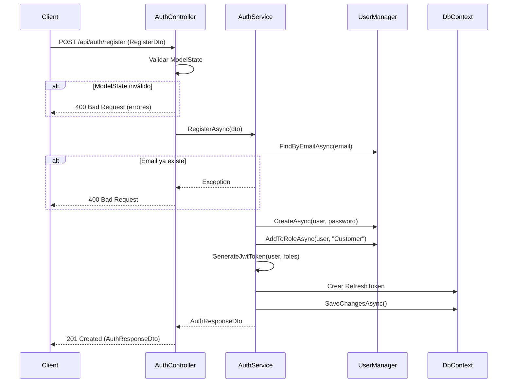

---

#### POST `/api/auth/login`

**Descripción**: Autentica un usuario existente con email y contraseña. Soporta la opción "recordarme" que extiende la duración del refresh token.

**Autenticación requerida**: No

**Parámetros de entrada**:

| Campo | Tipo | Requerido | Descripción |
|-------|------|-----------|-------------|
| `email` | string | Sí | Email del usuario |
| `password` | string | Sí | Contraseña del usuario |
| `rememberMe` | boolean | No | Extender duración del refresh token (default: false) |

**Respuesta exitosa** (200 OK):

```json
{
  "token": "eyJhbGciOiJIUzI1NiIs...",
  "refreshToken": "base64-encoded-string",
  "expiresAt": "2026-02-05T15:00:00Z",
  "user": {
    "id": "550e8400-e29b-41d4-a716-446655440000",
    "email": "user@example.com",
    "firstName": "John",
    "lastName": "Doe",
    "language": "es",
    "emailVerified": false,
    "roles": ["Customer", "Admin"]
  }
}
```

**Errores posibles**:
- `400 Bad Request`: Datos inválidos
- `401 Unauthorized`: Credenciales incorrectas o cuenta bloqueada

**Diagrama de secuencia**:

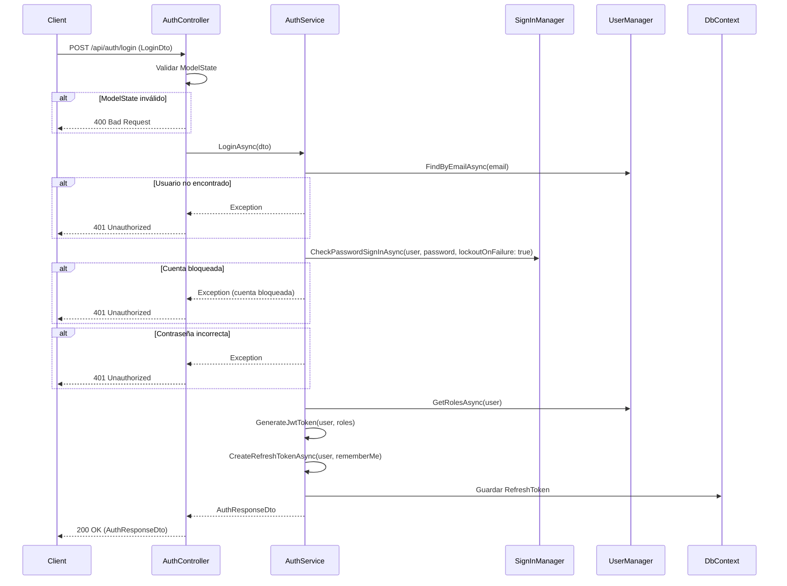

---

#### POST `/api/auth/refresh-token`

**Descripción**: Renueva un JWT expirado usando un refresh token válido. El refresh token anterior es revocado (rotación de tokens).

**Autenticación requerida**: No

**Parámetros de entrada**:

| Campo | Tipo | Requerido | Descripción |
|-------|------|-----------|-------------|
| `refreshToken` | string | Sí | Refresh token válido |

**Respuesta exitosa** (200 OK):

```json
{
  "token": "eyJhbGciOiJIUzI1NiIs...",
  "refreshToken": "nuevo-base64-encoded-string",
  "expiresAt": "2026-02-05T16:00:00Z",
  "user": {
    "id": "550e8400-e29b-41d4-a716-446655440000",
    "email": "user@example.com",
    "firstName": "John",
    "lastName": "Doe",
    "language": "es",
    "emailVerified": false,
    "roles": ["Customer"]
  }
}
```

**Errores posibles**:
- `400 Bad Request`: Datos inválidos
- `401 Unauthorized`: Token inválido, expirado o revocado

**Diagrama de secuencia**:

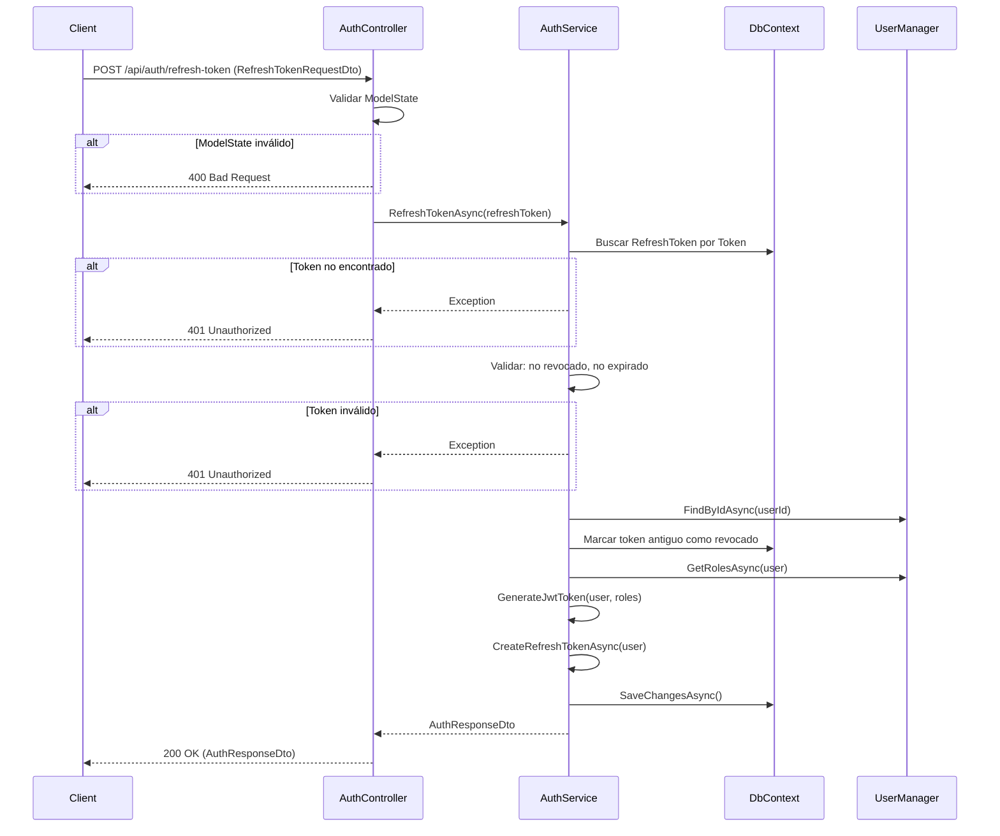

---

#### POST `/api/auth/forgot-password`

**Descripción**: Inicia el proceso de recuperación de contraseña. Envía un email con un enlace de reset si el usuario existe. Por seguridad, siempre retorna éxito independientemente de si el email existe.

**Autenticación requerida**: No

**Parámetros de entrada**:

| Campo | Tipo | Requerido | Descripción |
|-------|------|-----------|-------------|
| `email` | string | Sí | Email del usuario (formato válido) |

**Respuesta exitosa** (200 OK):

```json
{
  "message": "Si el email existe, recibirás instrucciones para restablecer tu contraseña."
}
```

**Errores posibles**:
- `400 Bad Request`: Formato de email inválido

**Diagrama de secuencia**:

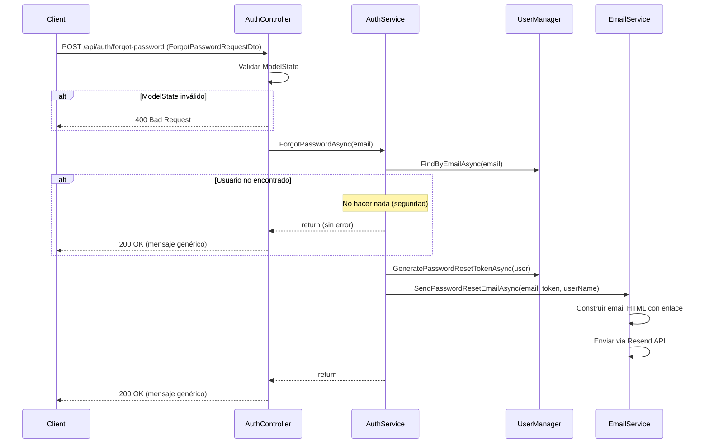

---

#### POST `/api/auth/reset-password`

**Descripción**: Completa el proceso de recuperación de contraseña. Valida el token recibido por email y establece la nueva contraseña. Revoca todos los refresh tokens activos del usuario.

**Autenticación requerida**: No

**Parámetros de entrada**:

| Campo | Tipo | Requerido | Descripción |
|-------|------|-----------|-------------|
| `email` | string | Sí | Email del usuario |
| `token` | string | Sí | Token de reset (recibido por email) |
| `newPassword` | string | Sí | Nueva contraseña (min 8 chars) |
| `confirmPassword` | string | Sí | Confirmación de contraseña |

**Respuesta exitosa** (200 OK):

```json
{
  "message": "Contraseña restablecida exitosamente."
}
```

**Errores posibles**:
- `400 Bad Request`: Token inválido, expirado o contraseñas no coinciden

**Diagrama de secuencia**:

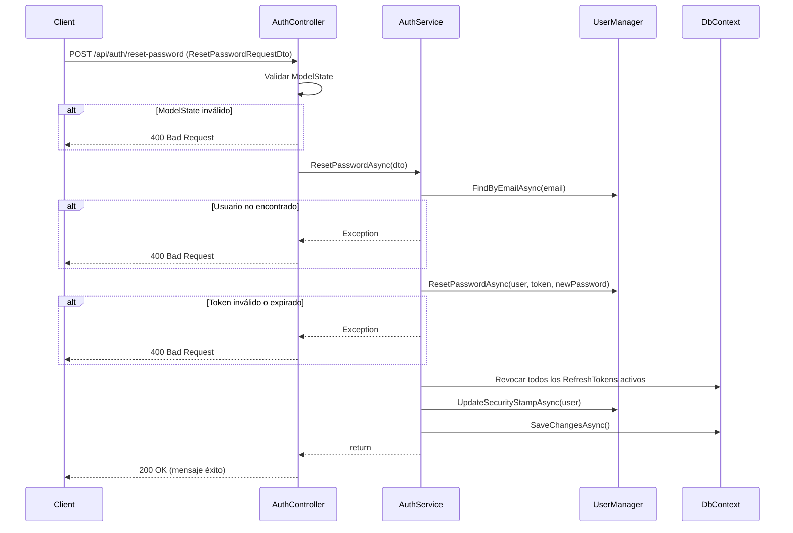

---

#### GET `/api/auth/me`

**Descripción**: Obtiene la información del usuario autenticado actual basándose en el JWT proporcionado.

**Autenticación requerida**: Sí (Bearer Token)

**Parámetros de entrada**: Ninguno (usuario extraído del JWT)

**Respuesta exitosa** (200 OK):

```json
{
  "id": "550e8400-e29b-41d4-a716-446655440000",
  "email": "user@example.com",
  "firstName": "John",
  "lastName": "Doe",
  "language": "es",
  "emailVerified": false,
  "roles": ["Customer"]
}
```

**Errores posibles**:
- `401 Unauthorized`: Token no proporcionado o inválido
- `404 Not Found`: Usuario no encontrado

**Diagrama de secuencia**:

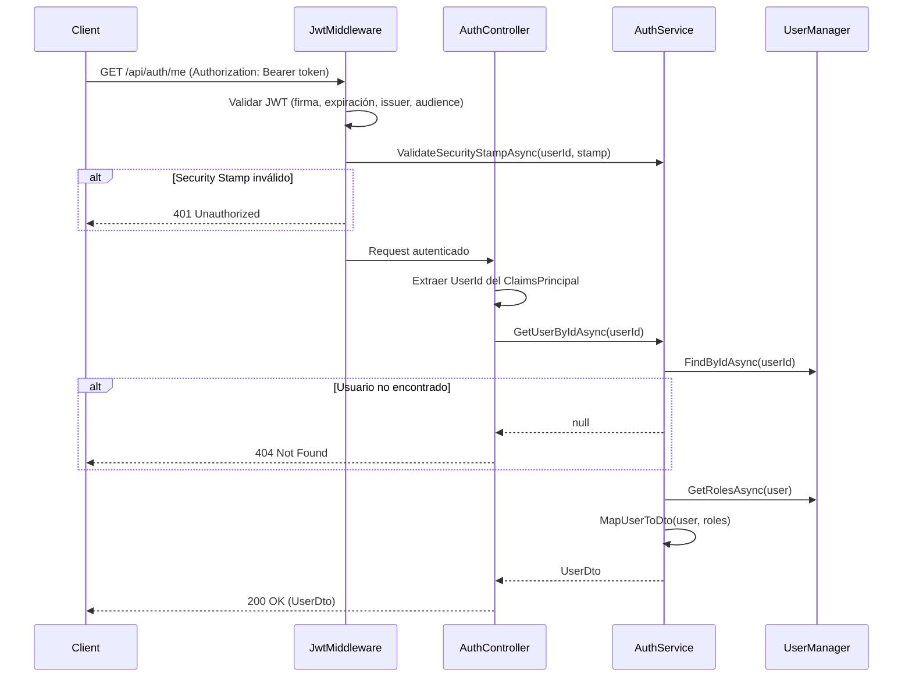

---

#### GET `/api/auth/test-auth`

**Descripción**: Endpoint de prueba para verificar que la autenticación JWT funciona correctamente. Útil durante desarrollo.

**Autenticación requerida**: Sí (Bearer Token)

**Parámetros de entrada**: Ninguno

**Respuesta exitosa** (200 OK):

```json
{
  "message": "Authenticated!",
  "userId": "550e8400-e29b-41d4-a716-446655440000",
  "email": "user@example.com",
  "roles": ["Customer"]
}
```

**Errores posibles**:
- `401 Unauthorized`: Token no proporcionado o inválido

**Diagrama de secuencia**:

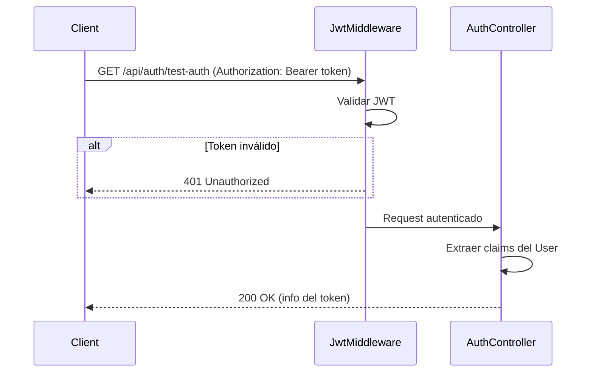

---

#### GET `/api/auth/admin-only`

**Descripción**: Endpoint de prueba que solo permite acceso a usuarios con el rol "Admin". Útil para verificar autorización basada en roles.

**Autenticación requerida**: Sí (Bearer Token con rol Admin)

**Parámetros de entrada**: Ninguno

**Respuesta exitosa** (200 OK):

```json
{
  "message": "Welcome, Admin!"
}
```

**Errores posibles**:
- `401 Unauthorized`: Token no proporcionado o inválido
- `403 Forbidden`: Usuario autenticado pero sin rol Admin

**Diagrama de secuencia**:

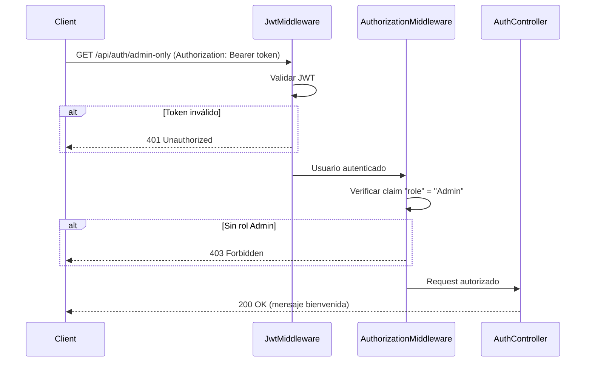

---

#### POST `/api/auth/logout`

**Descripción**: Cierra la sesión del usuario actual. Revoca todos los refresh tokens activos y actualiza el security stamp para invalidar todos los JWT emitidos.

**Autenticación requerida**: Sí (Bearer Token)

**Parámetros de entrada**: Ninguno

**Respuesta exitosa** (200 OK):

```json
{
  "message": "Sesión cerrada exitosamente."
}
```

**Errores posibles**:
- `401 Unauthorized`: Token no proporcionado o inválido

**Diagrama de secuencia**:

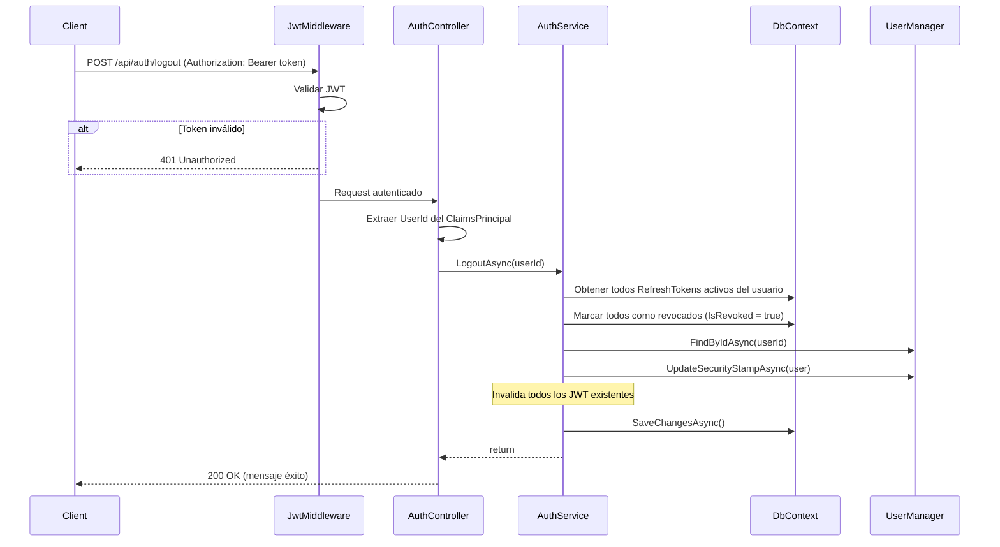

---

### 2. ProductsController

**Ruta Base**: `/api/products`

**Descripción**: Controlador público de productos del catálogo. Proporciona listado paginado con filtros avanzados y detalle de producto por ID o slug. Soporta internacionalización (i18n) mediante el parámetro `locale`. Los resultados se cachean en Redis mediante el patrón Decorator (`CachedProductRepository`) para optimizar el rendimiento.

**Dependencias**:
- `IProductRepository`: Repositorio de productos (decorado con cache Redis)
- `ILogger<ProductsController>`: Logging

**Estrategia de Cache (Redis)**:

| Endpoint | Cache Key | TTL |
|----------|-----------|-----|
| `GET /api/products` | `products:list:{locale}:{page}:{pageSize}:{search}:{minPrice}:{maxPrice}:{isActive}:{isCustomizable}:{sortBy}:{sortDescending}` | 1 hora |
| `GET /api/products/{id}` | `products:detail:id:{id}:{locale}` | 24 horas |
| `GET /api/products/slug/{slug}` | `products:detail:slug:{slug}:{locale}` | 24 horas |

> Los resultados `null` (producto no encontrado) no se cachean.

---

#### GET `/api/products`

**Descripción**: Obtiene un listado paginado de productos con soporte para búsqueda full-text, filtros por precio, estado y personalización, y ordenamiento configurable.

**Autenticación requerida**: No

**Parámetros de entrada** (query string):

| Campo | Tipo | Requerido | Default | Descripción |
|-------|------|-----------|---------|-------------|
| `search` | string | No | — | Búsqueda por nombre o descripción corta (ILIKE) |
| `minPrice` | decimal | No | — | Precio mínimo |
| `maxPrice` | decimal | No | — | Precio máximo |
| `isActive` | bool | No | `true` | Filtrar por estado activo |
| `isCustomizable` | bool | No | — | Filtrar por productos personalizables |
| `locale` | string | No | `"es"` | Idioma de las traducciones |
| `page` | int | No | `1` | Número de página |
| `pageSize` | int | No | `12` | Tamaño de página (1-50) |
| `sortBy` | string | No | — | Ordenar por: `"price"`, `"name"`, `"newest"` |
| `sortDescending` | bool | No | `false` | Orden descendente |

**Respuesta exitosa** (200 OK):

```json
{
  "items": [
    {
      "id": "550e8400-e29b-41d4-a716-446655440000",
      "sku": "SKU-001",
      "name": "Volante F1 Pro",
      "slug": "volante-f1-pro",
      "shortDescription": "Volante de competición con display integrado",
      "basePrice": 299.99,
      "vatRate": 0.21,
      "imageUrl": "https://cdn.example.com/products/volante-f1.jpg",
      "isActive": true,
      "isCustomizable": true
    }
  ],
  "totalCount": 15,
  "page": 1,
  "pageSize": 12,
  "totalPages": 2
}
```

**Diagrama de secuencia**:

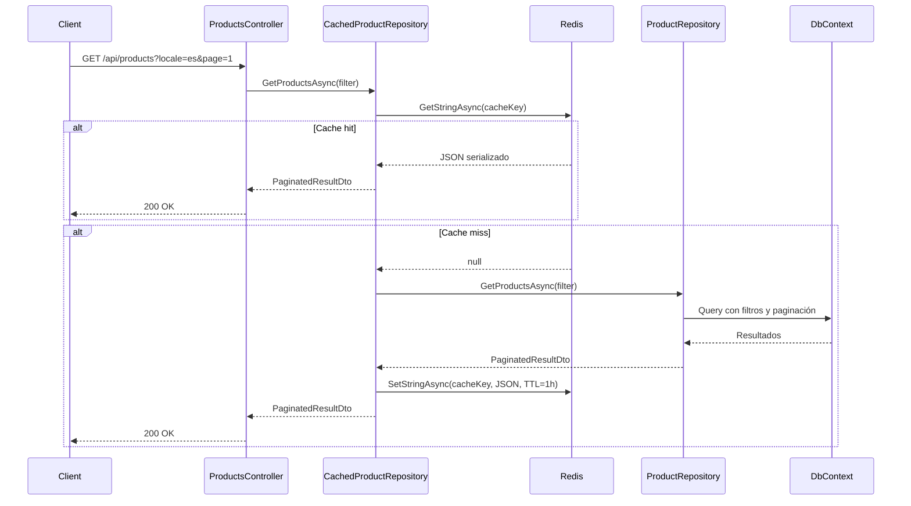

---

#### GET `/api/products/{id}`

**Descripción**: Obtiene el detalle completo de un producto por su ID, incluyendo imágenes, especificaciones y metadatos SEO.

**Autenticación requerida**: No

**Parámetros de entrada**:

| Campo | Tipo | Requerido | Default | Descripción |
|-------|------|-----------|---------|-------------|
| `id` | Guid | Sí | — | ID del producto (path) |
| `locale` | string | No | `"es"` | Idioma de las traducciones (query) |

**Respuesta exitosa** (200 OK):

```json
{
  "id": "550e8400-e29b-41d4-a716-446655440000",
  "sku": "SKU-001",
  "name": "Volante F1 Pro",
  "slug": "volante-f1-pro",
  "shortDescription": "Volante de competición con display integrado",
  "longDescription": "Descripción detallada del producto...",
  "basePrice": 299.99,
  "vatRate": 0.21,
  "metaTitle": "Volante F1 Pro | SimRacing Shop",
  "metaDescription": "Compra el volante F1 Pro...",
  "model3dUrl": "https://cdn.example.com/models/volante-f1.glb",
  "model3dSizeKb": 2048,
  "isActive": true,
  "isCustomizable": true,
  "baseProductionDays": 5,
  "weightGrams": 1200,
  "createdAt": "2026-01-15T10:00:00Z",
  "images": [
    {
      "id": "660e8400-e29b-41d4-a716-446655440001",
      "imageUrl": "https://cdn.example.com/products/volante-f1-front.jpg",
      "altText": "Volante F1 Pro - Vista frontal",
      "displayOrder": 0
    }
  ],
  "specifications": [
    {
      "specKey": "Diámetro",
      "specValue": "300mm",
      "displayOrder": 0
    }
  ]
}
```

**Errores posibles**:
- `404 Not Found`: Producto no encontrado

**Diagrama de secuencia**:

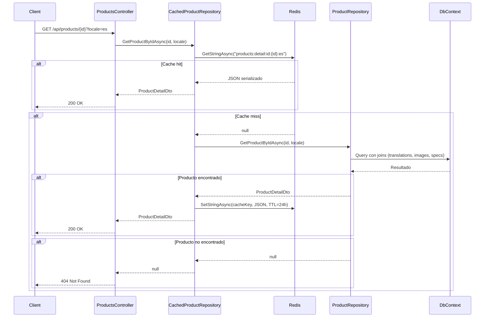

---

#### GET `/api/products/slug/{slug}`

**Descripción**: Obtiene el detalle completo de un producto por su slug traducido. Ideal para URLs amigables en el frontend.

**Autenticación requerida**: No

**Parámetros de entrada**:

| Campo | Tipo | Requerido | Default | Descripción |
|-------|------|-----------|---------|-------------|
| `slug` | string | Sí | — | Slug del producto (path) |
| `locale` | string | No | `"es"` | Idioma de las traducciones (query) |

**Respuesta exitosa** (200 OK): Misma estructura que `GET /api/products/{id}`

**Errores posibles**:
- `404 Not Found`: Producto no encontrado

**Diagrama de secuencia**:

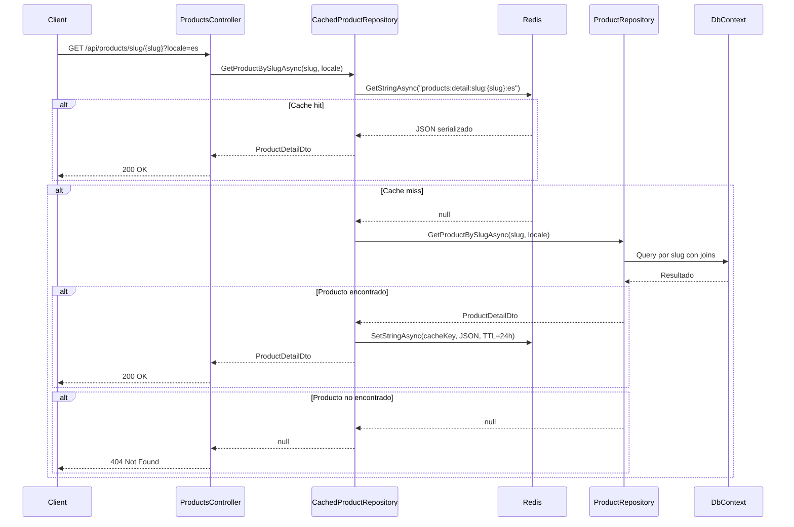

---

### 3. ComponentsController

**Ruta Base**: `/api/components`

**Descripción**: Controlador público de componentes del catálogo. Proporciona listado paginado de componentes con filtros y consulta de componentes disponibles para un producto específico (opciones de personalización).

**Dependencias**:
- `IComponentRepository`: Repositorio de componentes
- `ILogger<ComponentsController>`: Logging

---

#### GET `/api/components`

**Descripción**: Obtiene un listado paginado de componentes con filtros por tipo y disponibilidad de stock.

**Autenticación requerida**: No

**Parámetros de entrada** (query string):

| Campo | Tipo | Requerido | Default | Descripción |
|-------|------|-----------|---------|-------------|
| `search` | string | No | — | Búsqueda por nombre |
| `componentType` | string | No | — | Filtrar por tipo de componente |
| `inStock` | bool | No | — | Filtrar por disponibilidad |
| `locale` | string | No | `"es"` | Idioma de las traducciones |
| `page` | int | No | `1` | Número de página |
| `pageSize` | int | No | `12` | Tamaño de página |

**Respuesta exitosa** (200 OK):

```json
{
  "items": [
    {
      "id": "770e8400-e29b-41d4-a716-446655440000",
      "sku": "COMP-001",
      "componentType": "wheel_rim",
      "name": "Aro de aluminio 300mm",
      "description": "Aro fresado en aluminio aeronáutico",
      "stockQuantity": 25,
      "inStock": true,
      "weightGrams": 450
    }
  ],
  "totalCount": 8,
  "page": 1,
  "pageSize": 12,
  "totalPages": 1
}
```

**Diagrama de secuencia**:

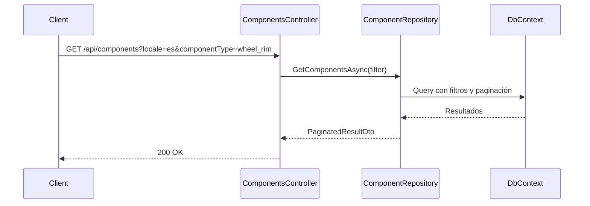

---

#### GET `/api/components/product/{productId}`

**Descripción**: Obtiene las opciones de componentes disponibles para personalizar un producto específico, agrupadas por tipo de opción.

**Autenticación requerida**: No

**Parámetros de entrada**:

| Campo | Tipo | Requerido | Default | Descripción |
|-------|------|-----------|---------|-------------|
| `productId` | Guid | Sí | — | ID del producto (path) |
| `locale` | string | No | `"es"` | Idioma de las traducciones (query) |

**Respuesta exitosa** (200 OK):

```json
[
  {
    "componentId": "770e8400-e29b-41d4-a716-446655440000",
    "sku": "COMP-001",
    "componentType": "wheel_rim",
    "name": "Aro de aluminio 300mm",
    "description": "Aro fresado en aluminio aeronáutico",
    "optionGroup": "Aro",
    "priceModifier": 49.99,
    "isDefault": true,
    "displayOrder": 0,
    "stockQuantity": 25,
    "inStock": true
  },
  {
    "componentId": "880e8400-e29b-41d4-a716-446655440001",
    "sku": "COMP-002",
    "componentType": "wheel_rim",
    "name": "Aro de fibra de carbono 300mm",
    "description": "Aro ultraligero de fibra de carbono",
    "optionGroup": "Aro",
    "priceModifier": 149.99,
    "isDefault": false,
    "displayOrder": 1,
    "stockQuantity": 10,
    "inStock": true
  }
]
```

**Diagrama de secuencia**:

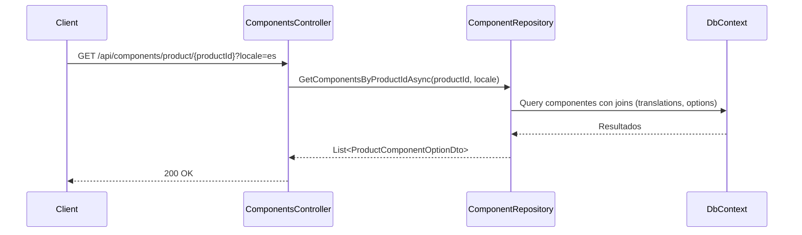

---

## Modelos de Datos (DTOs)

### DTOs de Autenticación

#### RegisterDto
```csharp
public class RegisterDto
{
    [Required]
    [EmailAddress]
    public string Email { get; set; }

    [Required]
    [MinLength(8)]
    public string Password { get; set; }

    [Required]
    [Compare("Password")]
    public string ConfirmPassword { get; set; }

    public string? FirstName { get; set; }
    public string? LastName { get; set; }
    public string Language { get; set; } = "es";
}
```

#### LoginDto
```csharp
public class LoginDto
{
    [Required]
    [EmailAddress]
    public string Email { get; set; }

    [Required]
    public string Password { get; set; }

    public bool RememberMe { get; set; } = false;
}
```

#### RefreshTokenRequestDto
```csharp
public class RefreshTokenRequestDto
{
    [Required]
    public string RefreshToken { get; set; }
}
```

#### ForgotPasswordRequestDto
```csharp
public class ForgotPasswordRequestDto
{
    [Required]
    [EmailAddress]
    public string Email { get; set; }
}
```

#### ResetPasswordRequestDto
```csharp
public class ResetPasswordRequestDto
{
    [Required]
    [EmailAddress]
    public string Email { get; set; }

    [Required]
    public string Token { get; set; }

    [Required]
    [MinLength(8)]
    public string NewPassword { get; set; }

    [Required]
    [Compare("NewPassword")]
    public string ConfirmPassword { get; set; }
}
```

#### AuthResponseDto
```csharp
public class AuthResponseDto
{
    public string Token { get; set; }
    public string RefreshToken { get; set; }
    public DateTime ExpiresAt { get; set; }
    public UserDto User { get; set; }
}
```

#### UserDto
```csharp
public class UserDto
{
    public Guid Id { get; set; }
    public string Email { get; set; }
    public string? FirstName { get; set; }
    public string? LastName { get; set; }
    public string Language { get; set; }
    public bool EmailVerified { get; set; }
    public List<string> Roles { get; set; }
}
```

### DTOs de Productos

#### ProductFilterDto
```csharp
public record ProductFilterDto
{
    public string? Search { get; init; }
    public decimal? MinPrice { get; init; }
    public decimal? MaxPrice { get; init; }
    public bool? IsActive { get; init; } = true;
    public bool? IsCustomizable { get; init; }
    public string Locale { get; init; } = "es";
    public int Page { get; init; } = 1;
    public int PageSize { get; init; } = 12;
    public string? SortBy { get; init; }
    public bool SortDescending { get; init; }
}
```

#### ProductListItemDto
```csharp
public record ProductListItemDto
{
    public Guid Id { get; init; }
    public string Sku { get; init; }
    public string Name { get; init; }
    public string Slug { get; init; }
    public string? ShortDescription { get; init; }
    public decimal BasePrice { get; init; }
    public decimal VatRate { get; init; }
    public string? ImageUrl { get; init; }
    public bool IsActive { get; init; }
    public bool IsCustomizable { get; init; }
}
```

#### ProductDetailDto
```csharp
public record ProductDetailDto
{
    public Guid Id { get; init; }
    public string Sku { get; init; }
    public string Name { get; init; }
    public string Slug { get; init; }
    public string? ShortDescription { get; init; }
    public string? LongDescription { get; init; }
    public decimal BasePrice { get; init; }
    public decimal VatRate { get; init; }
    public string? MetaTitle { get; init; }
    public string? MetaDescription { get; init; }
    public string? Model3dUrl { get; init; }
    public int? Model3dSizeKb { get; init; }
    public bool IsActive { get; init; }
    public bool IsCustomizable { get; init; }
    public int BaseProductionDays { get; init; }
    public int? WeightGrams { get; init; }
    public DateTime CreatedAt { get; init; }
    public List<ProductImageDto> Images { get; init; }
    public List<ProductSpecificationDto> Specifications { get; init; }
}
```

#### ProductImageDto
```csharp
public record ProductImageDto
{
    public Guid Id { get; init; }
    public string ImageUrl { get; init; }
    public string? AltText { get; init; }
    public int DisplayOrder { get; init; }
}
```

#### ProductSpecificationDto
```csharp
public record ProductSpecificationDto
{
    public string SpecKey { get; init; }
    public string SpecValue { get; init; }
    public int DisplayOrder { get; init; }
}
```

#### PaginatedResultDto\<T\>
```csharp
public record PaginatedResultDto<T>
{
    public List<T> Items { get; init; }
    public int TotalCount { get; init; }
    public int Page { get; init; }
    public int PageSize { get; init; }
    public int TotalPages { get; init; }
}
```

### DTOs de Componentes

#### ComponentFilterDto
```csharp
public record ComponentFilterDto
{
    public string? Search { get; init; }
    public string? ComponentType { get; init; }
    public bool? InStock { get; init; }
    public string Locale { get; init; } = "es";
    public int Page { get; init; } = 1;
    public int PageSize { get; init; } = 12;
}
```

#### ComponentListItemDto
```csharp
public record ComponentListItemDto
{
    public Guid Id { get; init; }
    public string Sku { get; init; }
    public string ComponentType { get; init; }
    public string Name { get; init; }
    public string? Description { get; init; }
    public int StockQuantity { get; init; }
    public bool InStock { get; init; }
    public int? WeightGrams { get; init; }
}
```

#### ProductComponentOptionDto
```csharp
public record ProductComponentOptionDto
{
    public Guid ComponentId { get; init; }
    public string Sku { get; init; }
    public string ComponentType { get; init; }
    public string Name { get; init; }
    public string? Description { get; init; }
    public string OptionGroup { get; init; }
    public decimal PriceModifier { get; init; }
    public bool IsDefault { get; init; }
    public int DisplayOrder { get; init; }
    public int StockQuantity { get; init; }
    public bool InStock { get; init; }
}
```

---

## Flujos de Autenticación

### Flujo Completo de Autenticación

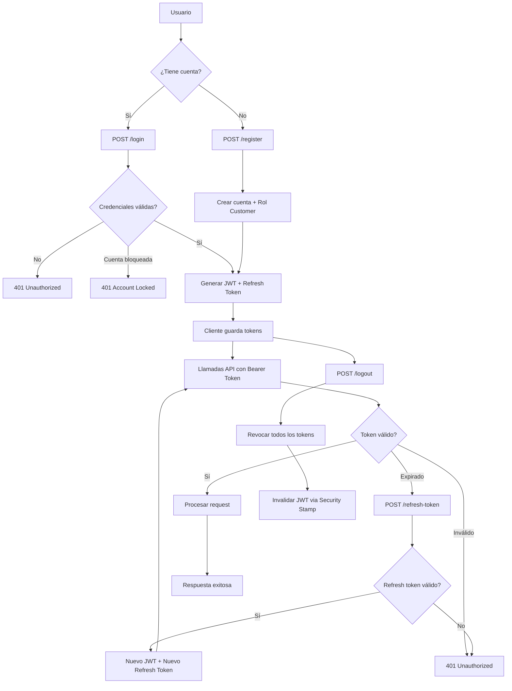

### Flujo de Recuperación de Contraseña

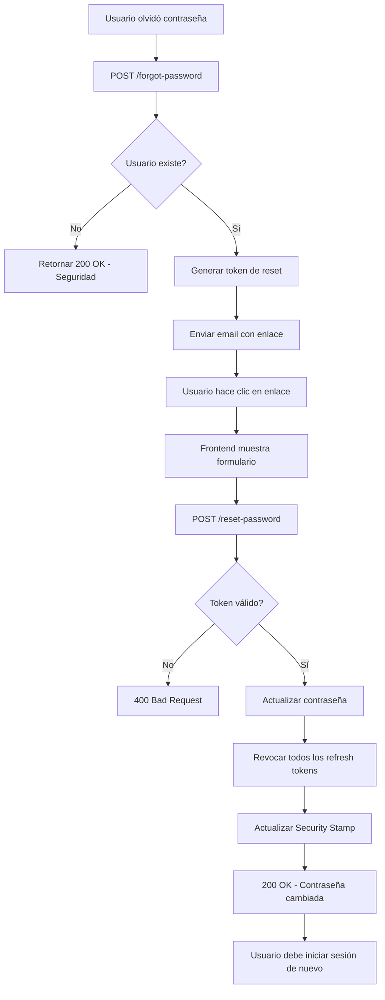

---

## Configuración

### JWT Settings

```json
{
  "JwtSettings": {
    "Secret": "clave-secreta-minimo-32-caracteres",
    "Issuer": "SimRacingShop",
    "Audience": "SimRacingShop",
    "ExpiryMinutes": 60,
    "RefreshTokenExpiryDays": 7
  }
}
```

### Redis Cache

```json
{
  "ConnectionStrings": {
    "Redis": "localhost:6379"
  }
}
```

**Implementación**: Se utiliza `IDistributedCache` con el proveedor `StackExchange.Redis`. El cache se implementa mediante el patrón Decorator con `CachedProductRepository`, que envuelve al `ProductRepository` original sin modificarlo.

**Configuración DI**:
```csharp
builder.Services.AddStackExchangeRedisCache(options =>
{
    options.Configuration = builder.Configuration.GetConnectionString("Redis");
    options.InstanceName = "SimRacingShop:";
});
```

**Políticas de TTL**:

| Recurso | TTL | Justificación |
|---------|-----|---------------|
| Listado de productos | 1 hora | Los listados cambian con frecuencia moderada (nuevos productos, precios) |
| Producto individual (por ID) | 24 horas | Los detalles de producto cambian raramente |
| Producto individual (por slug) | 24 horas | Misma política que por ID |

### Estructura del JWT

**Header**:
```json
{
  "alg": "HS256",
  "typ": "JWT"
}
```

**Payload**:
```json
{
  "sub": "550e8400-e29b-41d4-a716-446655440000",
  "email": "user@example.com",
  "jti": "unique-token-id",
  "language": "es",
  "security_stamp": "stamp-hash",
  "role": ["Customer", "Admin"],
  "iss": "SimRacingShop",
  "aud": "SimRacingShop",
  "exp": 1738770000,
  "iat": 1738766400
}
```

---

## Códigos de Estado HTTP

| Código | Descripción | Uso en la API |
|--------|-------------|---------------|
| 200 | OK | Operación exitosa (login, refresh, logout, listados, detalle) |
| 201 | Created | Recurso creado (registro de usuario) |
| 400 | Bad Request | Validación fallida, datos inválidos |
| 401 | Unauthorized | Token inválido, expirado o no proporcionado |
| 403 | Forbidden | Usuario autenticado pero sin permisos |
| 404 | Not Found | Recurso no encontrado (producto, usuario) |
| 500 | Internal Server Error | Error del servidor |

---

## Notas de Seguridad

1. **Nunca** almacenar tokens JWT en localStorage (vulnerable a XSS)
2. **Siempre** usar HTTPS en producción
3. Los refresh tokens se almacenan en base de datos con hash
4. El security stamp invalida todos los JWT tras logout o cambio de contraseña
5. Las respuestas de `/forgot-password` no revelan si el email existe
6. Bloqueo automático de cuenta tras 5 intentos fallidos de login
