# API Architecture Documentation

## Descripción General

SimRacing Shop API es el backend de una plataforma e-commerce para hardware de sim racing personalizable. Está construida con **.NET 10** siguiendo los principios de **Clean Architecture** y proporciona servicios RESTful para autenticación, gestión de usuarios, productos y pedidos.

### Stack Tecnológico

| Tecnología | Uso |
|------------|-----|
| ASP.NET Core 10 | Framework web |
| PostgreSQL 16 | Base de datos relacional |
| Redis 7 | Cache distribuido |
| Entity Framework Core | ORM |
| ASP.NET Identity | Gestión de usuarios y roles |
| JWT + Refresh Tokens | Autenticación stateless |
| FluentValidation | Validación de DTOs (capa dominio) |
| Serilog | Logging estructurado |
| Resend | Servicio de emails |

### Arquitectura de Capas

```
┌─────────────────────────────────────────────────────────────┐
│                    SimRacingShop.API                        │
│              (Controllers, Middleware, Config)              │
├─────────────────────────────────────────────────────────────┤
│                   SimRacingShop.Core                        │
│        (Entities, DTOs, Validators, Settings, Interfaces)   │
├─────────────────────────────────────────────────────────────┤
│                SimRacingShop.Infrastructure                 │
│         (DbContext, Repositories, Services, EF Config)      │
├─────────────────────────────────────────────────────────────┤
│               PostgreSQL 16        Redis 7                  │
│              (Persistencia)    (Cache distribuido)           │
└─────────────────────────────────────────────────────────────┘
```

### Estructura de Proyectos

```
backend/src/
├── SimRacingShop.API/
│   ├── Controllers/          # Endpoints REST
│   ├── Program.cs            # Configuración DI y middleware
│   └── appsettings.json      # Configuración
├── SimRacingShop.Core/
│   ├── DTOs/                 # Objetos de transferencia
│   ├── Entities/             # Entidades de dominio
│   ├── Repositories/         # Interfaces de repositorios
│   ├── Services/             # Interfaces de servicios
│   ├── Settings/             # Clases de configuración
│   └── Validators/           # FluentValidation (reglas de dominio)
└── SimRacingShop.Infrastructure/
    ├── Data/                 # DbContext y configuraciones EF
    ├── Repositories/         # Implementaciones de repositorios
    └── Services/             # Implementaciones de servicios
```

### Características de Seguridad

- **Validación de contraseñas**: Mínimo 8 caracteres, mayúscula, minúscula y dígito
- **Bloqueo de cuenta**: 15 minutos después de 5 intentos fallidos
- **Security Stamp**: Invalidación de tokens tras logout o cambio de contraseña
- **Rotación de Refresh Tokens**: Token anterior revocado al emitir uno nuevo
- **HTTPS**: Redirección automática en producción

---

## Controladores

### 1. AuthController

**Ruta Base**: `/api/auth`

**Descripción**: Controlador de autenticación y autorización. Gestiona el registro de usuarios, inicio de sesión, renovación de tokens JWT, recuperación de contraseña y cierre de sesión. Implementa un flujo completo de autenticación basado en JWT con soporte para refresh tokens persistidos en base de datos.

**Dependencias**:
- `IAuthService`: Servicio de autenticación
- `ILogger<AuthController>`: Logging

---

#### POST `/api/auth/register`

**Descripción**: Registra un nuevo usuario en el sistema. Crea la cuenta, asigna el rol "Customer" por defecto y retorna tokens de autenticación.

**Autenticación requerida**: No

**Parámetros de entrada**:

| Campo | Tipo | Requerido | Descripción |
|-------|------|-----------|-------------|
| `email` | string | Sí | Email del usuario (formato válido) |
| `password` | string | Sí | Contraseña (min 8 chars, mayúscula, minúscula, dígito) |
| `confirmPassword` | string | Sí | Confirmación de contraseña (debe coincidir) |
| `firstName` | string | No | Nombre del usuario |
| `lastName` | string | No | Apellido del usuario |
| `language` | string | No | Idioma preferido (default: "es") |

**Respuesta exitosa** (201 Created):

```json
{
  "token": "eyJhbGciOiJIUzI1NiIs...",
  "refreshToken": "base64-encoded-string",
  "expiresAt": "2026-02-05T15:00:00Z",
  "user": {
    "id": "550e8400-e29b-41d4-a716-446655440000",
    "email": "user@example.com",
    "firstName": "John",
    "lastName": "Doe",
    "language": "es",
    "emailVerified": false,
    "roles": ["Customer"]
  }
}
```

**Errores posibles**:
- `400 Bad Request`: Datos inválidos o email ya registrado

**Diagrama de secuencia**:

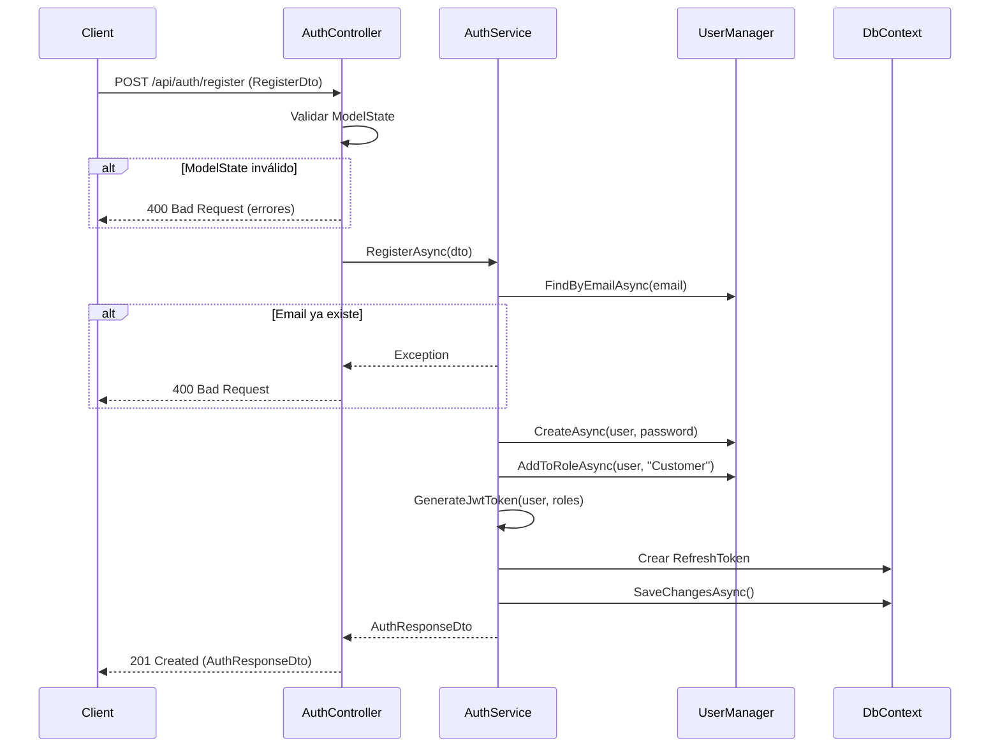
```mermaid
sequenceDiagram
    participant Client
    participant AuthController
    participant AuthService
    participant UserManager
    participant DbContext

    Client->>AuthController: POST /api/auth/register (RegisterDto)
    AuthController->>AuthController: Validar ModelState

    alt ModelState inválido
        AuthController-->>Client: 400 Bad Request (errores)
    end

    AuthController->>AuthService: RegisterAsync(dto)
    AuthService->>UserManager: FindByEmailAsync(email)

    alt Email ya existe
        AuthService-->>AuthController: Exception
        AuthController-->>Client: 400 Bad Request
    end

    AuthService->>UserManager: CreateAsync(user, password)
    AuthService->>UserManager: AddToRoleAsync(user, "Customer")
    AuthService->>AuthService: GenerateJwtToken(user, roles)
    AuthService->>DbContext: Crear RefreshToken
    AuthService->>DbContext: SaveChangesAsync()
    AuthService-->>AuthController: AuthResponseDto
    AuthController-->>Client: 201 Created (AuthResponseDto)
```

---

#### POST `/api/auth/login`

**Descripción**: Autentica un usuario existente con email y contraseña. Soporta la opción "recordarme" que extiende la duración del refresh token.

**Autenticación requerida**: No

**Parámetros de entrada**:

| Campo | Tipo | Requerido | Descripción |
|-------|------|-----------|-------------|
| `email` | string | Sí | Email del usuario |
| `password` | string | Sí | Contraseña del usuario |
| `rememberMe` | boolean | No | Extender duración del refresh token (default: false) |

**Respuesta exitosa** (200 OK):

```json
{
  "token": "eyJhbGciOiJIUzI1NiIs...",
  "refreshToken": "base64-encoded-string",
  "expiresAt": "2026-02-05T15:00:00Z",
  "user": {
    "id": "550e8400-e29b-41d4-a716-446655440000",
    "email": "user@example.com",
    "firstName": "John",
    "lastName": "Doe",
    "language": "es",
    "emailVerified": false,
    "roles": ["Customer", "Admin"]
  }
}
```

**Errores posibles**:
- `400 Bad Request`: Datos inválidos
- `401 Unauthorized`: Credenciales incorrectas o cuenta bloqueada

**Diagrama de secuencia**:

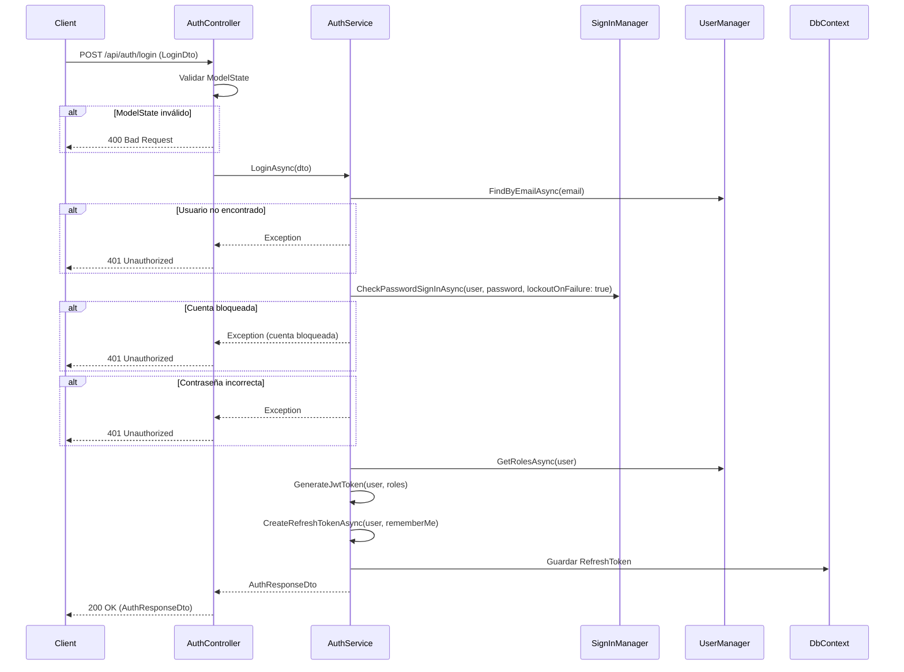
```mermaid
sequenceDiagram
    participant Client
    participant AuthController
    participant AuthService
    participant SignInManager
    participant UserManager
    participant DbContext

    Client->>AuthController: POST /api/auth/login (LoginDto)
    AuthController->>AuthController: Validar ModelState

    alt ModelState inválido
        AuthController-->>Client: 400 Bad Request
    end

    AuthController->>AuthService: LoginAsync(dto)
    AuthService->>UserManager: FindByEmailAsync(email)

    alt Usuario no encontrado
        AuthService-->>AuthController: Exception
        AuthController-->>Client: 401 Unauthorized
    end

    AuthService->>SignInManager: CheckPasswordSignInAsync(user, password, lockoutOnFailure: true)

    alt Cuenta bloqueada
        AuthService-->>AuthController: Exception (cuenta bloqueada)
        AuthController-->>Client: 401 Unauthorized
    end

    alt Contraseña incorrecta
        AuthService-->>AuthController: Exception
        AuthController-->>Client: 401 Unauthorized
    end

    AuthService->>UserManager: GetRolesAsync(user)
    AuthService->>AuthService: GenerateJwtToken(user, roles)
    AuthService->>AuthService: CreateRefreshTokenAsync(user, rememberMe)
    AuthService->>DbContext: Guardar RefreshToken
    AuthService-->>AuthController: AuthResponseDto
    AuthController-->>Client: 200 OK (AuthResponseDto)
```

---

#### POST `/api/auth/refresh-token`

**Descripción**: Renueva un JWT expirado usando un refresh token válido. El refresh token anterior es revocado (rotación de tokens).

**Autenticación requerida**: No

**Parámetros de entrada**:

| Campo | Tipo | Requerido | Descripción |
|-------|------|-----------|-------------|
| `refreshToken` | string | Sí | Refresh token válido |

**Respuesta exitosa** (200 OK):

```json
{
  "token": "eyJhbGciOiJIUzI1NiIs...",
  "refreshToken": "nuevo-base64-encoded-string",
  "expiresAt": "2026-02-05T16:00:00Z",
  "user": {
    "id": "550e8400-e29b-41d4-a716-446655440000",
    "email": "user@example.com",
    "firstName": "John",
    "lastName": "Doe",
    "language": "es",
    "emailVerified": false,
    "roles": ["Customer"]
  }
}
```

**Errores posibles**:
- `400 Bad Request`: Datos inválidos
- `401 Unauthorized`: Token inválido, expirado o revocado

**Diagrama de secuencia**:

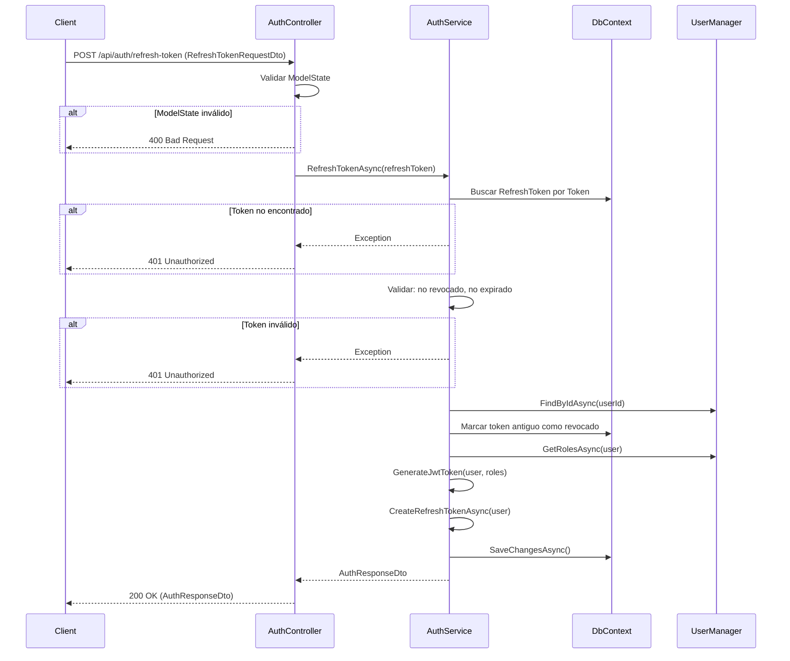
```mermaid
sequenceDiagram
    participant Client
    participant AuthController
    participant AuthService
    participant DbContext
    participant UserManager

    Client->>AuthController: POST /api/auth/refresh-token (RefreshTokenRequestDto)
    AuthController->>AuthController: Validar ModelState

    alt ModelState inválido
        AuthController-->>Client: 400 Bad Request
    end

    AuthController->>AuthService: RefreshTokenAsync(refreshToken)
    AuthService->>DbContext: Buscar RefreshToken por Token

    alt Token no encontrado
        AuthService-->>AuthController: Exception
        AuthController-->>Client: 401 Unauthorized
    end

    AuthService->>AuthService: Validar: no revocado, no expirado

    alt Token inválido
        AuthService-->>AuthController: Exception
        AuthController-->>Client: 401 Unauthorized
    end

    AuthService->>UserManager: FindByIdAsync(userId)
    AuthService->>DbContext: Marcar token antiguo como revocado
    AuthService->>UserManager: GetRolesAsync(user)
    AuthService->>AuthService: GenerateJwtToken(user, roles)
    AuthService->>AuthService: CreateRefreshTokenAsync(user)
    AuthService->>DbContext: SaveChangesAsync()
    AuthService-->>AuthController: AuthResponseDto
    AuthController-->>Client: 200 OK (AuthResponseDto)
```

---

#### POST `/api/auth/forgot-password`

**Descripción**: Inicia el proceso de recuperación de contraseña. Envía un email con un enlace de reset si el usuario existe. Por seguridad, siempre retorna éxito independientemente de si el email existe.

**Autenticación requerida**: No

**Parámetros de entrada**:

| Campo | Tipo | Requerido | Descripción |
|-------|------|-----------|-------------|
| `email` | string | Sí | Email del usuario (formato válido) |

**Respuesta exitosa** (200 OK):

```json
{
  "message": "Si el email existe, recibirás instrucciones para restablecer tu contraseña."
}
```

**Errores posibles**:
- `400 Bad Request`: Formato de email inválido

**Diagrama de secuencia**:

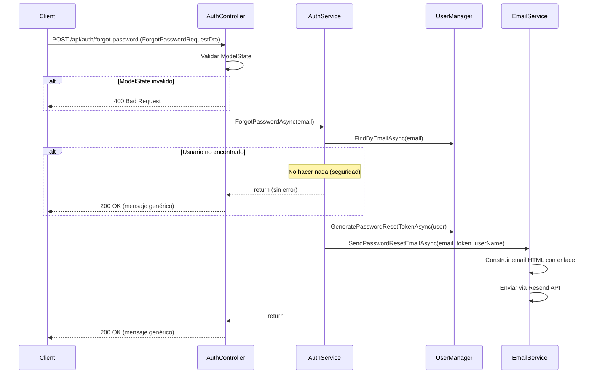
```mermaid
sequenceDiagram
    participant Client
    participant AuthController
    participant AuthService
    participant UserManager
    participant EmailService

    Client->>AuthController: POST /api/auth/forgot-password (ForgotPasswordRequestDto)
    AuthController->>AuthController: Validar ModelState

    alt ModelState inválido
        AuthController-->>Client: 400 Bad Request
    end

    AuthController->>AuthService: ForgotPasswordAsync(email)
    AuthService->>UserManager: FindByEmailAsync(email)

    alt Usuario no encontrado
        Note over AuthService: No hacer nada (seguridad)
        AuthService-->>AuthController: return (sin error)
        AuthController-->>Client: 200 OK (mensaje genérico)
    end

    AuthService->>UserManager: GeneratePasswordResetTokenAsync(user)
    AuthService->>EmailService: SendPasswordResetEmailAsync(email, token, userName)
    EmailService->>EmailService: Construir email HTML con enlace
    EmailService->>EmailService: Enviar via Resend API
    AuthService-->>AuthController: return
    AuthController-->>Client: 200 OK (mensaje genérico)
```

---

#### POST `/api/auth/reset-password`

**Descripción**: Completa el proceso de recuperación de contraseña. Valida el token recibido por email y establece la nueva contraseña. Revoca todos los refresh tokens activos del usuario.

**Autenticación requerida**: No

**Parámetros de entrada**:

| Campo | Tipo | Requerido | Descripción |
|-------|------|-----------|-------------|
| `email` | string | Sí | Email del usuario |
| `token` | string | Sí | Token de reset (recibido por email) |
| `newPassword` | string | Sí | Nueva contraseña (min 8 chars) |
| `confirmPassword` | string | Sí | Confirmación de contraseña |

**Respuesta exitosa** (200 OK):

```json
{
  "message": "Contraseña restablecida exitosamente."
}
```

**Errores posibles**:
- `400 Bad Request`: Token inválido, expirado o contraseñas no coinciden

**Diagrama de secuencia**:

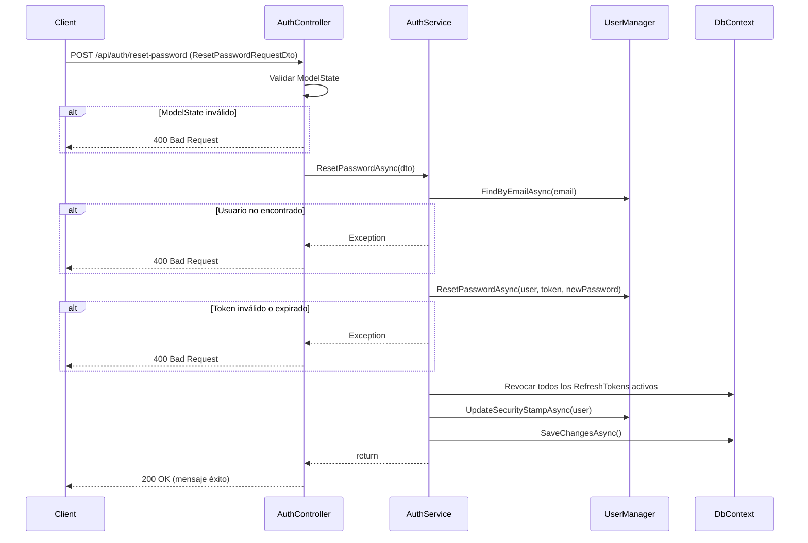
```mermaid
sequenceDiagram
    participant Client
    participant AuthController
    participant AuthService
    participant UserManager
    participant DbContext

    Client->>AuthController: POST /api/auth/reset-password (ResetPasswordRequestDto)
    AuthController->>AuthController: Validar ModelState

    alt ModelState inválido
        AuthController-->>Client: 400 Bad Request
    end

    AuthController->>AuthService: ResetPasswordAsync(dto)
    AuthService->>UserManager: FindByEmailAsync(email)

    alt Usuario no encontrado
        AuthService-->>AuthController: Exception
        AuthController-->>Client: 400 Bad Request
    end

    AuthService->>UserManager: ResetPasswordAsync(user, token, newPassword)

    alt Token inválido o expirado
        AuthService-->>AuthController: Exception
        AuthController-->>Client: 400 Bad Request
    end

    AuthService->>DbContext: Revocar todos los RefreshTokens activos
    AuthService->>UserManager: UpdateSecurityStampAsync(user)
    AuthService->>DbContext: SaveChangesAsync()
    AuthService-->>AuthController: return
    AuthController-->>Client: 200 OK (mensaje éxito)
```

---

#### GET `/api/auth/me`

**Descripción**: Obtiene la información del usuario autenticado actual basándose en el JWT proporcionado.

**Autenticación requerida**: Sí (Bearer Token)

**Parámetros de entrada**: Ninguno (usuario extraído del JWT)

**Respuesta exitosa** (200 OK):

```json
{
  "id": "550e8400-e29b-41d4-a716-446655440000",
  "email": "user@example.com",
  "firstName": "John",
  "lastName": "Doe",
  "language": "es",
  "emailVerified": false,
  "roles": ["Customer"]
}
```

**Errores posibles**:
- `401 Unauthorized`: Token no proporcionado o inválido
- `404 Not Found`: Usuario no encontrado

**Diagrama de secuencia**:

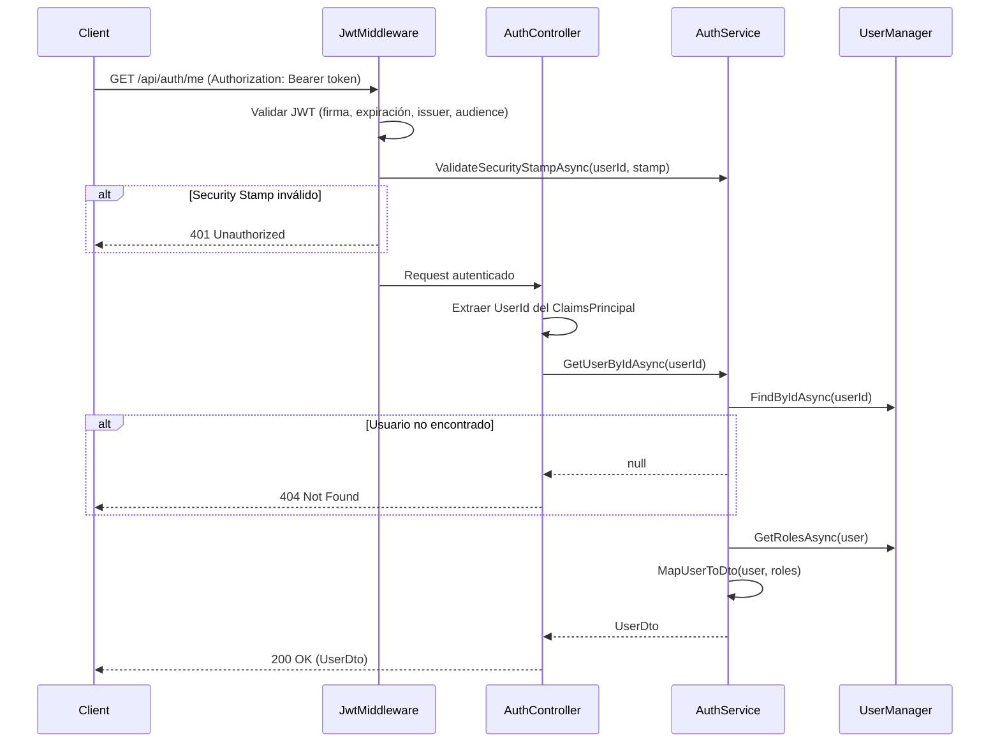
```mermaid
sequenceDiagram
    participant Client
    participant JwtMiddleware
    participant AuthController
    participant AuthService
    participant UserManager

    Client->>JwtMiddleware: GET /api/auth/me (Authorization: Bearer token)
    JwtMiddleware->>JwtMiddleware: Validar JWT (firma, expiración, issuer, audience)
    JwtMiddleware->>AuthService: ValidateSecurityStampAsync(userId, stamp)

    alt Security Stamp inválido
        JwtMiddleware-->>Client: 401 Unauthorized
    end

    JwtMiddleware->>AuthController: Request autenticado
    AuthController->>AuthController: Extraer UserId del ClaimsPrincipal
    AuthController->>AuthService: GetUserByIdAsync(userId)
    AuthService->>UserManager: FindByIdAsync(userId)

    alt Usuario no encontrado
        AuthService-->>AuthController: null
        AuthController-->>Client: 404 Not Found
    end

    AuthService->>UserManager: GetRolesAsync(user)
    AuthService->>AuthService: MapUserToDto(user, roles)
    AuthService-->>AuthController: UserDto
    AuthController-->>Client: 200 OK (UserDto)
```

---

#### GET `/api/auth/test-auth`

**Descripción**: Endpoint de prueba para verificar que la autenticación JWT funciona correctamente. Útil durante desarrollo.

**Autenticación requerida**: Sí (Bearer Token)

**Parámetros de entrada**: Ninguno

**Respuesta exitosa** (200 OK):

```json
{
  "message": "Authenticated!",
  "userId": "550e8400-e29b-41d4-a716-446655440000",
  "email": "user@example.com",
  "roles": ["Customer"]
}
```

**Errores posibles**:
- `401 Unauthorized`: Token no proporcionado o inválido

**Diagrama de secuencia**:

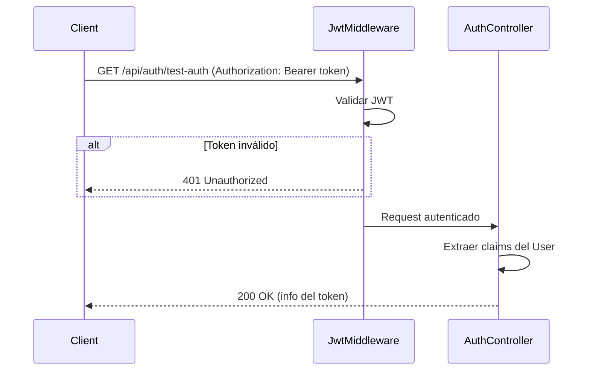
```mermaid
sequenceDiagram
    participant Client
    participant JwtMiddleware
    participant AuthController

    Client->>JwtMiddleware: GET /api/auth/test-auth (Authorization: Bearer token)
    JwtMiddleware->>JwtMiddleware: Validar JWT

    alt Token inválido
        JwtMiddleware-->>Client: 401 Unauthorized
    end

    JwtMiddleware->>AuthController: Request autenticado
    AuthController->>AuthController: Extraer claims del User
    AuthController-->>Client: 200 OK (info del token)
```

---

#### GET `/api/auth/admin-only`

**Descripción**: Endpoint de prueba que solo permite acceso a usuarios con el rol "Admin". Útil para verificar autorización basada en roles.

**Autenticación requerida**: Sí (Bearer Token con rol Admin)

**Parámetros de entrada**: Ninguno

**Respuesta exitosa** (200 OK):

```json
{
  "message": "Welcome, Admin!"
}
```

**Errores posibles**:
- `401 Unauthorized`: Token no proporcionado o inválido
- `403 Forbidden`: Usuario autenticado pero sin rol Admin

**Diagrama de secuencia**:

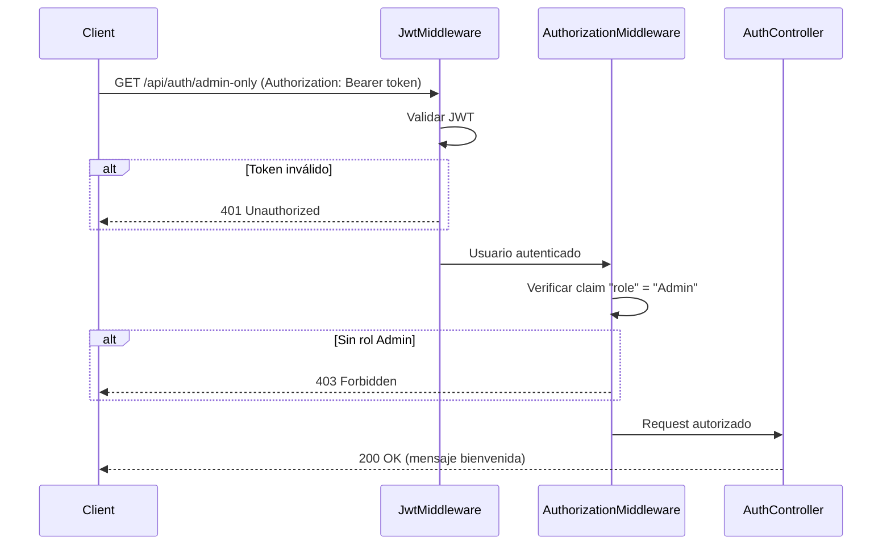
```mermaid
sequenceDiagram
    participant Client
    participant JwtMiddleware
    participant AuthorizationMiddleware
    participant AuthController

    Client->>JwtMiddleware: GET /api/auth/admin-only (Authorization: Bearer token)
    JwtMiddleware->>JwtMiddleware: Validar JWT

    alt Token inválido
        JwtMiddleware-->>Client: 401 Unauthorized
    end

    JwtMiddleware->>AuthorizationMiddleware: Usuario autenticado
    AuthorizationMiddleware->>AuthorizationMiddleware: Verificar claim "role" = "Admin"

    alt Sin rol Admin
        AuthorizationMiddleware-->>Client: 403 Forbidden
    end

    AuthorizationMiddleware->>AuthController: Request autorizado
    AuthController-->>Client: 200 OK (mensaje bienvenida)
```

---

#### POST `/api/auth/logout`

**Descripción**: Cierra la sesión del usuario actual. Revoca todos los refresh tokens activos y actualiza el security stamp para invalidar todos los JWT emitidos.

**Autenticación requerida**: Sí (Bearer Token)

**Parámetros de entrada**: Ninguno

**Respuesta exitosa** (200 OK):

```json
{
  "message": "Sesión cerrada exitosamente."
}
```

**Errores posibles**:
- `401 Unauthorized`: Token no proporcionado o inválido

**Diagrama de secuencia**:

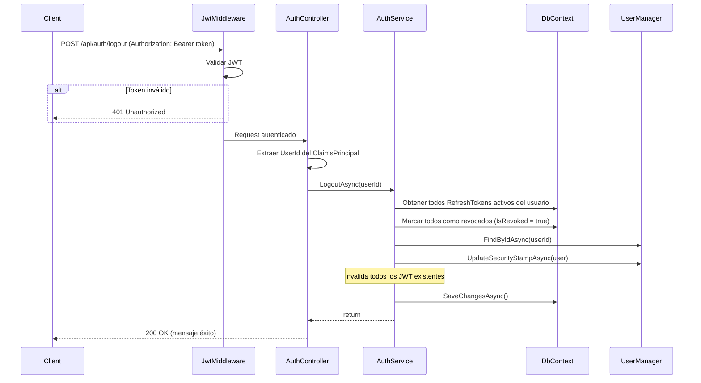
```mermaid
sequenceDiagram
    participant Client
    participant JwtMiddleware
    participant AuthController
    participant AuthService
    participant DbContext
    participant UserManager

    Client->>JwtMiddleware: POST /api/auth/logout (Authorization: Bearer token)
    JwtMiddleware->>JwtMiddleware: Validar JWT

    alt Token inválido
        JwtMiddleware-->>Client: 401 Unauthorized
    end

    JwtMiddleware->>AuthController: Request autenticado
    AuthController->>AuthController: Extraer UserId del ClaimsPrincipal
    AuthController->>AuthService: LogoutAsync(userId)
    AuthService->>DbContext: Obtener todos RefreshTokens activos del usuario
    AuthService->>DbContext: Marcar todos como revocados (IsRevoked = true)
    AuthService->>UserManager: FindByIdAsync(userId)
    AuthService->>UserManager: UpdateSecurityStampAsync(user)
    Note over AuthService: Invalida todos los JWT existentes
    AuthService->>DbContext: SaveChangesAsync()
    AuthService-->>AuthController: return
    AuthController-->>Client: 200 OK (mensaje éxito)
```

---

### 2. ProductsController

**Ruta Base**: `/api/products`

**Descripción**: Controlador público de productos del catálogo. Proporciona listado paginado con filtros avanzados y detalle de producto por ID o slug. Soporta internacionalización (i18n) mediante el parámetro `locale`. Los resultados se cachean en Redis mediante el patrón Decorator (`CachedProductRepository`) para optimizar el rendimiento.

**Dependencias**:
- `IProductRepository`: Repositorio de productos (decorado con cache Redis)
- `ILogger<ProductsController>`: Logging

**Estrategia de Cache (Redis)**:

| Endpoint | Cache Key | TTL |
|----------|-----------|-----|
| `GET /api/products` | `products:list:{locale}:{page}:{pageSize}:{search}:{minPrice}:{maxPrice}:{isActive}:{isCustomizable}:{sortBy}:{sortDescending}` | 1 hora |
| `GET /api/products/{id}` | `products:detail:id:{id}:{locale}` | 24 horas |
| `GET /api/products/slug/{slug}` | `products:detail:slug:{slug}:{locale}` | 24 horas |

> Los resultados `null` (producto no encontrado) no se cachean.

---

#### GET `/api/products`

**Descripción**: Obtiene un listado paginado de productos con soporte para búsqueda full-text, filtros por precio, estado y personalización, y ordenamiento configurable.

**Autenticación requerida**: No

**Parámetros de entrada** (query string):

| Campo | Tipo | Requerido | Default | Descripción |
|-------|------|-----------|---------|-------------|
| `search` | string | No | — | Búsqueda por nombre o descripción corta (ILIKE) |
| `minPrice` | decimal | No | — | Precio mínimo |
| `maxPrice` | decimal | No | — | Precio máximo |
| `isActive` | bool | No | `true` | Filtrar por estado activo |
| `isCustomizable` | bool | No | — | Filtrar por productos personalizables |
| `locale` | string | No | `"es"` | Idioma de las traducciones |
| `page` | int | No | `1` | Número de página |
| `pageSize` | int | No | `12` | Tamaño de página (1-50) |
| `sortBy` | string | No | — | Ordenar por: `"price"`, `"name"`, `"newest"` |
| `sortDescending` | bool | No | `false` | Orden descendente |

**Respuesta exitosa** (200 OK):

```json
{
  "items": [
    {
      "id": "550e8400-e29b-41d4-a716-446655440000",
      "sku": "SKU-001",
      "name": "Volante F1 Pro",
      "slug": "volante-f1-pro",
      "shortDescription": "Volante de competición con display integrado",
      "basePrice": 299.99,
      "vatRate": 0.21,
      "imageUrl": "https://cdn.example.com/products/volante-f1.jpg",
      "isActive": true,
      "isCustomizable": true
    }
  ],
  "totalCount": 15,
  "page": 1,
  "pageSize": 12,
  "totalPages": 2
}
```

**Diagrama de secuencia**:

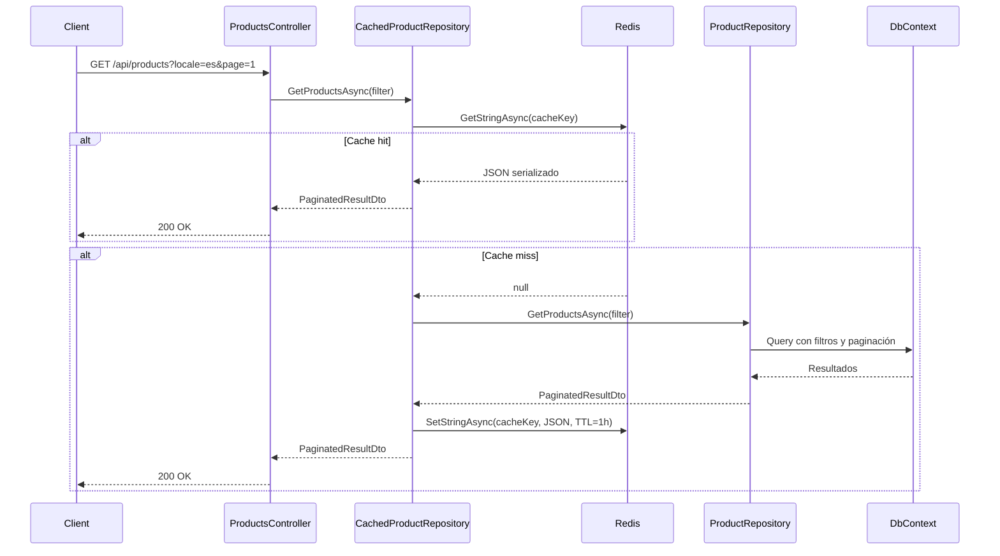
```mermaid
sequenceDiagram
    participant Client
    participant ProductsController
    participant CachedProductRepository
    participant Redis
    participant ProductRepository
    participant DbContext

    Client->>ProductsController: GET /api/products?locale=es&page=1
    ProductsController->>CachedProductRepository: GetProductsAsync(filter)
    CachedProductRepository->>Redis: GetStringAsync(cacheKey)

    alt Cache hit
        Redis-->>CachedProductRepository: JSON serializado
        CachedProductRepository-->>ProductsController: PaginatedResultDto
        ProductsController-->>Client: 200 OK
    end

    alt Cache miss
        Redis-->>CachedProductRepository: null
        CachedProductRepository->>ProductRepository: GetProductsAsync(filter)
        ProductRepository->>DbContext: Query con filtros y paginación
        DbContext-->>ProductRepository: Resultados
        ProductRepository-->>CachedProductRepository: PaginatedResultDto
        CachedProductRepository->>Redis: SetStringAsync(cacheKey, JSON, TTL=1h)
        CachedProductRepository-->>ProductsController: PaginatedResultDto
        ProductsController-->>Client: 200 OK
    end
```

---

#### GET `/api/products/{id}`

**Descripción**: Obtiene el detalle completo de un producto por su ID, incluyendo imágenes, especificaciones y metadatos SEO.

**Autenticación requerida**: No

**Parámetros de entrada**:

| Campo | Tipo | Requerido | Default | Descripción |
|-------|------|-----------|---------|-------------|
| `id` | Guid | Sí | — | ID del producto (path) |
| `locale` | string | No | `"es"` | Idioma de las traducciones (query) |

**Respuesta exitosa** (200 OK):

```json
{
  "id": "550e8400-e29b-41d4-a716-446655440000",
  "sku": "SKU-001",
  "name": "Volante F1 Pro",
  "slug": "volante-f1-pro",
  "shortDescription": "Volante de competición con display integrado",
  "longDescription": "Descripción detallada del producto...",
  "basePrice": 299.99,
  "vatRate": 0.21,
  "metaTitle": "Volante F1 Pro | SimRacing Shop",
  "metaDescription": "Compra el volante F1 Pro...",
  "model3dUrl": "https://cdn.example.com/models/volante-f1.glb",
  "model3dSizeKb": 2048,
  "isActive": true,
  "isCustomizable": true,
  "baseProductionDays": 5,
  "weightGrams": 1200,
  "createdAt": "2026-01-15T10:00:00Z",
  "images": [
    {
      "id": "660e8400-e29b-41d4-a716-446655440001",
      "imageUrl": "https://cdn.example.com/products/volante-f1-front.jpg",
      "altText": "Volante F1 Pro - Vista frontal",
      "displayOrder": 0
    }
  ],
  "specifications": [
    {
      "specKey": "Diámetro",
      "specValue": "300mm",
      "displayOrder": 0
    }
  ]
}
```

**Errores posibles**:
- `404 Not Found`: Producto no encontrado

**Diagrama de secuencia**:

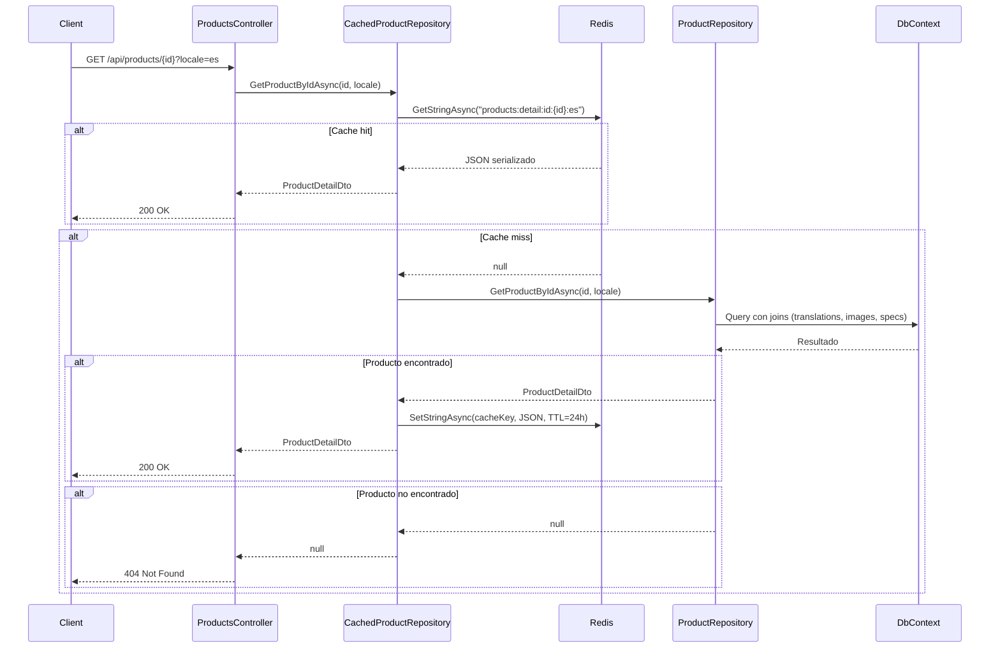
```mermaid
sequenceDiagram
    participant Client
    participant ProductsController
    participant CachedProductRepository
    participant Redis
    participant ProductRepository
    participant DbContext

    Client->>ProductsController: GET /api/products/{id}?locale=es
    ProductsController->>CachedProductRepository: GetProductByIdAsync(id, locale)
    CachedProductRepository->>Redis: GetStringAsync("products:detail:id:{id}:es")

    alt Cache hit
        Redis-->>CachedProductRepository: JSON serializado
        CachedProductRepository-->>ProductsController: ProductDetailDto
        ProductsController-->>Client: 200 OK
    end

    alt Cache miss
        Redis-->>CachedProductRepository: null
        CachedProductRepository->>ProductRepository: GetProductByIdAsync(id, locale)
        ProductRepository->>DbContext: Query con joins (translations, images, specs)
        DbContext-->>ProductRepository: Resultado

        alt Producto encontrado
            ProductRepository-->>CachedProductRepository: ProductDetailDto
            CachedProductRepository->>Redis: SetStringAsync(cacheKey, JSON, TTL=24h)
            CachedProductRepository-->>ProductsController: ProductDetailDto
            ProductsController-->>Client: 200 OK
        end

        alt Producto no encontrado
            ProductRepository-->>CachedProductRepository: null
            CachedProductRepository-->>ProductsController: null
            ProductsController-->>Client: 404 Not Found
        end
    end
```

---

#### GET `/api/products/slug/{slug}`

**Descripción**: Obtiene el detalle completo de un producto por su slug traducido. Ideal para URLs amigables en el frontend.

**Autenticación requerida**: No

**Parámetros de entrada**:

| Campo | Tipo | Requerido | Default | Descripción |
|-------|------|-----------|---------|-------------|
| `slug` | string | Sí | — | Slug del producto (path) |
| `locale` | string | No | `"es"` | Idioma de las traducciones (query) |

**Respuesta exitosa** (200 OK): Misma estructura que `GET /api/products/{id}`

**Errores posibles**:
- `404 Not Found`: Producto no encontrado

**Diagrama de secuencia**:

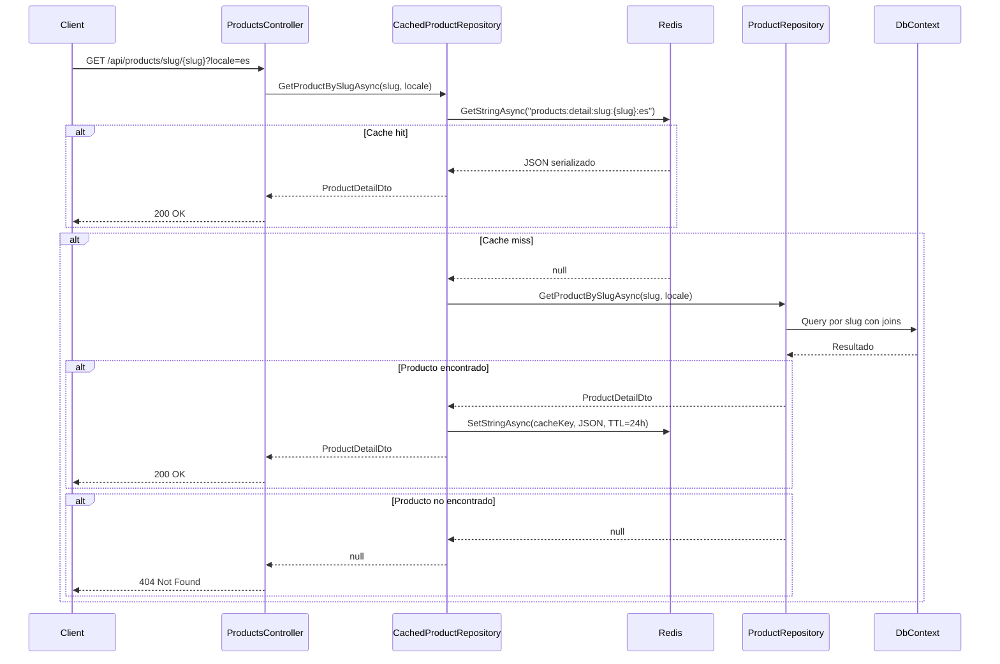
```mermaid
sequenceDiagram
    participant Client
    participant ProductsController
    participant CachedProductRepository
    participant Redis
    participant ProductRepository
    participant DbContext

    Client->>ProductsController: GET /api/products/slug/{slug}?locale=es
    ProductsController->>CachedProductRepository: GetProductBySlugAsync(slug, locale)
    CachedProductRepository->>Redis: GetStringAsync("products:detail:slug:{slug}:es")

    alt Cache hit
        Redis-->>CachedProductRepository: JSON serializado
        CachedProductRepository-->>ProductsController: ProductDetailDto
        ProductsController-->>Client: 200 OK
    end

    alt Cache miss
        Redis-->>CachedProductRepository: null
        CachedProductRepository->>ProductRepository: GetProductBySlugAsync(slug, locale)
        ProductRepository->>DbContext: Query por slug con joins
        DbContext-->>ProductRepository: Resultado

        alt Producto encontrado
            ProductRepository-->>CachedProductRepository: ProductDetailDto
            CachedProductRepository->>Redis: SetStringAsync(cacheKey, JSON, TTL=24h)
            CachedProductRepository-->>ProductsController: ProductDetailDto
            ProductsController-->>Client: 200 OK
        end

        alt Producto no encontrado
            ProductRepository-->>CachedProductRepository: null
            CachedProductRepository-->>ProductsController: null
            ProductsController-->>Client: 404 Not Found
        end
    end
```

---

### 3. ComponentsController

**Ruta Base**: `/api/components`

**Descripción**: Controlador público de componentes del catálogo. Proporciona listado paginado de componentes con filtros y consulta de componentes disponibles para un producto específico (opciones de personalización).

**Dependencias**:
- `IComponentRepository`: Repositorio de componentes
- `ILogger<ComponentsController>`: Logging

---

#### GET `/api/components`

**Descripción**: Obtiene un listado paginado de componentes con filtros por tipo y disponibilidad de stock.

**Autenticación requerida**: No

**Parámetros de entrada** (query string):

| Campo | Tipo | Requerido | Default | Descripción |
|-------|------|-----------|---------|-------------|
| `search` | string | No | — | Búsqueda por nombre |
| `componentType` | string | No | — | Filtrar por tipo de componente |
| `inStock` | bool | No | — | Filtrar por disponibilidad |
| `locale` | string | No | `"es"` | Idioma de las traducciones |
| `page` | int | No | `1` | Número de página |
| `pageSize` | int | No | `12` | Tamaño de página |

**Respuesta exitosa** (200 OK):

```json
{
  "items": [
    {
      "id": "770e8400-e29b-41d4-a716-446655440000",
      "sku": "COMP-001",
      "componentType": "wheel_rim",
      "name": "Aro de aluminio 300mm",
      "description": "Aro fresado en aluminio aeronáutico",
      "stockQuantity": 25,
      "inStock": true,
      "weightGrams": 450
    }
  ],
  "totalCount": 8,
  "page": 1,
  "pageSize": 12,
  "totalPages": 1
}
```

**Diagrama de secuencia**:

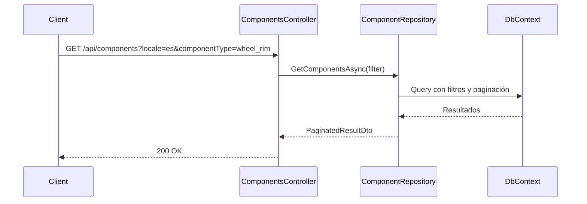
```mermaid
sequenceDiagram
    participant Client
    participant ComponentsController
    participant ComponentRepository
    participant DbContext

    Client->>ComponentsController: GET /api/components?locale=es&componentType=wheel_rim
    ComponentsController->>ComponentRepository: GetComponentsAsync(filter)
    ComponentRepository->>DbContext: Query con filtros y paginación
    DbContext-->>ComponentRepository: Resultados
    ComponentRepository-->>ComponentsController: PaginatedResultDto
    ComponentsController-->>Client: 200 OK
```

---

#### GET `/api/components/product/{productId}`

**Descripción**: Obtiene las opciones de componentes disponibles para personalizar un producto específico, agrupadas por tipo de opción.

**Autenticación requerida**: No

**Parámetros de entrada**:

| Campo | Tipo | Requerido | Default | Descripción |
|-------|------|-----------|---------|-------------|
| `productId` | Guid | Sí | — | ID del producto (path) |
| `locale` | string | No | `"es"` | Idioma de las traducciones (query) |

**Respuesta exitosa** (200 OK):

```json
[
  {
    "componentId": "770e8400-e29b-41d4-a716-446655440000",
    "sku": "COMP-001",
    "componentType": "wheel_rim",
    "name": "Aro de aluminio 300mm",
    "description": "Aro fresado en aluminio aeronáutico",
    "optionGroup": "Aro",
    "priceModifier": 49.99,
    "isDefault": true,
    "displayOrder": 0,
    "stockQuantity": 25,
    "inStock": true
  },
  {
    "componentId": "880e8400-e29b-41d4-a716-446655440001",
    "sku": "COMP-002",
    "componentType": "wheel_rim",
    "name": "Aro de fibra de carbono 300mm",
    "description": "Aro ultraligero de fibra de carbono",
    "optionGroup": "Aro",
    "priceModifier": 149.99,
    "isDefault": false,
    "displayOrder": 1,
    "stockQuantity": 10,
    "inStock": true
  }
]
```

**Diagrama de secuencia**:

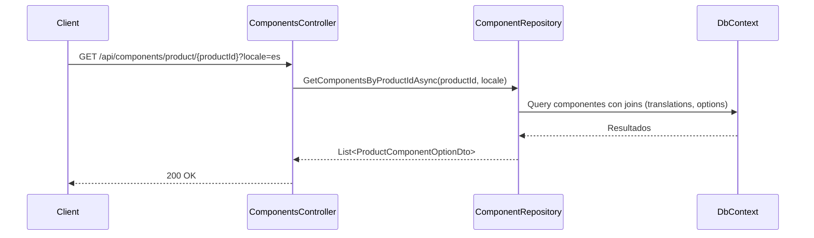
```mermaid
sequenceDiagram
    participant Client
    participant ComponentsController
    participant ComponentRepository
    participant DbContext

    Client->>ComponentsController: GET /api/components/product/{productId}?locale=es
    ComponentsController->>ComponentRepository: GetComponentsByProductIdAsync(productId, locale)
    ComponentRepository->>DbContext: Query componentes con joins (translations, options)
    DbContext-->>ComponentRepository: Resultados
    ComponentRepository-->>ComponentsController: List<ProductComponentOptionDto>
    ComponentsController-->>Client: 200 OK
```

---

### 4. AdminProductsController

**Ruta Base**: `/api/admin/products`

**Descripción**: Controlador de administración de productos. Proporciona CRUD completo, subida de imágenes al sistema de archivos local y gestión de traducciones. Invalida la cache Redis tras cada operación de escritura.

**Autenticación requerida**: Sí (Bearer Token con rol **Admin**)

**Dependencias**:
- `IProductAdminRepository`: Repositorio admin de productos
- `IFileStorageService`: Almacenamiento de archivos (local filesystem)
- `IDistributedCache`: Cache Redis para invalidación
- `ILogger<AdminProductsController>`: Logging

**Validación (FluentValidation)**:

| DTO | Reglas |
|-----|--------|
| `CreateProductDto` | SKU requerido/max 50, SKU único (async), BasePrice > 0, VatRate 0-100, BaseProductionDays 1-365, Translations no vacías |
| `UpdateProductDto` | BasePrice > 0, VatRate 0-100, BaseProductionDays 1-365 |
| `UpdateTranslationsDto` | Translations no vacías, cada traducción con Locale/Name/Slug requeridos |

**Invalidación de Cache**:

Tras cada operación de escritura se invalidan las cache keys de detalle por ID y slug para cada locale del producto. Los listados expiran naturalmente por TTL (1 hora).

---

#### POST `/api/admin/products`

**Descripción**: Crea un nuevo producto con sus traducciones iniciales.

**Autenticación requerida**: Sí (Admin)

**Parámetros de entrada** (body JSON):

| Campo | Tipo | Requerido | Default | Descripción |
|-------|------|-----------|---------|-------------|
| `sku` | string | Sí | — | SKU único del producto (max 50) |
| `basePrice` | decimal | Sí | — | Precio base (> 0) |
| `vatRate` | decimal | No | `21.00` | Porcentaje de IVA (0-100) |
| `model3dUrl` | string | No | — | URL del modelo 3D |
| `model3dSizeKb` | int | No | — | Tamaño del modelo 3D en KB |
| `isActive` | bool | No | `true` | Estado activo |
| `isCustomizable` | bool | No | `true` | Es personalizable |
| `baseProductionDays` | int | No | `7` | Días de producción (1-365) |
| `weightGrams` | int | No | — | Peso en gramos |
| `translations` | array | Sí | — | Al menos una traducción |

**Respuesta exitosa** (201 Created): `ProductDetailDto`

**Errores posibles**:
- `400 Bad Request`: Validación fallida (SKU duplicado, precio negativo, traducciones vacías)

**Diagrama de secuencia**:

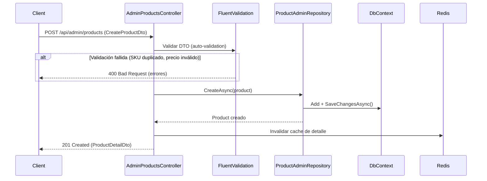
```mermaid
sequenceDiagram
    participant Client
    participant AdminProductsController
    participant FluentValidation
    participant ProductAdminRepository
    participant DbContext
    participant Redis

    Client->>AdminProductsController: POST /api/admin/products (CreateProductDto)
    AdminProductsController->>FluentValidation: Validar DTO (auto-validation)

    alt Validación fallida (SKU duplicado, precio inválido)
        FluentValidation-->>Client: 400 Bad Request (errores)
    end

    AdminProductsController->>ProductAdminRepository: CreateAsync(product)
    ProductAdminRepository->>DbContext: Add + SaveChangesAsync()
    ProductAdminRepository-->>AdminProductsController: Product creado
    AdminProductsController->>Redis: Invalidar cache de detalle
    AdminProductsController-->>Client: 201 Created (ProductDetailDto)
```

---

#### PUT `/api/admin/products/{id}`

**Descripción**: Edita los campos base de un producto existente (no modifica traducciones ni imágenes).

**Autenticación requerida**: Sí (Admin)

**Parámetros de entrada**:

| Campo | Tipo | Requerido | Descripción |
|-------|------|-----------|-------------|
| `id` | Guid | Sí | ID del producto (path) |
| `basePrice` | decimal | Sí | Precio base (> 0) |
| `vatRate` | decimal | No | Porcentaje de IVA (0-100) |
| `model3dUrl` | string | No | URL del modelo 3D |
| `model3dSizeKb` | int | No | Tamaño del modelo 3D en KB |
| `isActive` | bool | No | Estado activo |
| `isCustomizable` | bool | No | Es personalizable |
| `baseProductionDays` | int | No | Días de producción (1-365) |
| `weightGrams` | int | No | Peso en gramos |

**Respuesta exitosa** (200 OK): `ProductDetailDto`

**Errores posibles**:
- `400 Bad Request`: Validación fallida
- `404 Not Found`: Producto no encontrado

---

#### DELETE `/api/admin/products/{id}`

**Descripción**: Elimina un producto, sus traducciones, especificaciones y archivos de imagen del filesystem.

**Autenticación requerida**: Sí (Admin)

**Parámetros de entrada**:

| Campo | Tipo | Requerido | Descripción |
|-------|------|-----------|-------------|
| `id` | Guid | Sí | ID del producto (path) |

**Respuesta exitosa** (204 No Content)

**Errores posibles**:
- `404 Not Found`: Producto no encontrado

**Diagrama de secuencia**:

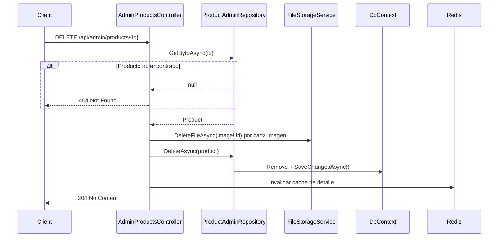
```mermaid
sequenceDiagram
    participant Client
    participant AdminProductsController
    participant ProductAdminRepository
    participant FileStorageService
    participant DbContext
    participant Redis

    Client->>AdminProductsController: DELETE /api/admin/products/{id}
    AdminProductsController->>ProductAdminRepository: GetByIdAsync(id)

    alt Producto no encontrado
        ProductAdminRepository-->>AdminProductsController: null
        AdminProductsController-->>Client: 404 Not Found
    end

    ProductAdminRepository-->>AdminProductsController: Product
    AdminProductsController->>FileStorageService: DeleteFileAsync(imageUrl) por cada imagen
    AdminProductsController->>ProductAdminRepository: DeleteAsync(product)
    ProductAdminRepository->>DbContext: Remove + SaveChangesAsync()
    AdminProductsController->>Redis: Invalidar cache de detalle
    AdminProductsController-->>Client: 204 No Content
```

---

#### POST `/api/admin/products/{id}/images`

**Descripción**: Sube imágenes para un producto. Los archivos se almacenan en `wwwroot/uploads/products/` con nombre GUID. Se auto-asigna el `displayOrder` incremental.

**Autenticación requerida**: Sí (Admin)

**Parámetros de entrada** (multipart/form-data):

| Campo | Tipo | Requerido | Descripción |
|-------|------|-----------|-------------|
| `id` | Guid | Sí | ID del producto (path) |
| `files` | IFormFile[] | Sí | Archivos de imagen (jpg, jpeg, png, webp; max 5MB) |

**Respuesta exitosa** (201 Created):

```json
[
  {
    "id": "550e8400-e29b-41d4-a716-446655440000",
    "imageUrl": "/uploads/products/a1b2c3d4.jpg",
    "altText": "nombre-archivo",
    "displayOrder": 1
  }
]
```

**Errores posibles**:
- `400 Bad Request`: Sin archivos, tipo de archivo no permitido o tamaño excedido
- `404 Not Found`: Producto no encontrado

---

#### PUT `/api/admin/products/{id}/translations`

**Descripción**: Reemplaza todas las traducciones de un producto. Elimina las existentes y añade las nuevas.

**Autenticación requerida**: Sí (Admin)

**Parámetros de entrada** (body JSON):

| Campo | Tipo | Requerido | Descripción |
|-------|------|-----------|-------------|
| `id` | Guid | Sí | ID del producto (path) |
| `translations` | array | Sí | Al menos una traducción |
| `translations[].locale` | string | Sí | Código de idioma (max 5) |
| `translations[].name` | string | Sí | Nombre del producto (max 200) |
| `translations[].slug` | string | Sí | Slug URL-friendly (max 200) |
| `translations[].shortDescription` | string | No | Descripción corta |
| `translations[].longDescription` | string | No | Descripción larga |
| `translations[].metaTitle` | string | No | Título SEO |
| `translations[].metaDescription` | string | No | Descripción SEO |

**Respuesta exitosa** (200 OK): `ProductDetailDto`

**Errores posibles**:
- `400 Bad Request`: Validación fallida (traducciones vacías)
- `404 Not Found`: Producto no encontrado

---

### 5. CategoriesController

**Ruta Base**: `/api/categories`

**Descripción**: Controlador público de categorías de productos del catálogo. Proporciona listado paginado con filtros y detalle de categoría por ID. Soporta internacionalización (i18n) mediante el parámetro `locale`. Los resultados se cachean en Redis mediante el patrón Decorator (`CachedCategoryRepository`) para optimizar el rendimiento.

**Dependencias**:
- `ICategoryRepository`: Repositorio de categorías (decorado con cache Redis)
- `ILogger<CategoriesController>`: Logging

**Estrategia de Cache (Redis)**:

| Endpoint | Cache Key | TTL |
|----------|-----------|-----|
| `GET /api/categories` | `categories:list:{locale}:{page}:{pageSize}:{isActive}:{sortBy}:{sortDescending}` | 1 hora |
| `GET /api/categories/{id}` | `categories:detail:id:{id}:{locale}` | 24 horas |

> Los resultados `null` (categoría no encontrada) no se cachean.

---

#### GET `/api/categories`

**Descripción**: Obtiene un listado paginado de categorías con soporte para filtros por estado activo y ordenamiento configurable.

**Autenticación requerida**: No

**Parámetros de entrada** (query string):

| Campo | Tipo | Requerido | Default | Descripción |
|-------|------|-----------|---------|-------------|
| `isActive` | bool | No | `true` | Filtrar por estado activo |
| `locale` | string | No | `"es"` | Idioma de las traducciones |
| `page` | int | No | `1` | Número de página |
| `pageSize` | int | No | `12` | Tamaño de página (1-50) |
| `sortBy` | string | No | — | Ordenar por: `"name"`, `"newest"` |
| `sortDescending` | bool | No | `false` | Orden descendente |

**Respuesta exitosa** (200 OK):

```json
{
  "items": [
    {
      "id": "550e8400-e29b-41d4-a716-446655440000",
      "name": "Volantes",
      "slug": "volantes",
      "shortDescription": "Categoría de volantes de competición",
      "imageUrl": "https://cdn.example.com/categories/volantes.jpg",
      "isActive": true
    }
  ],
  "totalCount": 5,
  "page": 1,
  "pageSize": 12,
  "totalPages": 1
}
```

**Diagrama de secuencia**:

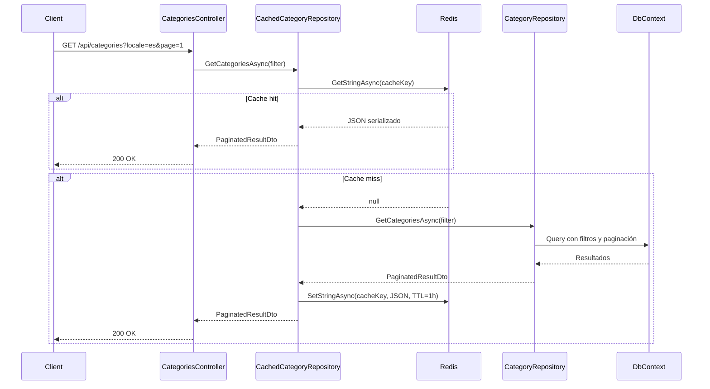
```mermaid
sequenceDiagram
    participant Client
    participant CategoriesController
    participant CachedCategoryRepository
    participant Redis
    participant CategoryRepository
    participant DbContext

    Client->>CategoriesController: GET /api/categories?locale=es&page=1
    CategoriesController->>CachedCategoryRepository: GetCategoriesAsync(filter)
    CachedCategoryRepository->>Redis: GetStringAsync(cacheKey)

    alt Cache hit
        Redis-->>CachedCategoryRepository: JSON serializado
        CachedCategoryRepository-->>CategoriesController: PaginatedResultDto
        CategoriesController-->>Client: 200 OK
    end

    alt Cache miss
        Redis-->>CachedCategoryRepository: null
        CachedCategoryRepository->>CategoryRepository: GetCategoriesAsync(filter)
        CategoryRepository->>DbContext: Query con filtros y paginación
        DbContext-->>CategoryRepository: Resultados
        CategoryRepository-->>CachedCategoryRepository: PaginatedResultDto
        CachedCategoryRepository->>Redis: SetStringAsync(cacheKey, JSON, TTL=1h)
        CachedCategoryRepository-->>CategoriesController: PaginatedResultDto
        CategoriesController-->>Client: 200 OK
    end
```

---

#### GET `/api/categories/{id}`

**Descripción**: Obtiene el detalle completo de una categoría por su ID, incluyendo imagen y metadatos.

**Autenticación requerida**: No

**Parámetros de entrada**:

| Campo | Tipo | Requerido | Default | Descripción |
|-------|------|-----------|---------|-------------|
| `id` | Guid | Sí | — | ID de la categoría (path) |
| `locale` | string | No | `"es"` | Idioma de las traducciones (query) |

**Respuesta exitosa** (200 OK):

```json
{
  "id": "550e8400-e29b-41d4-a716-446655440000",
  "parentCategory": null,
  "name": "Volantes",
  "slug": "volantes",
  "shortDescription": "Categoría de volantes de competición",
  "isActive": true,
  "createdAt": "2026-01-15T10:00:00Z",
  "image": {
    "id": "660e8400-e29b-41d4-a716-446655440001",
    "imageUrl": "https://cdn.example.com/categories/volantes.jpg",
    "altText": "Categoría Volantes"
  }
}
```

**Errores posibles**:
- `404 Not Found`: Categoría no encontrada

**Diagrama de secuencia**:

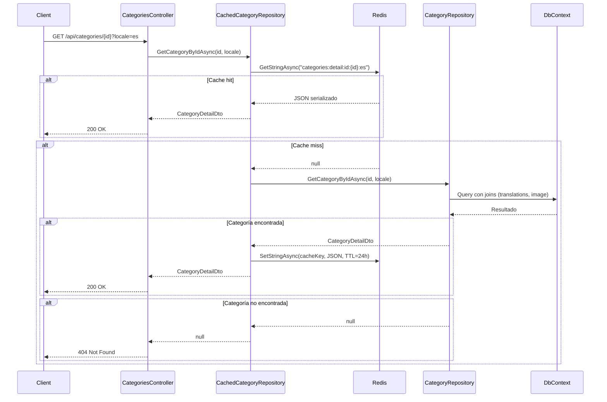
```mermaid
sequenceDiagram
    participant Client
    participant CategoriesController
    participant CachedCategoryRepository
    participant Redis
    participant CategoryRepository
    participant DbContext

    Client->>CategoriesController: GET /api/categories/{id}?locale=es
    CategoriesController->>CachedCategoryRepository: GetCategoryByIdAsync(id, locale)
    CachedCategoryRepository->>Redis: GetStringAsync("categories:detail:id:{id}:es")

    alt Cache hit
        Redis-->>CachedCategoryRepository: JSON serializado
        CachedCategoryRepository-->>CategoriesController: CategoryDetailDto
        CategoriesController-->>Client: 200 OK
    end

    alt Cache miss
        Redis-->>CachedCategoryRepository: null
        CachedCategoryRepository->>CategoryRepository: GetCategoryByIdAsync(id, locale)
        CategoryRepository->>DbContext: Query con joins (translations, image)
        DbContext-->>CategoryRepository: Resultado

        alt Categoría encontrada
            CategoryRepository-->>CachedCategoryRepository: CategoryDetailDto
            CachedCategoryRepository->>Redis: SetStringAsync(cacheKey, JSON, TTL=24h)
            CachedCategoryRepository-->>CategoriesController: CategoryDetailDto
            CategoriesController-->>Client: 200 OK
        end

        alt Categoría no encontrada
            CategoryRepository-->>CachedCategoryRepository: null
            CachedCategoryRepository-->>CategoriesController: null
            CategoriesController-->>Client: 404 Not Found
        end
    end
```

---

### 6. AdminCategoriesController

**Ruta Base**: `/api/admin/categories`

**Descripción**: Controlador de administración de categorías. Proporciona CRUD completo, subida de imagen al sistema de archivos local y gestión de traducciones. Soporta jerarquía de categorías mediante `parentCategory`. Invalida la cache Redis tras cada operación de escritura.

**Autenticación requerida**: Sí (Bearer Token con rol **Admin**)

**Dependencias**:
- `ICategoryAdminRepository`: Repositorio admin de categorías
- `IFileStorageService`: Almacenamiento de archivos (local filesystem)
- `IDistributedCache`: Cache Redis para invalidación
- `ILogger<AdminCategoriesController>`: Logging

**Validación (FluentValidation)**:

| DTO | Reglas |
|-----|--------|
| `CreateCategoryDto` | ParentCategory debe existir (si se proporciona), Translations no vacías |
| `UpdateCategoryDto` | ParentCategory debe existir (si se proporciona) |
| `UpdateCategoryTranslationsDto` | Translations no vacías, cada traducción con Locale/Name/Slug requeridos |

**Invalidación de Cache**:

Tras cada operación de escritura se invalidan las cache keys de detalle por ID y slug para cada locale de la categoría. Los listados expiran naturalmente por TTL (1 hora).

---

#### POST `/api/admin/categories`

**Descripción**: Crea una nueva categoría con sus traducciones iniciales. Opcionalmente puede tener una categoría padre.

**Autenticación requerida**: Sí (Admin)

**Parámetros de entrada** (body JSON):

| Campo | Tipo | Requerido | Default | Descripción |
|-------|------|-----------|---------|-------------|
| `parentCategory` | Guid | No | `null` | ID de la categoría padre (debe existir) |
| `isActive` | bool | No | `true` | Estado activo |
| `translations` | array | Sí | — | Al menos una traducción |

**Respuesta exitosa** (201 Created): `CategoryDetailDto`

**Errores posibles**:
- `400 Bad Request`: Validación fallida (categoría padre no existe, traducciones vacías)

**Diagrama de secuencia**:

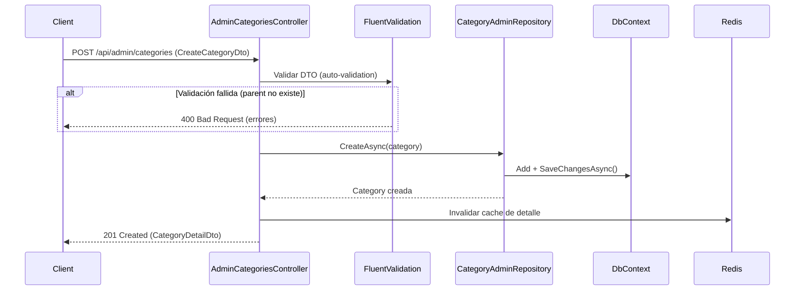
```mermaid
sequenceDiagram
    participant Client
    participant AdminCategoriesController
    participant FluentValidation
    participant CategoryAdminRepository
    participant DbContext
    participant Redis

    Client->>AdminCategoriesController: POST /api/admin/categories (CreateCategoryDto)
    AdminCategoriesController->>FluentValidation: Validar DTO (auto-validation)

    alt Validación fallida (parent no existe)
        FluentValidation-->>Client: 400 Bad Request (errores)
    end

    AdminCategoriesController->>CategoryAdminRepository: CreateAsync(category)
    CategoryAdminRepository->>DbContext: Add + SaveChangesAsync()
    CategoryAdminRepository-->>AdminCategoriesController: Category creada
    AdminCategoriesController->>Redis: Invalidar cache de detalle
    AdminCategoriesController-->>Client: 201 Created (CategoryDetailDto)
```

---

#### PUT `/api/admin/categories/{id}`

**Descripción**: Edita los campos base de una categoría existente (no modifica traducciones ni imagen).

**Autenticación requerida**: Sí (Admin)

**Parámetros de entrada**:

| Campo | Tipo | Requerido | Descripción |
|-------|------|-----------|-------------|
| `id` | Guid | Sí | ID de la categoría (path) |
| `parentCategory` | Guid | No | ID de la categoría padre (debe existir) |
| `isActive` | bool | No | Estado activo |

**Respuesta exitosa** (200 OK): `CategoryDetailDto`

**Errores posibles**:
- `400 Bad Request`: Validación fallida
- `404 Not Found`: Categoría no encontrada

---

#### DELETE `/api/admin/categories/{id}`

**Descripción**: Elimina una categoría, sus traducciones y el archivo de imagen del filesystem.

**Autenticación requerida**: Sí (Admin)

**Parámetros de entrada**:

| Campo | Tipo | Requerido | Descripción |
|-------|------|-----------|-------------|
| `id` | Guid | Sí | ID de la categoría (path) |

**Respuesta exitosa** (204 No Content)

**Errores posibles**:
- `404 Not Found`: Categoría no encontrada

**Diagrama de secuencia**:

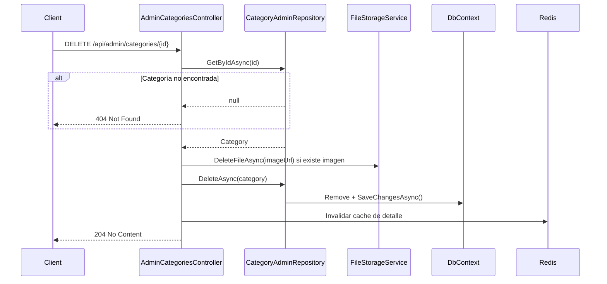
```mermaid
sequenceDiagram
    participant Client
    participant AdminCategoriesController
    participant CategoryAdminRepository
    participant FileStorageService
    participant DbContext
    participant Redis

    Client->>AdminCategoriesController: DELETE /api/admin/categories/{id}
    AdminCategoriesController->>CategoryAdminRepository: GetByIdAsync(id)

    alt Categoría no encontrada
        CategoryAdminRepository-->>AdminCategoriesController: null
        AdminCategoriesController-->>Client: 404 Not Found
    end

    CategoryAdminRepository-->>AdminCategoriesController: Category
    AdminCategoriesController->>FileStorageService: DeleteFileAsync(imageUrl) si existe imagen
    AdminCategoriesController->>CategoryAdminRepository: DeleteAsync(category)
    CategoryAdminRepository->>DbContext: Remove + SaveChangesAsync()
    AdminCategoriesController->>Redis: Invalidar cache de detalle
    AdminCategoriesController-->>Client: 204 No Content
```

---

#### POST `/api/admin/categories/{id}/images`

**Descripción**: Sube una imagen para una categoría. El archivo se almacena en `wwwroot/uploads/categories/` con nombre GUID. Reemplaza la imagen existente si la hay.

**Autenticación requerida**: Sí (Admin)

**Parámetros de entrada** (multipart/form-data):

| Campo | Tipo | Requerido | Descripción |
|-------|------|-----------|-------------|
| `id` | Guid | Sí | ID de la categoría (path) |
| `file` | IFormFile | Sí | Archivo de imagen (jpg, jpeg, png, webp; max 5MB) |

**Respuesta exitosa** (201 Created):

```json
{
  "id": "550e8400-e29b-41d4-a716-446655440000",
  "imageUrl": "/uploads/categories/a1b2c3d4.jpg",
  "altText": "nombre-archivo"
}
```

**Errores posibles**:
- `400 Bad Request`: Sin archivo, tipo de archivo no permitido o tamaño excedido
- `404 Not Found`: Categoría no encontrada

---

#### PUT `/api/admin/categories/{id}/translations`

**Descripción**: Reemplaza todas las traducciones de una categoría. Elimina las existentes y añade las nuevas.

**Autenticación requerida**: Sí (Admin)

**Parámetros de entrada** (body JSON):

| Campo | Tipo | Requerido | Descripción |
|-------|------|-----------|-------------|
| `id` | Guid | Sí | ID de la categoría (path) |
| `translations` | array | Sí | Al menos una traducción |
| `translations[].locale` | string | Sí | Código de idioma (max 5) |
| `translations[].name` | string | Sí | Nombre de la categoría (max 200) |
| `translations[].slug` | string | Sí | Slug URL-friendly (max 200) |
| `translations[].shortDescription` | string | No | Descripción corta |

**Respuesta exitosa** (200 OK): `CategoryDetailDto`

**Errores posibles**:
- `400 Bad Request`: Validación fallida (traducciones vacías)
- `404 Not Found`: Categoría no encontrada

---

### 7. AdminComponentsController

**Ruta Base**: `/api/admin/components`

**Descripción**: Controlador de administración de componentes. Proporciona CRUD completo, actualización de stock, gestión de traducciones y consulta de componentes con stock bajo. No utiliza cache Redis (los componentes no están cacheados).

**Autenticación requerida**: Sí (Bearer Token con rol **Admin**)

**Dependencias**:
- `IComponentAdminRepository`: Repositorio admin de componentes
- `ILogger<AdminComponentsController>`: Logging

**Validación (FluentValidation)**:

| DTO | Reglas |
|-----|--------|
| `CreateComponentDto` | SKU requerido/max 50, SKU único (async), ComponentType requerido/max 50, StockQuantity >= 0, MinStockThreshold >= 0, CostPrice >= 0 (si presente), Translations no vacías |
| `UpdateComponentDto` | ComponentType requerido/max 50, StockQuantity >= 0, MinStockThreshold >= 0, CostPrice >= 0 (si presente) |
| `UpdateStockDto` | Quantity >= 0 |
| `UpdateComponentTranslationsDto` | Translations no vacías, cada traducción con Locale/Name requeridos |

---

#### POST `/api/admin/components`

**Descripción**: Crea un nuevo componente con sus traducciones iniciales.

**Autenticación requerida**: Sí (Admin)

**Parámetros de entrada** (body JSON):

| Campo | Tipo | Requerido | Default | Descripción |
|-------|------|-----------|---------|-------------|
| `sku` | string | Sí | — | SKU único del componente (max 50) |
| `componentType` | string | Sí | — | Tipo de componente (max 50) |
| `stockQuantity` | int | No | `0` | Cantidad en stock (>= 0) |
| `minStockThreshold` | int | No | `5` | Umbral mínimo de stock (>= 0) |
| `leadTimeDays` | int | No | `0` | Días de entrega |
| `weightGrams` | int | No | — | Peso en gramos |
| `costPrice` | decimal | No | — | Precio de coste (>= 0) |
| `translations` | array | Sí | — | Al menos una traducción |

**Respuesta exitosa** (201 Created): `ComponentDetailDto`

**Errores posibles**:
- `400 Bad Request`: Validación fallida (SKU duplicado, stock negativo, traducciones vacías)

**Diagrama de secuencia**:

```mermaid
sequenceDiagram
    participant Client
    participant AdminComponentsController
    participant FluentValidation
    participant ComponentAdminRepository
    participant DbContext

    Client->>AdminComponentsController: POST /api/admin/components (CreateComponentDto)
    AdminComponentsController->>FluentValidation: Validar DTO (auto-validation)

    alt Validación fallida (SKU duplicado, stock negativo)
        FluentValidation-->>Client: 400 Bad Request (errores)
    end

    AdminComponentsController->>ComponentAdminRepository: CreateAsync(component)
    ComponentAdminRepository->>DbContext: Add + SaveChangesAsync()
    ComponentAdminRepository-->>AdminComponentsController: Component creado
    AdminComponentsController-->>Client: 201 Created (ComponentDetailDto)
```

---

#### PUT `/api/admin/components/{id}`

**Descripción**: Edita los campos base de un componente existente (no modifica traducciones).

**Autenticación requerida**: Sí (Admin)

**Parámetros de entrada**:

| Campo | Tipo | Requerido | Descripción |
|-------|------|-----------|-------------|
| `id` | Guid | Sí | ID del componente (path) |
| `componentType` | string | Sí | Tipo de componente (max 50) |
| `stockQuantity` | int | No | Cantidad en stock (>= 0) |
| `minStockThreshold` | int | No | Umbral mínimo de stock (>= 0) |
| `leadTimeDays` | int | No | Días de entrega |
| `weightGrams` | int | No | Peso en gramos |
| `costPrice` | decimal | No | Precio de coste (>= 0) |

**Respuesta exitosa** (200 OK): `ComponentDetailDto`

**Errores posibles**:
- `400 Bad Request`: Validación fallida
- `404 Not Found`: Componente no encontrado

---

#### DELETE `/api/admin/components/{id}`

**Descripción**: Elimina un componente y todas sus traducciones.

**Autenticación requerida**: Sí (Admin)

**Parámetros de entrada**:

| Campo | Tipo | Requerido | Descripción |
|-------|------|-----------|-------------|
| `id` | Guid | Sí | ID del componente (path) |

**Respuesta exitosa** (204 No Content)

**Errores posibles**:
- `404 Not Found`: Componente no encontrado

---

#### PATCH `/api/admin/components/{id}/stock`

**Descripción**: Actualiza la cantidad de stock de un componente. El campo `lowStock` se calcula automáticamente comparando con `minStockThreshold`.

**Autenticación requerida**: Sí (Admin)

**Parámetros de entrada**:

| Campo | Tipo | Requerido | Descripción |
|-------|------|-----------|-------------|
| `id` | Guid | Sí | ID del componente (path) |
| `quantity` | int | Sí | Nueva cantidad de stock (>= 0) |

**Respuesta exitosa** (200 OK): `ComponentDetailDto`

**Errores posibles**:
- `400 Bad Request`: Cantidad negativa
- `404 Not Found`: Componente no encontrado

**Diagrama de secuencia**:

```mermaid
sequenceDiagram
    participant Client
    participant AdminComponentsController
    participant ComponentAdminRepository
    participant DbContext

    Client->>AdminComponentsController: PATCH /api/admin/components/{id}/stock
    AdminComponentsController->>ComponentAdminRepository: GetByIdAsync(id)

    alt Componente no encontrado
        ComponentAdminRepository-->>AdminComponentsController: null
        AdminComponentsController-->>Client: 404 Not Found
    end

    ComponentAdminRepository-->>AdminComponentsController: Component
    AdminComponentsController->>AdminComponentsController: component.StockQuantity = dto.Quantity
    AdminComponentsController->>ComponentAdminRepository: UpdateAsync(component)
    ComponentAdminRepository->>DbContext: Update + SaveChangesAsync()
    AdminComponentsController-->>Client: 200 OK (ComponentDetailDto con InStock/LowStock calculados)
```

---

#### PUT `/api/admin/components/{id}/translations`

**Descripción**: Reemplaza todas las traducciones de un componente. Elimina las existentes y añade las nuevas.

**Autenticación requerida**: Sí (Admin)

**Parámetros de entrada** (body JSON):

| Campo | Tipo | Requerido | Descripción |
|-------|------|-----------|-------------|
| `id` | Guid | Sí | ID del componente (path) |
| `translations` | array | Sí | Al menos una traducción |
| `translations[].locale` | string | Sí | Código de idioma (max 5) |
| `translations[].name` | string | Sí | Nombre del componente (max 255) |
| `translations[].description` | string | No | Descripción |

**Respuesta exitosa** (200 OK): `ComponentDetailDto`

**Errores posibles**:
- `400 Bad Request`: Validación fallida (traducciones vacías)
- `404 Not Found`: Componente no encontrado

---

#### GET `/api/admin/components/low-stock`

**Descripción**: Lista todos los componentes cuyo stock está por debajo o igual a su umbral mínimo (`stockQuantity <= minStockThreshold`), ordenados por stock ascendente.

**Autenticación requerida**: Sí (Admin)

**Parámetros de entrada**: Ninguno

**Respuesta exitosa** (200 OK):

```json
[
  {
    "id": "770e8400-e29b-41d4-a716-446655440000",
    "sku": "COMP-001",
    "componentType": "grip",
    "stockQuantity": 2,
    "inStock": true,
    "minStockThreshold": 5,
    "lowStock": true,
    "leadTimeDays": 3,
    "weightGrams": 120,
    "costPrice": 15.00,
    "createdAt": "2026-01-15T10:00:00Z",
    "updatedAt": "2026-02-01T14:30:00Z",
    "translations": [
      {
        "id": "880e8400-e29b-41d4-a716-446655440001",
        "locale": "es",
        "name": "Grip Estándar",
        "description": "Grip de cuero sintético"
      }
    ]
  }
]
```

**Diagrama de secuencia**:

```mermaid
sequenceDiagram
    participant Client
    participant AdminComponentsController
    participant ComponentAdminRepository
    participant DbContext

    Client->>AdminComponentsController: GET /api/admin/components/low-stock
    AdminComponentsController->>ComponentAdminRepository: GetLowStockAsync()
    ComponentAdminRepository->>DbContext: WHERE StockQuantity <= MinStockThreshold ORDER BY StockQuantity
    DbContext-->>ComponentAdminRepository: List<Component>
    ComponentAdminRepository-->>AdminComponentsController: Componentes con stock bajo
    AdminComponentsController-->>Client: 200 OK (List<ComponentDetailDto>)
```

---

### 8. UserAddressesController

**Ruta Base**: `/api/addresses`

**Descripción**: Controlador de gestión de direcciones del usuario autenticado. Permite administrar direcciones de facturación (una única por usuario) y direcciones de envío (múltiples). Las direcciones se asocian automáticamente al usuario autenticado mediante el token JWT.

**Autenticación requerida**: Sí (Bearer Token)

**Dependencias**:
- `IUserAddressRepository`: Repositorio de direcciones de usuario
- `ILogger<UserAddressesController>`: Logging

**Validación (FluentValidation)**:

| DTO | Reglas |
|-----|--------|
| `CreateBillingAddressDto` | Street/City/PostalCode/Country requeridos (no vacíos), UserId debe coincidir con usuario autenticado, no debe existir otra dirección de facturación para el usuario |
| `UpdateBillingAddressDto` | Street/City/PostalCode/Country requeridos (no vacíos) |
| `CreateDeliveryAddressDto` | Name/Street/City/PostalCode/Country requeridos (no vacíos), UserId debe coincidir con usuario autenticado |
| `UpdateDeliveryAddressDto` | Name/Street/City/PostalCode/Country requeridos (no vacíos) |

---

#### POST `/api/addresses/billing`

**Descripción**: Crea una nueva dirección de facturación para el usuario autenticado. Solo se permite una dirección de facturación por usuario. La dirección se marca automáticamente como predeterminada.

**Autenticación requerida**: Sí

**Parámetros de entrada** (body JSON):

| Campo | Tipo | Requerido | Default | Descripción |
|-------|------|-----------|---------|-------------|
| `userId` | Guid | Sí | — | ID del usuario (debe coincidir con el usuario autenticado) |
| `street` | string | Sí | — | Calle y número |
| `city` | string | Sí | — | Ciudad |
| `state` | string | No | — | Provincia/Estado |
| `postalCode` | string | Sí | — | Código postal |
| `country` | string | No | `"ES"` | País (código ISO) |

**Respuesta exitosa** (201 Created): `BillingAddressDetailDto`

```json
{
  "id": "550e8400-e29b-41d4-a716-446655440000",
  "street": "Calle Mayor 123",
  "city": "Madrid",
  "state": "Madrid",
  "postalCode": "28001",
  "country": "ES"
}
```

**Errores posibles**:
- `400 Bad Request`: Validación fallida (campos vacíos, ya existe dirección de facturación)
- `401 Unauthorized`: Token inválido o userId no coincide con usuario autenticado

---

#### PUT `/api/addresses/billing`

**Descripción**: Actualiza la dirección de facturación del usuario autenticado.

**Autenticación requerida**: Sí

**Parámetros de entrada** (body JSON):

| Campo | Tipo | Requerido | Descripción |
|-------|------|-----------|-------------|
| `street` | string | Sí | Calle y número |
| `city` | string | Sí | Ciudad |
| `state` | string | No | Provincia/Estado |
| `postalCode` | string | Sí | Código postal |
| `country` | string | Sí | País (código ISO) |

**Respuesta exitosa** (200 OK): `BillingAddressDetailDto`

**Errores posibles**:
- `400 Bad Request`: Validación fallida
- `401 Unauthorized`: Token inválido
- `404 Not Found`: Usuario no tiene dirección de facturación

---

#### GET `/api/addresses/billing`

**Descripción**: Obtiene la dirección de facturación del usuario autenticado.

**Autenticación requerida**: Sí

**Parámetros de entrada**: Ninguno

**Respuesta exitosa** (200 OK): `UserAddress` (entidad completa)

**Errores posibles**:
- `401 Unauthorized`: Token inválido
- `404 Not Found`: Usuario no tiene dirección de facturación

---

#### POST `/api/addresses/delivery`

**Descripción**: Crea una nueva dirección de envío para el usuario autenticado. Un usuario puede tener múltiples direcciones de envío con nombres personalizados (ej: "Casa", "Oficina", "Casa de vacaciones").

**Autenticación requerida**: Sí

**Parámetros de entrada** (body JSON):

| Campo | Tipo | Requerido | Default | Descripción |
|-------|------|-----------|---------|-------------|
| `userId` | Guid | Sí | — | ID del usuario (debe coincidir con el usuario autenticado) |
| `name` | string | Sí | — | Nombre identificativo de la dirección |
| `street` | string | Sí | — | Calle y número |
| `city` | string | Sí | — | Ciudad |
| `state` | string | No | — | Provincia/Estado |
| `postalCode` | string | Sí | — | Código postal |
| `country` | string | No | `"ES"` | País (código ISO) |
| `isDefault` | bool | No | `false` | Marcar como dirección predeterminada |

**Respuesta exitosa** (201 Created): `DeliveryAddressDetailDto`

```json
{
  "id": "660e8400-e29b-41d4-a716-446655440000",
  "name": "Casa",
  "street": "Avenida Principal 456",
  "city": "Barcelona",
  "state": "Barcelona",
  "postalCode": "08001",
  "country": "ES",
  "isDefault": true
}
```

**Errores posibles**:
- `400 Bad Request`: Validación fallida (campos vacíos, nombre vacío)
- `401 Unauthorized`: Token inválido o userId no coincide

---

#### PUT `/api/addresses/delivery/{id}`

**Descripción**: Actualiza una dirección de envío específica del usuario autenticado. Solo el propietario puede modificar sus direcciones.

**Autenticación requerida**: Sí

**Parámetros de entrada**:

| Campo | Tipo | Requerido | Descripción |
|-------|------|-----------|-------------|
| `id` | Guid | Sí | ID de la dirección (path) |
| `name` | string | Sí | Nombre identificativo |
| `street` | string | Sí | Calle y número |
| `city` | string | Sí | Ciudad |
| `state` | string | No | Provincia/Estado |
| `postalCode` | string | Sí | Código postal |
| `country` | string | Sí | País (código ISO) |
| `isDefault` | bool | No | Marcar como predeterminada |

**Respuesta exitosa** (200 OK): `DeliveryAddressDetailDto`

**Errores posibles**:
- `400 Bad Request`: Validación fallida
- `401 Unauthorized`: Token inválido o dirección no pertenece al usuario
- `404 Not Found`: Dirección no encontrada

---

#### DELETE `/api/addresses/delivery/{id}`

**Descripción**: Elimina una dirección de envío específica del usuario autenticado.

**Autenticación requerida**: Sí

**Parámetros de entrada**:

| Campo | Tipo | Requerido | Descripción |
|-------|------|-----------|-------------|
| `id` | Guid | Sí | ID de la dirección (path) |

**Respuesta exitosa** (204 No Content)

**Errores posibles**:
- `401 Unauthorized`: Token inválido o dirección no pertenece al usuario
- `404 Not Found`: Dirección no encontrada

---

#### GET `/api/addresses/delivery`

**Descripción**: Lista todas las direcciones de envío del usuario autenticado.

**Autenticación requerida**: Sí

**Parámetros de entrada**: Ninguno

**Respuesta exitosa** (200 OK):

```json
[
  {
    "id": "660e8400-e29b-41d4-a716-446655440000",
    "name": "Casa",
    "street": "Avenida Principal 456",
    "city": "Barcelona",
    "state": "Barcelona",
    "postalCode": "08001",
    "country": "ES",
    "isDefault": true
  },
  {
    "id": "770e8400-e29b-41d4-a716-446655440001",
    "name": "Oficina",
    "street": "Calle Trabajo 789",
    "city": "Valencia",
    "state": "Valencia",
    "postalCode": "46001",
    "country": "ES",
    "isDefault": false
  }
]
```

**Errores posibles**:
- `401 Unauthorized`: Token inválido
- `404 Not Found`: Usuario no tiene direcciones de envío

**Diagrama de secuencia**:

```mermaid
sequenceDiagram
    participant Client
    participant UserAddressesController
    participant UserAddressRepository
    participant DbContext

    Client->>UserAddressesController: GET /api/addresses/delivery
    UserAddressesController->>UserAddressesController: Extraer userId del token JWT
    UserAddressesController->>UserAddressRepository: GetDeliveryAddressesByUserIdAsync(userId)
    UserAddressRepository->>DbContext: WHERE UserId == userId AND AddressType == Delivery
    DbContext-->>UserAddressRepository: List<UserAddress>
    UserAddressRepository-->>UserAddressesController: Direcciones de envío

    alt Sin direcciones
        UserAddressesController-->>Client: 404 Not Found
    else Con direcciones
        UserAddressesController-->>Client: 200 OK (List<UserAddress>)
    end
```

---

### 9. UserController

**Ruta Base**: `/api/user`

**Descripción**: Controlador de gestión de datos del usuario autenticado. Permite actualizar información personal y eliminar la cuenta. Todas las operaciones se aplican automáticamente al usuario identificado por el token JWT.

**Autenticación requerida**: Sí (Bearer Token)

**Dependencias**:
- `IUserRepository`: Repositorio de usuarios
- `ILogger<UserController>`: Logging

---

#### PUT `/api/user`

**Descripción**: Actualiza los datos personales del usuario autenticado (email, nombre, apellido, idioma). La actualización del email valida que no esté ya registrado por otro usuario.

**Autenticación requerida**: Sí

**Parámetros de entrada** (body JSON):

| Campo | Tipo | Requerido | Descripción |
|-------|------|-----------|-------------|
| `email` | string | Sí | Nuevo email del usuario |
| `firstName` | string | No | Nombre |
| `lastName` | string | No | Apellido |
| `language` | string | Sí | Idioma preferido (ej: "es", "en") |
| `emailVerified` | bool | No | Estado de verificación de email |

**Respuesta exitosa** (200 OK): `UserDetailDto`

```json
{
  "id": "550e8400-e29b-41d4-a716-446655440000",
  "email": "nuevo@example.com",
  "firstName": "Juan",
  "lastName": "Pérez",
  "language": "es",
  "emailVerified": true,
  "roles": ["Customer"]
}
```

**Errores posibles**:
- `400 Bad Request`: Email ya registrado por otro usuario
- `401 Unauthorized`: Token inválido
- `404 Not Found`: Usuario no encontrado

**Diagrama de secuencia**:

```mermaid
sequenceDiagram
    participant Client
    participant UserController
    participant UserRepository
    participant UserManager

    Client->>UserController: PUT /api/user (UpdateUserDto)
    UserController->>UserController: Extraer userId del token JWT
    UserController->>UserRepository: GetUserByIdAsync(userId)

    alt Usuario no encontrado
        UserRepository-->>UserController: null
        UserController-->>Client: 404 Not Found
    end

    UserRepository-->>UserController: User
    UserController->>UserController: Actualizar campos (email, firstName, lastName, language)
    UserController->>UserRepository: UpdateAsync(user)
    UserRepository->>UserManager: FindByEmailAsync(newEmail)

    alt Email duplicado
        UserManager-->>UserRepository: Usuario existente con ese email
        UserRepository-->>UserController: InvalidOperationException
        UserController-->>Client: 400 Bad Request
    end

    UserRepository->>UserManager: UpdateAsync(user)
    UserManager-->>UserRepository: Success
    UserRepository-->>UserController: OK
    UserController-->>Client: 200 OK (UserDetailDto)
```

---

#### DELETE `/api/user`

**Descripción**: Elimina permanentemente la cuenta del usuario autenticado. Esta acción es irreversible y eliminará todos los datos asociados al usuario según las cascadas configuradas en la base de datos.

**Autenticación requerida**: Sí

**Parámetros de entrada**: Ninguno

**Respuesta exitosa** (204 No Content)

**Errores posibles**:
- `401 Unauthorized`: Token inválido
- `404 Not Found`: Usuario no encontrado

**Diagrama de secuencia**:

```mermaid
sequenceDiagram
    participant Client
    participant UserController
    participant UserRepository
    participant UserManager
    participant DbContext

    Client->>UserController: DELETE /api/user
    UserController->>UserController: Extraer userId del token JWT
    UserController->>UserRepository: GetUserByIdAsync(userId)

    alt Usuario no encontrado
        UserRepository-->>UserController: null
        UserController-->>Client: 404 Not Found
    end

    UserRepository-->>UserController: User
    UserController->>UserRepository: DeleteAsync(user)
    UserRepository->>UserManager: DeleteAsync(user)
    UserManager->>DbContext: Remove(user) + SaveChangesAsync()

    alt Error al eliminar
        UserManager-->>UserRepository: IdentityResult.Failed
        UserRepository-->>UserController: InvalidOperationException
        UserController-->>Client: 500 Internal Server Error
    end

    UserManager-->>UserRepository: IdentityResult.Success
    UserRepository-->>UserController: OK
    UserController-->>Client: 204 No Content
```

---

## Modelos de Datos (DTOs)

### DTOs de Autenticación

#### RegisterDto
```csharp
public class RegisterDto
{
    [Required]
    [EmailAddress]
    public string Email { get; set; }

    [Required]
    [MinLength(8)]
    public string Password { get; set; }

    [Required]
    [Compare("Password")]
    public string ConfirmPassword { get; set; }

    public string? FirstName { get; set; }
    public string? LastName { get; set; }
    public string Language { get; set; } = "es";
}
```

#### LoginDto
```csharp
public class LoginDto
{
    [Required]
    [EmailAddress]
    public string Email { get; set; }

    [Required]
    public string Password { get; set; }

    public bool RememberMe { get; set; } = false;
}
```

#### RefreshTokenRequestDto
```csharp
public class RefreshTokenRequestDto
{
    [Required]
    public string RefreshToken { get; set; }
}
```

#### ForgotPasswordRequestDto
```csharp
public class ForgotPasswordRequestDto
{
    [Required]
    [EmailAddress]
    public string Email { get; set; }
}
```

#### ResetPasswordRequestDto
```csharp
public class ResetPasswordRequestDto
{
    [Required]
    [EmailAddress]
    public string Email { get; set; }

    [Required]
    public string Token { get; set; }

    [Required]
    [MinLength(8)]
    public string NewPassword { get; set; }

    [Required]
    [Compare("NewPassword")]
    public string ConfirmPassword { get; set; }
}
```

#### AuthResponseDto
```csharp
public class AuthResponseDto
{
    public string Token { get; set; }
    public string RefreshToken { get; set; }
    public DateTime ExpiresAt { get; set; }
    public UserDto User { get; set; }
}
```

#### UserDto
```csharp
public class UserDto
{
    public Guid Id { get; set; }
    public string Email { get; set; }
    public string? FirstName { get; set; }
    public string? LastName { get; set; }
    public string Language { get; set; }
    public bool EmailVerified { get; set; }
    public List<string> Roles { get; set; }
}
```

### DTOs de Productos

#### ProductFilterDto
```csharp
public record ProductFilterDto
{
    public string? Search { get; init; }
    public decimal? MinPrice { get; init; }
    public decimal? MaxPrice { get; init; }
    public bool? IsActive { get; init; } = true;
    public bool? IsCustomizable { get; init; }
    public string Locale { get; init; } = "es";
    public int Page { get; init; } = 1;
    public int PageSize { get; init; } = 12;
    public string? SortBy { get; init; }
    public bool SortDescending { get; init; }
}
```

#### ProductListItemDto
```csharp
public record ProductListItemDto
{
    public Guid Id { get; init; }
    public string Sku { get; init; }
    public string Name { get; init; }
    public string Slug { get; init; }
    public string? ShortDescription { get; init; }
    public decimal BasePrice { get; init; }
    public decimal VatRate { get; init; }
    public string? ImageUrl { get; init; }
    public bool IsActive { get; init; }
    public bool IsCustomizable { get; init; }
}
```

#### ProductDetailDto
```csharp
public record ProductDetailDto
{
    public Guid Id { get; init; }
    public string Sku { get; init; }
    public string Name { get; init; }
    public string Slug { get; init; }
    public string? ShortDescription { get; init; }
    public string? LongDescription { get; init; }
    public decimal BasePrice { get; init; }
    public decimal VatRate { get; init; }
    public string? MetaTitle { get; init; }
    public string? MetaDescription { get; init; }
    public string? Model3dUrl { get; init; }
    public int? Model3dSizeKb { get; init; }
    public bool IsActive { get; init; }
    public bool IsCustomizable { get; init; }
    public int BaseProductionDays { get; init; }
    public int? WeightGrams { get; init; }
    public DateTime CreatedAt { get; init; }
    public List<ProductImageDto> Images { get; init; }
    public List<ProductSpecificationDto> Specifications { get; init; }
}
```

#### ProductImageDto
```csharp
public record ProductImageDto
{
    public Guid Id { get; init; }
    public string ImageUrl { get; init; }
    public string? AltText { get; init; }
    public int DisplayOrder { get; init; }
}
```

#### ProductSpecificationDto
```csharp
public record ProductSpecificationDto
{
    public string SpecKey { get; init; }
    public string SpecValue { get; init; }
    public int DisplayOrder { get; init; }
}
```

#### PaginatedResultDto\<T\>
```csharp
public record PaginatedResultDto<T>
{
    public List<T> Items { get; init; }
    public int TotalCount { get; init; }
    public int Page { get; init; }
    public int PageSize { get; init; }
    public int TotalPages { get; init; }
}
```

### DTOs de Categorías

#### CategoryFilterDto
```csharp
public record CategoryFilterDto
{
    public bool? IsActive { get; init; } = true;
    public string Locale { get; init; } = "es";
    public int Page { get; init; } = 1;
    public int PageSize { get; init; } = 12;
    public string? SortBy { get; init; }
    public bool SortDescending { get; init; }
}
```

#### CategoryListItemDto
```csharp
public record CategoryListItemDto
{
    public Guid Id { get; init; }
    public string Name { get; init; }
    public string Slug { get; init; }
    public string? ShortDescription { get; init; }
    public string? ImageUrl { get; init; }
    public bool IsActive { get; init; }
}
```

#### CategoryDetailDto
```csharp
public record CategoryDetailDto
{
    public Guid Id { get; init; }
    public Guid? ParentCategory { get; set; }
    public string Name { get; init; }
    public string Slug { get; init; }
    public string? ShortDescription { get; init; }
    public bool IsActive { get; init; }
    public DateTime CreatedAt { get; init; }
    public CategoryImageDto Image { get; init; }
}
```

#### CategoryImageDto
```csharp
public record CategoryImageDto
{
    public Guid Id { get; init; }
    public string ImageUrl { get; init; }
    public string? AltText { get; init; }
}
```

### DTOs de Administración de Categorías

#### CreateCategoryDto
```csharp
public record CreateCategoryDto
{
    public Guid? ParentCategory { get; set; }
    public bool IsActive { get; init; } = true;
    public List<CategoryTranslationInputDto> Translations { get; init; }
}
```

#### UpdateCategoryDto
```csharp
public record UpdateCategoryDto
{
    public Guid? ParentCategory { get; set; }
    public bool IsActive { get; init; } = true;
}
```

#### CategoryTranslationInputDto
```csharp
public record CategoryTranslationInputDto
{
    public string Locale { get; init; }
    public string Name { get; init; }
    public string Slug { get; init; }
    public string? ShortDescription { get; init; }
}
```

#### UpdateCategoryTranslationsDto
```csharp
public record UpdateCategoryTranslationsDto
{
    public List<CategoryTranslationInputDto> Translations { get; init; }
}
```

#### CategoryImageUploadResultDto
```csharp
public record CategoryImageUploadResultDto
{
    public Guid Id { get; init; }
    public string ImageUrl { get; init; }
    public string? AltText { get; init; }
}
```

### DTOs de Componentes

#### ComponentFilterDto
```csharp
public record ComponentFilterDto
{
    public string? Search { get; init; }
    public string? ComponentType { get; init; }
    public bool? InStock { get; init; }
    public string Locale { get; init; } = "es";
    public int Page { get; init; } = 1;
    public int PageSize { get; init; } = 12;
}
```

#### ComponentListItemDto
```csharp
public record ComponentListItemDto
{
    public Guid Id { get; init; }
    public string Sku { get; init; }
    public string ComponentType { get; init; }
    public string Name { get; init; }
    public string? Description { get; init; }
    public int StockQuantity { get; init; }
    public bool InStock { get; init; }
    public int? WeightGrams { get; init; }
}
```

#### ProductComponentOptionDto
```csharp
public record ProductComponentOptionDto
{
    public Guid ComponentId { get; init; }
    public string Sku { get; init; }
    public string ComponentType { get; init; }
    public string Name { get; init; }
    public string? Description { get; init; }
    public string OptionGroup { get; init; }
    public decimal PriceModifier { get; init; }
    public bool IsDefault { get; init; }
    public int DisplayOrder { get; init; }
    public int StockQuantity { get; init; }
    public bool InStock { get; init; }
}
```

### DTOs de Administración de Productos

#### CreateProductDto
```csharp
public record CreateProductDto
{
    public string Sku { get; init; }
    public decimal BasePrice { get; init; }
    public decimal VatRate { get; init; } = 21.00m;
    public string? Model3dUrl { get; init; }
    public int? Model3dSizeKb { get; init; }
    public bool IsActive { get; init; } = true;
    public bool IsCustomizable { get; init; } = true;
    public int BaseProductionDays { get; init; } = 7;
    public int? WeightGrams { get; init; }
    public List<ProductTranslationInputDto> Translations { get; init; }
}
```

#### UpdateProductDto
```csharp
public record UpdateProductDto
{
    public decimal BasePrice { get; init; }
    public decimal VatRate { get; init; } = 21.00m;
    public string? Model3dUrl { get; init; }
    public int? Model3dSizeKb { get; init; }
    public bool IsActive { get; init; } = true;
    public bool IsCustomizable { get; init; } = true;
    public int BaseProductionDays { get; init; } = 7;
    public int? WeightGrams { get; init; }
}
```

#### ProductTranslationInputDto
```csharp
public record ProductTranslationInputDto
{
    public string Locale { get; init; }
    public string Name { get; init; }
    public string Slug { get; init; }
    public string? ShortDescription { get; init; }
    public string? LongDescription { get; init; }
    public string? MetaTitle { get; init; }
    public string? MetaDescription { get; init; }
}
```

#### UpdateTranslationsDto
```csharp
public record UpdateTranslationsDto
{
    public List<ProductTranslationInputDto> Translations { get; init; }
}
```

#### ProductImageUploadResultDto
```csharp
public record ProductImageUploadResultDto
{
    public Guid Id { get; init; }
    public string ImageUrl { get; init; }
    public string? AltText { get; init; }
    public int DisplayOrder { get; init; }
}
```

### DTOs de Administración de Componentes

#### CreateComponentDto
```csharp
public record CreateComponentDto
{
    public string Sku { get; init; }
    public string ComponentType { get; init; }
    public int StockQuantity { get; init; }
    public int MinStockThreshold { get; init; } = 5;
    public int LeadTimeDays { get; init; }
    public int? WeightGrams { get; init; }
    public decimal? CostPrice { get; init; }
    public List<ComponentTranslationInputDto> Translations { get; init; }
}
```

#### UpdateComponentDto
```csharp
public record UpdateComponentDto
{
    public string ComponentType { get; init; }
    public int StockQuantity { get; init; }
    public int MinStockThreshold { get; init; } = 5;
    public int LeadTimeDays { get; init; }
    public int? WeightGrams { get; init; }
    public decimal? CostPrice { get; init; }
}
```

#### ComponentTranslationInputDto
```csharp
public record ComponentTranslationInputDto
{
    public string Locale { get; init; }
    public string Name { get; init; }
    public string? Description { get; init; }
}
```

#### UpdateComponentTranslationsDto
```csharp
public record UpdateComponentTranslationsDto
{
    public List<ComponentTranslationInputDto> Translations { get; init; }
}
```

#### UpdateStockDto
```csharp
public record UpdateStockDto
{
    public int Quantity { get; init; }
}
```

#### ComponentDetailDto
```csharp
public record ComponentDetailDto
{
    public Guid Id { get; init; }
    public string Sku { get; init; }
    public string ComponentType { get; init; }
    public int StockQuantity { get; init; }
    public bool InStock { get; init; }          // Calculado: StockQuantity > 0
    public int MinStockThreshold { get; init; }
    public bool LowStock { get; init; }         // Calculado: StockQuantity <= MinStockThreshold
    public int LeadTimeDays { get; init; }
    public int? WeightGrams { get; init; }
    public decimal? CostPrice { get; init; }
    public DateTime CreatedAt { get; init; }
    public DateTime UpdatedAt { get; init; }
    public List<ComponentTranslationDto> Translations { get; init; }
}
```

#### ComponentTranslationDto
```csharp
public record ComponentTranslationDto
{
    public Guid Id { get; init; }
    public string Locale { get; init; }
    public string Name { get; init; }
    public string? Description { get; init; }
}
```

### DTOs de Direcciones de Usuario

#### CreateBillingAddressDto
```csharp
public class CreateBillingAddressDto
{
    public Guid UserId { get; set; }
    public string Street { get; set; } = null!;
    public string City { get; set; } = null!;
    public string? State { get; set; }
    public string PostalCode { get; set; } = null!;
    public string Country { get; set; } = "ES";
}
```

#### UpdateBillingAddressDto
```csharp
public class UpdateBillingAddressDto
{
    public Guid Id { get; set; }
    public string Street { get; set; } = null!;
    public string City { get; set; } = null!;
    public string? State { get; set; }
    public string PostalCode { get; set; } = null!;
    public string Country { get; set; } = "ES";
}
```

#### BillingAddressDetailDto
```csharp
public class BillingAddressDetailDto
{
    public Guid Id { get; set; }
    public string Street { get; set; } = null!;
    public string City { get; set; } = null!;
    public string? State { get; set; }
    public string PostalCode { get; set; } = null!;
    public string Country { get; set; } = "ES";
}
```

#### CreateDeliveryAddressDto
```csharp
public class CreateDeliveryAddressDto
{
    public Guid UserId { get; set; }
    public string Name { get; set; } = null!;
    public string Street { get; set; } = null!;
    public string City { get; set; } = null!;
    public string? State { get; set; }
    public string PostalCode { get; set; } = null!;
    public string Country { get; set; } = "ES";
    public bool IsDefault { get; set; }
}
```

#### UpdateDeliveryAddressDto
```csharp
public class UpdateDeliveryAddressDto
{
    public string Name { get; set; } = null!;
    public string Street { get; set; } = null!;
    public string City { get; set; } = null!;
    public string? State { get; set; }
    public string PostalCode { get; set; } = null!;
    public string Country { get; set; } = "ES";
    public bool IsDefault { get; set; }
}
```

#### DeliveryAddressDetailDto
```csharp
public class DeliveryAddressDetailDto
{
    public Guid Id { get; set; }
    public string Name { get; set; } = null!;
    public string Street { get; set; } = null!;
    public string City { get; set; } = null!;
    public string? State { get; set; }
    public string PostalCode { get; set; } = null!;
    public string Country { get; set; } = "ES";
    public bool IsDefault { get; set; }
}
```

### DTOs de Usuario

#### UpdateUserDto
```csharp
public record UpdateUserDto
{
    public string Email { get; init; } = null!;
    public string? FirstName { get; init; }
    public string? LastName { get; init; }
    public string Language { get; init; } = null!;
    public bool EmailVerified { get; init; }
}
```

#### UserDetailDto
```csharp
public record UserDetailDto
{
    public Guid Id { get; init; }
    public string Email { get; init; } = null!;
    public string? FirstName { get; init; }
    public string? LastName { get; init; }
    public string Language { get; init; } = null!;
    public bool EmailVerified { get; init; }
    public IEnumerable<string> Roles { get; init; } = new List<string>();
}
```

---

## Validación (FluentValidation)

Las validaciones se implementan con **FluentValidation** en la capa de dominio (`SimRacingShop.Core/Validators/`), separando las reglas de negocio de los controladores. La capa API solo registra los validators mediante `AddValidatorsFromAssemblyContaining` y activa la auto-validación con `AddFluentValidationAutoValidation()`.

### Arquitectura de Validación

```
┌─────────────────────────────────────────────────────────────┐
│                    SimRacingShop.API                        │
│  FluentValidation.AspNetCore → Auto-validation pipeline    │
│  AddValidatorsFromAssemblyContaining<> → Registro DI       │
├─────────────────────────────────────────────────────────────┤
│                   SimRacingShop.Core                        │
│  FluentValidation → AbstractValidator<TDto>                │
│  Validators/AdminProductValidators.cs                      │
│  Validators/AdminComponentValidators.cs                    │
│  Validators/AdminCategoryValidators.cs                     │
│  Validators/UserAddressValidators.cs                       │
│  Reglas: SKU único (async), precios positivos, stock >= 0  │
│  Reglas: ParentCategory existe (sync), traducciones valid  │
│  Reglas: Dirección facturación única (sync), campos reqs.  │
└─────────────────────────────────────────────────────────────┘
```

### Resumen de Validators

| Validator | DTO | Reglas principales |
|-----------|-----|--------------------|
| `CreateProductDtoValidator` | `CreateProductDto` | SKU requerido/max 50, SKU único (async via `IProductAdminRepository`), BasePrice > 0, VatRate 0-100, BaseProductionDays 1-365, Translations no vacías |
| `UpdateProductDtoValidator` | `UpdateProductDto` | BasePrice > 0, VatRate 0-100, BaseProductionDays 1-365 |
| `ProductTranslationInputDtoValidator` | `ProductTranslationInputDto` | Locale requerido/max 5, Name requerido/max 200, Slug requerido/max 200 |
| `UpdateTranslationsDtoValidator` | `UpdateTranslationsDto` | Translations no vacías, cada traducción validada |
| `CreateComponentDtoValidator` | `CreateComponentDto` | SKU requerido/max 50, SKU único (async via `IComponentAdminRepository`), ComponentType requerido/max 50, StockQuantity >= 0, MinStockThreshold >= 0, CostPrice >= 0 (cuando presente), Translations no vacías |
| `UpdateComponentDtoValidator` | `UpdateComponentDto` | ComponentType requerido/max 50, StockQuantity >= 0, MinStockThreshold >= 0, CostPrice >= 0 |
| `ComponentTranslationInputDtoValidator` | `ComponentTranslationInputDto` | Locale requerido/max 5, Name requerido/max 255 |
| `UpdateComponentTranslationsDtoValidator` | `UpdateComponentTranslationsDto` | Translations no vacías |
| `UpdateStockDtoValidator` | `UpdateStockDto` | Quantity >= 0 |
| `CreateCategoryDtoValidator` | `CreateCategoryDto` | ParentCategory debe existir (sync via `ICategoryAdminRepository`), Translations no vacías |
| `UpdateCategoryDtoValidator` | `UpdateCategoryDto` | ParentCategory debe existir (sync) |
| `CategoryTranslationInputDtoValidator` | `CategoryTranslationInputDto` | Locale requerido/max 5, Name requerido/max 200, Slug requerido/max 200 |
| `UpdateCategoryTranslationsDtoValidator` | `UpdateCategoryTranslationsDto` | Translations no vacías, cada traducción validada |
| `CreateBillingAddressDtoValidator` | `CreateBillingAddressDto` | Street/City/PostalCode/Country requeridos (no vacíos), UserId no debe tener dirección de facturación existente (sync via `IUserAddressRepository.ExistBillingAddressForUser`) |
| `UpdateBillingAddressDtoValidator` | `UpdateBillingAddressDto` | Street/City/PostalCode/Country requeridos (no vacíos) |
| `CreateDeliveryAddressDtoValidator` | `CreateDeliveryAddressDto` | Name/Street/City/PostalCode/Country requeridos (no vacíos) |
| `UpdateDeliveryAddressDtoValidator` | `UpdateDeliveryAddressDto` | Name/Street/City/PostalCode/Country requeridos (no vacíos) |

### Validación Async de SKU Único

Los validators de creación (`CreateProductDtoValidator`, `CreateComponentDtoValidator`) inyectan el repositorio admin correspondiente para verificar unicidad del SKU en base de datos:

```csharp
RuleFor(x => x.Sku)
    .NotEmpty()
    .MaximumLength(50)
    .MustAsync(async (sku, ct) => !await repository.SkuExistsAsync(sku))
    .WithMessage("Ya existe un producto con este SKU.");
```

### Validación Sync de ParentCategory

Los validators de categoría (`CreateCategoryDtoValidator`, `UpdateCategoryDtoValidator`) inyectan el repositorio admin para verificar existencia de la categoría padre usando validación **síncrona** (evita deadlocks en FluentValidation):

```csharp
RuleFor(x => x.ParentCategory)
    .Must(repository.ParentCategoryExists)
    .When(x => x.ParentCategory != null)
    .WithMessage("La categoría padre debe ser vacia o existir.");
```

### Validación Sync de Dirección de Facturación Única

El validator `CreateBillingAddressDtoValidator` inyecta el repositorio de direcciones para verificar que el usuario no tenga ya una dirección de facturación registrada, usando validación **síncrona**:

```csharp
RuleFor(x => x.UserId)
    .Must(x => !userAddressRepository.ExistBillingAddressForUser(x))
    .WithMessage("Ya existe una dirección de facturación para este usuario");
```

Esta regla garantiza que cada usuario solo pueda tener una dirección de facturación. Las direcciones de envío no tienen esta restricción y un usuario puede tener múltiples.

---

## Flujos de Autenticación

### Flujo Completo de Autenticación

```mermaid
flowchart TD
    A[Usuario] --> B{¿Tiene cuenta?}
    B -->|No| C[POST /register]
    B -->|Sí| D[POST /login]

    C --> E[Crear cuenta + Rol Customer]
    D --> F{Credenciales válidas?}

    F -->|No| G[401 Unauthorized]
    F -->|Cuenta bloqueada| H[401 Account Locked]
    F -->|Sí| I[Generar JWT + Refresh Token]

    E --> I
    I --> J[Cliente guarda tokens]
    J --> K[Llamadas API con Bearer Token]

    K --> L{Token válido?}
    L -->|Sí| M[Procesar request]
    L -->|Expirado| N[POST /refresh-token]
    L -->|Inválido| O[401 Unauthorized]

    N --> P{Refresh token válido?}
    P -->|Sí| Q[Nuevo JWT + Nuevo Refresh Token]
    P -->|No| O

    Q --> K

    M --> R[Respuesta exitosa]

    J --> S[POST /logout]
    S --> T[Revocar todos los tokens]
    T --> U[Invalidar JWT via Security Stamp]
```

### Flujo de Recuperación de Contraseña

```mermaid
flowchart TD
    A[Usuario olvidó contraseña] --> B[POST /forgot-password]
    B --> C{Usuario existe?}

    C -->|No| D[Retornar 200 OK - Seguridad]
    C -->|Sí| E[Generar token de reset]

    E --> F[Enviar email con enlace]
    F --> G[Usuario hace clic en enlace]
    G --> H[Frontend muestra formulario]
    H --> I[POST /reset-password]

    I --> J{Token válido?}
    J -->|No| K[400 Bad Request]
    J -->|Sí| L[Actualizar contraseña]

    L --> M[Revocar todos los refresh tokens]
    M --> N[Actualizar Security Stamp]
    N --> O[200 OK - Contraseña cambiada]

    O --> P[Usuario debe iniciar sesión de nuevo]
```

---

## Configuración

### JWT Settings

```json
{
  "JwtSettings": {
    "Secret": "clave-secreta-minimo-32-caracteres",
    "Issuer": "SimRacingShop",
    "Audience": "SimRacingShop",
    "ExpiryMinutes": 60,
    "RefreshTokenExpiryDays": 7
  }
}
```

### Redis Cache

```json
{
  "ConnectionStrings": {
    "Redis": "localhost:6379"
  }
}
```

**Implementación**: Se utiliza `IDistributedCache` con el proveedor `StackExchange.Redis`. El cache se implementa mediante el patrón Decorator con `CachedProductRepository`, que envuelve al `ProductRepository` original sin modificarlo.

**Configuración DI**:
```csharp
builder.Services.AddStackExchangeRedisCache(options =>
{
    options.Configuration = builder.Configuration.GetConnectionString("Redis");
    options.InstanceName = "SimRacingShop:";
});
```

**Políticas de TTL**:

| Recurso | TTL | Justificación |
|---------|-----|---------------|
| Listado de productos | 1 hora | Los listados cambian con frecuencia moderada (nuevos productos, precios) |
| Producto individual (por ID) | 24 horas | Los detalles de producto cambian raramente |
| Producto individual (por slug) | 24 horas | Misma política que por ID |
| Listado de categorías | 1 hora | Los listados cambian con frecuencia moderada (nuevas categorías) |
| Categoría individual (por ID) | 24 horas | Los detalles de categoría cambian raramente |

### Estructura del JWT

**Header**:
```json
{
  "alg": "HS256",
  "typ": "JWT"
}
```

**Payload**:
```json
{
  "sub": "550e8400-e29b-41d4-a716-446655440000",
  "email": "user@example.com",
  "jti": "unique-token-id",
  "language": "es",
  "security_stamp": "stamp-hash",
  "role": ["Customer", "Admin"],
  "iss": "SimRacingShop",
  "aud": "SimRacingShop",
  "exp": 1738770000,
  "iat": 1738766400
}
```

---

## Códigos de Estado HTTP

| Código | Descripción | Uso en la API |
|--------|-------------|---------------|
| 200 | OK | Operación exitosa (login, refresh, logout, listados, detalle, actualizaciones admin) |
| 201 | Created | Recurso creado (registro de usuario, crear producto/componente, subir imágenes) |
| 204 | No Content | Eliminación exitosa (delete producto/componente) |
| 400 | Bad Request | Validación fallida (FluentValidation), datos inválidos |
| 401 | Unauthorized | Token inválido, expirado o no proporcionado |
| 403 | Forbidden | Usuario autenticado pero sin permisos (ej: acceso a endpoints admin sin rol Admin) |
| 404 | Not Found | Recurso no encontrado (producto, componente, usuario) |
| 500 | Internal Server Error | Error del servidor |

---

## Notas de Seguridad

1. **Nunca** almacenar tokens JWT en localStorage (vulnerable a XSS)
2. **Siempre** usar HTTPS en producción
3. Los refresh tokens se almacenan en base de datos con hash
4. El security stamp invalida todos los JWT tras logout o cambio de contraseña
5. Las respuestas de `/forgot-password` no revelan si el email existe
6. Bloqueo automático de cuenta tras 5 intentos fallidos de login
7. Endpoints admin protegidos con `[Authorize(Roles = "Admin")]`
8. Validación de entrada con FluentValidation en capa de dominio (SKU únicos, precios positivos, stock no negativo)
9. Subida de archivos restringida: solo extensiones permitidas (jpg, jpeg, png, webp) y tamaño máximo de 5MB
